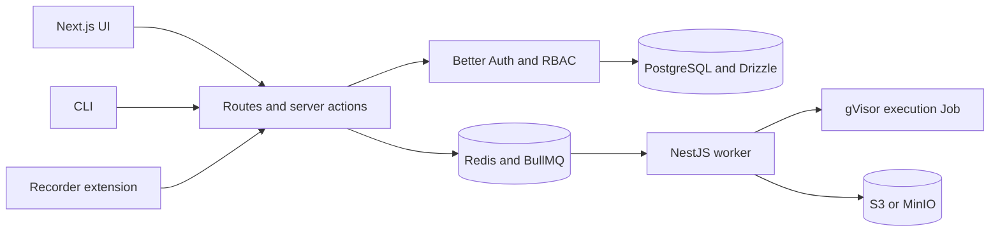
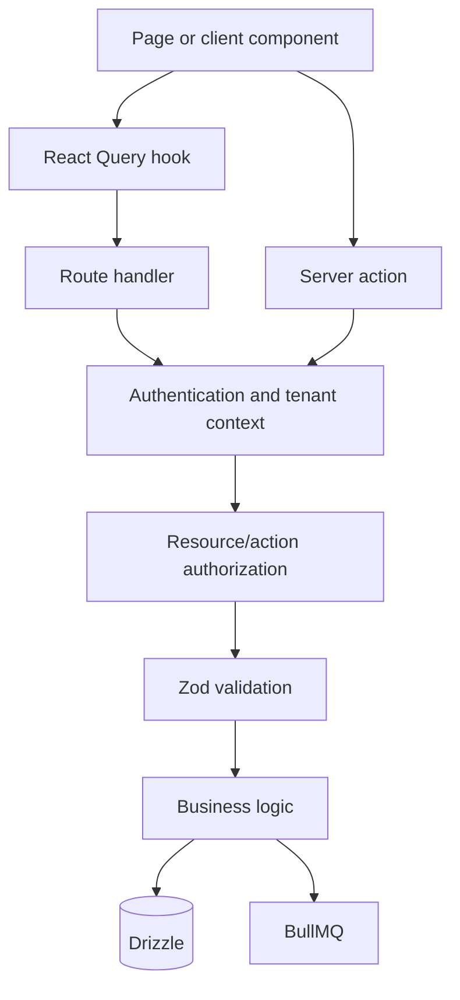

# Supercheck architecture

Supercheck is a multi-tenant testing, monitoring, and reliability platform. The repository contains a Next.js application, NestJS execution worker, CLI, browser recorder, documentation, and self-hosted deployment assets.

## Repository map

| Path | Responsibility |
|---|---|
| `app/src/app` | Next.js 16 App Router pages and route handlers |
| `app/src/actions` | Server-side UI mutations |
| `app/src/components` | Feature and shared React components |
| `app/src/hooks` | React Query data access and cache contracts |
| `app/src/db/schema` | Drizzle schema definitions |
| `app/src/db/migrations` | PostgreSQL migration history |
| `app/src/lib` | Auth, RBAC, queues, schedulers, validation, security, billing, and SRE services |
| `app/src/sre` | AI SRE agents, tools, skills, evaluation, and orchestration |
| `worker/src` | NestJS execution, monitor, notification, and private-agent workers |
| `cli` | `@supercheck/cli` monitoring-as-code client |
| `recorder` | Apache-licensed Playwright CRX recorder and browser extension |
| `docs` | Public Fumadocs site |
| `deploy/docker` | Public Docker Compose and self-hosted assets |

## Request and data boundaries

- Prefer Server Components until browser state, effects, or event handlers require `"use client"`.
- Keep business rules below transport and UI layers. Routes/actions translate auth, input, status codes, and public errors.
- Use bearer-compatible auth helpers for routes called by CLI/API keys; cookie-only helpers break those callers.
- Validate request bodies, params, search params, uploads, provider events, and browser messages at their trust boundary.
- Use the owning schema to determine scope. Organization-owned resources need organization scoping; project-owned resources need verified organization and project ownership. Do not mechanically add both IDs to tables that do not own both.

## Database and migration rules

- PostgreSQL 15+ and Drizzle ORM are current. Do not introduce Prisma, MySQL assumptions, or NextAuth patterns.
- Follow neighboring schema conventions for UUIDs, timestamps, indexes, foreign keys, uniqueness, and delete behavior.
- Add indexes for real filters, joins, ordering, and uniqueness—not as a template exercise.
- Generate and inspect migrations. New non-null columns need safe behavior for existing rows.
- Analyze destructive changes, backfills, transaction duration, locks, rollback/recovery, and rolling app/worker compatibility.
- Keep app and worker schema representations compatible where both packages read the same tables.

## React Query and client data

- Query keys are contracts. Prefetch, hooks, invalidation, and parameter object shapes must match exactly.
- Render cached query data directly. Do not mirror it into component state using an effect unless editing semantics require a deliberate snapshot.
- Preserve current freshness/refetch behavior when changing hooks; do not remove `refetchOnMount` or cache settings without tracing UX impact.
- Bound and paginate growing collections. Avoid N+1 requests and per-row database lookups.
- Mutations must invalidate or update every affected cache key and preserve loading, empty, error, and accessibility states.

## Cross-package compatibility

- App and worker deploy independently. Queue names, payloads, status values, retries, and result schemas must tolerate version skew.
- CLI and recorder are public clients. Preserve documented API and output compatibility or provide an explicit migration/version strategy.
- Cloud and self-hosted behavior must remain explicit. UI visibility does not substitute for server-side feature, entitlement, or security enforcement.

## Verification

- Trace every changed contract through callers, persistence/queue, consumers, tests, and docs.
- Run checks from each affected package directory.
- Schema changes require migration/schema-contract tests; shared contracts require producer and consumer coverage.
- Distinguish code verification from browser, provider, deployment, billing, and production acceptance.
