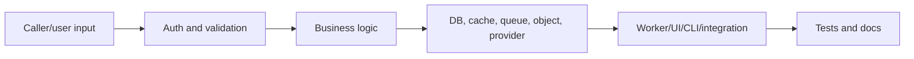
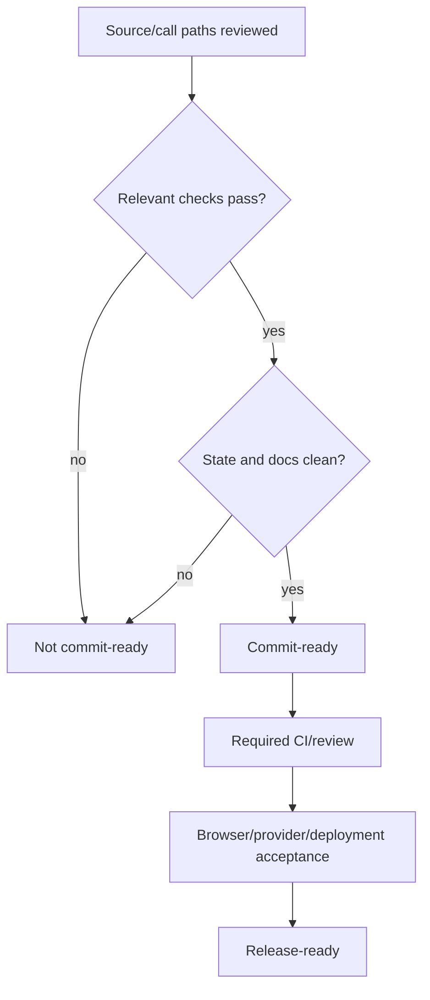

# Supercheck code review

Use every domain skill touched by the diff. Review is read-only unless the user also asks to fix findings.

## Establish scope

- Identify repositories, branch/base, commits, staged/unstaged/untracked files, submodules, generated outputs, and existing unrelated changes.
- Review the effective combined change, not only staged or unstaged fragments when both exist.
- Classify each file as architecture/data, auth/security, API/action, UI/hooks, execution/worker, monitoring, storage, SRE, deployment, testing/docs, CLI, recorder, billing, or another integration.

## Trace behavior

For each changed contract, follow:

- A diff that looks correct locally can still break a caller, worker, old deployment, CLI, extension, migration, or retry path.
- Treat reported findings as hypotheses. Confirm through current source, call paths, tests, and runtime contracts before recommending changes.
- Do not convert intentional hardening into a finding merely because it is stricter than generic guidance.

## Critical review areas

- Authentication mechanism and exact RBAC resource/action for cookie, bearer, trigger, admin, and public routes.
- Organization/project ownership on reads, writes, joins, cache keys, streams, objects, queue jobs, and provider identities.
- Zod/input bounds, uploads, HTML/browser messages, SSRF/redirect/DNS behavior, webhook signatures, and output allowlists.
- Secret encryption/redaction and absence from client data, config, queues, logs, errors, model prompts, and artifacts.
- Migration existing-data safety, constraints/indexes, lock duration, destructive operations, rollback/recovery, and version skew.
- Queue payload parity, atomic capacity, retries/idempotency, duplicate delivery, cancellation, terminal cleanup, and worker loss.
- React server/client boundary, query-key/invalidation parity, stale data, accessibility, error/loading/empty behavior.
- External effects: timeout, retry safety, idempotency, cancellation, billing/usage exactly-once behavior, and provider reconciliation.
- Deployment: immutable versions, secret handling, gVisor/network/namespace isolation, resource ceilings, autoscaling, health, and destructive blast radius.
- CLI/recorder public compatibility and AGPL versus Apache/third-party NOTICE obligations.

## Findings format

- Order by severity: critical/security/data loss, functional regression, reliability/performance, maintainability, suggestion.
- Give exact file/line, concrete failure scenario, affected users/system, and smallest safe correction.
- Avoid style-only noise unless repository tooling enforces it or it materially obscures correctness.
- Record important investigated claims that are not defects so reviewers understand intentional behavior.

## Verification and decision

- Run proportionate focused checks and broaden for shared/high-risk contracts.
- Confirm whitespace/diff checks, package contents, ignored/generated files, migrations, and docs/skills parity.
- Separate commit readiness from merge and release readiness.
- An unavailable browser/provider/production check is a disclosed acceptance boundary, never a pass.
