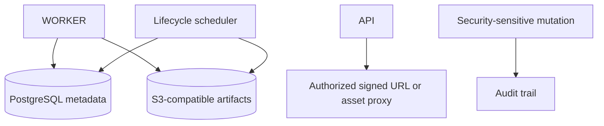

# Supercheck data storage and lifecycle

## PostgreSQL and object storage

- PostgreSQL holds relational state and artifact metadata; S3/MinIO-compatible stores hold large reports, traces, screenshots, files, and exports.
- Generate object keys server-side from trusted tenant/resource identifiers. Never accept arbitrary bucket/key pairs or filesystem paths from clients.
- Authorize ownership before issuing short-lived signed URLs or proxying an object.
- Asset proxying allows only configured storage origins/keys and must not become a generic server-side fetch endpoint.
- Uploads enforce object class, MIME/type expectations, byte limits, timeouts, and bounded streaming. Avoid buffering untrusted large objects in app memory.
- Preserve compatibility across cloud S3/R2-style services and self-hosted MinIO where shared adapters claim support.

## Lifecycle and retention

- Retention varies by artifact/data class, plan, and legal/security purpose. Read current constants/config before changing a duration.
- Cleanup work is bounded, paginated, idempotent, observable, and safe under concurrent scheduler instances.
- Coordinate metadata/object deletion so retries recover from partial failure without deleting another tenant’s object or leaving permanent billable orphans.
- Prefer mark/select/delete phases or other recoverable sequencing for large cleanup sets.
- Infrastructure state, backups, billing records, and security/audit history are not ordinary test artifacts and never inherit short playground/run retention.
- Changing product retention requires user documentation, entitlement/billing consideration, migration/backfill behavior, and provider lifecycle alignment.

## Dashboards, reports, and exports

- Every aggregation is tenant-scoped and uses explicit time range, time zone, status definitions, and units.
- Avoid N+1 and unbounded scans. Use suitable composite indexes and inspect plans for high-volume queries.
- Keep aggregate semantics aligned with raw execution/monitor state so dashboards, exports, and APIs report the same answer.
- Export generation is permission-checked, bounded, escaped against spreadsheet/formula injection where relevant, and stored/downloaded through scoped paths.
- Cache keys include all tenant/filter dimensions and invalidate when underlying state changes.

## Audit logging

- Audit records include actor or credential identity, organization/project scope, action, resource type/ID, timestamp, outcome, and safe metadata.
- Log sensitive mutations and denials according to policy without recording secrets, tokens, full request payloads, provider credentials, or decrypted variables.
- Audit failure behavior must be deliberate: critical security actions should not silently succeed without required audit evidence.
- Audit views/exports require elevated permission, pagination, tenant scope, and appropriate retention.

## Verify

- Test cross-tenant object access, forged keys, expired URLs, unsupported types, oversized streams, missing objects, and partial cleanup failures.
- Test cleanup idempotency/concurrency and DB/object reconciliation.
- Compare report queries with representative raw records and inspect query plans.
- Verify audit metadata and redaction for success, denial, and failure paths.
