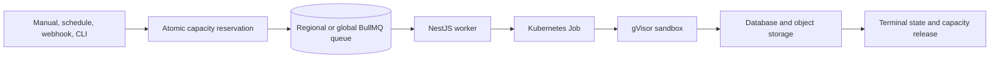

# Supercheck execution engine

## Workload model

- App routes/actions/schedulers admit and enqueue Playwright, k6, and monitor work.
- Scheduler processors execute in the app tier so scheduled work passes through central capacity policy. Workers must not consume scheduler payloads.
- Worker processors under `worker/src/execution`, `worker/src/k6`, and `worker/src/monitor` run independently from the app release.
- Regional queues target configured locations; global queues are used only when any eligible worker may process the job.
- Queue constants, payload types, status enums, retries, timeout meanings, IDs, and result contracts must remain in app/worker parity.

## Capacity and idempotency

- Organization-level admission is the capacity source of truth. Running and queued reservations use atomic Redis operations and fail closed if capacity state cannot be trusted.
- Reserve before dispatch. Release exactly once on every terminal path: completion, terminal failure, cancellation, timeout, dispatch failure, and unrecoverable worker loss.
- Retryable BullMQ attempts retain the reservation until the job becomes terminal.
- Duplicate delivery, scheduler overlap, API retries, and webhook retries must not create duplicate executions or double-release capacity.
- Keep configured app capacity, worker replicas, per-processor concurrency, and Kubernetes resource ceilings coherent.

## Redis and BullMQ

- Redis must use `maxmemory-policy noeviction`; evicting queue keys can lose or corrupt jobs.
- General queue operations may share appropriate base connections.
- Every `QueueEvents` consumer uses an independent duplicated connection because blocking `XREAD` cannot share a normal command connection.
- Do not set `commandTimeout` on shared options inherited by QueueEvents. Keep bounded connection establishment while allowing intentional failover reconnection.
- Monitor connection count across app replicas, workers, schedulers, dashboards, and event streams.

## Payloads, secrets, and artifacts

- Queue payloads contain trusted identifiers and bounded safe execution inputs—not decrypted tenant secrets.
- Workers resolve current scoped variables immediately before execution and redact values from output.
- Large scripts/results/artifacts belong in bounded payload/storage paths, not oversized Redis values or unbounded process memory.
- Artifact upload failures have explicit timeout/retry behavior and cannot leave runs permanently active.

## Cancellation and failures

- Cancellation is idempotent: mark intent, stop queued work or signal active work, terminate the execution Job when necessary, persist one terminal state, and release capacity once.
- Let BullMQ retry eligible failures; do not swallow processor errors after marking an intermediate state.
- Stalled-job policy is bounded and aligned with execution duration/lock settings.
- Worker shutdown drains or safely relinquishes work and does not orphan Jobs or reservations.

## Production sandbox

- Production execution runs in a dedicated namespace with `runtimeClassName: gvisor` and fails closed if required isolation is unavailable.
- `EXECUTION_RUNTIME_CLASS_NAME=none` is local-development only.
- Jobs use the zero-permission execution service account, non-root identity, read-only root filesystem, dropped capabilities, no privilege escalation, bounded writable storage, CPU/memory/ephemeral limits, and deadline/cleanup settings.
- Namespace LimitRange/ResourceQuota and worker-configured ceilings stay aligned.
- NetworkPolicy denies by default and allows only required DNS/egress. Application SSRF protection remains required even with network isolation.

## Verification

- Test races at capacity boundaries, duplicate dispatch, retries, cancellation timing, Redis loss/recovery, worker loss, timeout, upload failure, and cleanup.
- Test rolling app/worker compatibility and location normalization/routing.
- Render the actual Kubernetes Job and security policy; source-template review alone is insufficient.
