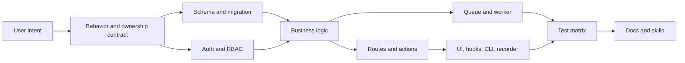

# Supercheck feature implementation

Use the domain skill matching the feature. For cross-cutting work, load each applicable domain skill; every skill is self-contained and available directly under `.agents/skills`.

## Choose the required layers

| Feature shape | Typical layers |
|---|---|
| UI-only | Component/page, accessibility, client/server boundary, UI tests |
| App CRUD | Schema/migration, validation, RBAC, service, route/action, hook/UI, audit, tests |
| App and worker | App CRUD plus shared queue contract, processor/service, capacity/cancellation, integration tests |
| External API/CLI | Bearer auth, stable schemas/status/output, rate limits, compatibility tests, docs |
| Recorder/browser | Extension permissions/messages, app bridge/API, browser tests, store/release docs |
| Provider integration | Credential/webhook boundary, idempotency, durable state, failure/recovery, provider acceptance |
| Infrastructure | Config/manifests, secrets, security controls, rollout/rollback, rendered/live validation |

Only add layers the behavior needs. Avoid speculative tables, CRUD, queues, abstractions, and client state.

## Implementation workflow

1. Define user-visible behavior, owning organization/project scope, authorization resource/action, state transitions, limits, retention, side effects, and failure behavior.
2. Read neighboring code and tests. Reuse central auth context, RBAC, validation, security, queue, storage, billing, and logging helpers.
3. Identify public and rolling-deployment contracts before changing schema, API, queue payload, statuses, CLI JSON, extension messages, or environment variables.
4. Implement the smallest complete vertical slice, preserving cloud and self-hosted behavior.
5. Add regression tests for happy, denied, malformed, cross-tenant, dependency-failure, retry/idempotency, cancellation, and cleanup paths as applicable.
6. Update public docs, examples, environment/deployment configuration, and affected agent skills in the same change.

## Data and API rules

- Determine scope from the owning resource; authorize before reads/mutations and scope queries at the database boundary.
- Validate all external input using existing schemas/patterns and bound strings, arrays, files, URLs, and result sizes.
- Generate/review database migrations and handle existing data, uniqueness, indexes, deletion, and version skew.
- Keep internal errors in structured/redacted logs and return stable safe public errors/status codes.
- Audit security, membership, secret, billing, and administrative mutations.

## Background and external side effects

- Keep app/worker queue contracts in parity and compatible during rolling deployments.
- Do not enqueue decrypted secrets. Resolve scoped values immediately before isolated use.
- Make retries safe and idempotent; use durable idempotency keys/records for provider, webhook, usage, and notification effects.
- Propagate cancellation and cleanup through every layer; release capacity/resources exactly once.
- Use SSRF-safe fetching for user-controlled URLs and verify signatures for inbound provider events.

## UI and public client rules

- Prefer Server Components and direct React Query data; keep query keys/invalidation exact.
- Preserve loading, empty, error, keyboard, focus, labels, and responsive states.
- CLI JSON and exit codes, recorder messages, public APIs, and configuration formats are compatibility contracts.
- Server-side enforcement remains authoritative for permissions, entitlements, limits, and feature modes.

## Completion gate

- Run focused then broad checks from affected package directories.
- Verify diff cleanliness and no generated/secret files.
- State local evidence and outstanding browser, CI, provider, deployment, billing, or production gates separately.
- Do not claim merge/release readiness only because implementation tests pass.
