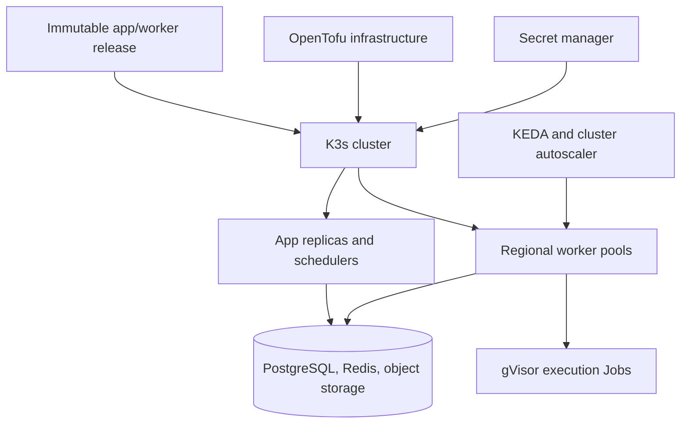

# Supercheck infrastructure and deployment

## Deployment surfaces

- `deploy/docker` contains public self-hosted Compose assets. Inspect current files to choose bundled dependencies, secure/TLS, external services, remote worker, or local-source behavior.
- Coolify uses its checked-in template and supported variable model; verify generated domains, persistent storage, health, and version selection.
- Production K3s/OpenTofu assets may be maintained outside this repository, but contributors must preserve the contracts described here when changing app/worker/deploy code.
- Local macOS Kubernetes may use OrbStack. Local exceptions must not weaken production defaults.

## Docker Compose and self-hosting

- App, worker, PostgreSQL, Redis, MinIO/object storage, proxy/TLS, and K3s dependencies start in a health-aware order.
- Generate unique auth/encryption/storage/Redis secrets and keep all `.env` files untracked.
- Browser URL, API URL, OAuth callbacks, cookie domain, trusted proxy, status-page domain, and TLS routing must agree.
- Bind stateful services privately; do not publish PostgreSQL, Redis, or object storage to the internet.
- Remote workers use authenticated network paths, a unique supported location, and an app/worker-compatible release.
- Capacity equals usable worker execution concurrency, not merely a replica count. Verify location queue routing and resource availability.

## Kubernetes and gVisor

- Production execution fails closed on the configured gVisor RuntimeClass.
- Execution Jobs run in the dedicated namespace with zero-permission service account, non-root/read-only containers, dropped capabilities, no privilege escalation, resource requests/limits, deadlines, TTL cleanup, and bounded writable storage.
- Namespace default-deny NetworkPolicy, DNS allowance, LimitRange, and ResourceQuota stay aligned with worker-generated Job resources.
- App/worker workloads use probes, disruption/rollout settings, anti-affinity/topology behavior, and service accounts appropriate to their role.
- Node-local DNS configuration must match cluster DNS IP, host paths, interface/listen behavior, and upstream configuration before rollout.

## OpenTofu and Hetzner

- Infrastructure is declarative; review `plan` output and exact targets before apply.
- Keep control-plane/stateful nodes protected. Replaceable workers may scale down according to current availability/cost policy.
- Never commit cloud tokens, kubeconfigs, generated secrets, private keys, state, or live inventory.
- OpenTofu state is critical persistent data. Store it remotely with locking/versioning and never apply artifact lifecycle deletion to it.
- Firewall and SSH/admin access use least privilege and restricted source networks. Prefer non-root administrative users with audited sudo.

## External services and secrets

- Supported deployments require PostgreSQL, BullMQ-compatible Redis, S3-compatible object storage, and optionally SMTP, OAuth, CAPTCHA, AI, billing, support, and observability providers.
- Provider names, pricing, limits, product IDs, regions, and setup UI are drift-prone; verify live before operational decisions.
- Redis uses `maxmemory-policy noeviction` and sufficient connection capacity.
- PostgreSQL connection pooling/SSL must match the provider endpoint and migration strategy.
- Secrets are injected through the approved secret manager/CI mechanism, rotated by environment, and unavailable to untrusted CI jobs.

## Autoscaling

- KEDA/worker scaling follows queue pressure and capacity policy; cluster autoscaler node pools must permit the corresponding location labels/taints and scale bounds.
- Preserve the current pre-launch baseline unless explicitly changed: one warm EU worker for scheduled monitor availability; US/APAC may scale to zero.
- Scale-to-zero acceptance proves node bootstrap, CNI/DNS readiness, image pull, worker registration, execution, and cleanup—not only VM creation.
- Validate app schedulers and queue capacity independently from node autoscaling.

## Disaster recovery

- Define and test backups for PostgreSQL, object storage, infrastructure state, cluster configuration, and required secrets.
- RPO/RTO claims require measured restore evidence; do not promise timings from an untested workstation bootstrap.
- Never run cluster reset on a healthy control plane or delete a stateful PVC/host before validating off-host restore material.
- Restore into an isolated environment when practical; verify integrity, migration compatibility, auth, queues, storage, and a disposable execution.

## Deployment verification

1. Use an explicit kubeconfig/context for every production command.
2. Render/validate manifests or Compose config and review destructive/resource changes.
3. Deploy an immutable exact SHA/version through a bounded rollout.
4. Inspect pods, events, logs, probes, revision labels, migrations, KEDA/autoscaler/control-plane health, and pressure.
5. Run disposable user and execution acceptance, then remove fixtures.
6. Keep DNS/TLS, provider accounts, credentials, spending, destructive changes, and final production approval as explicit gates.
