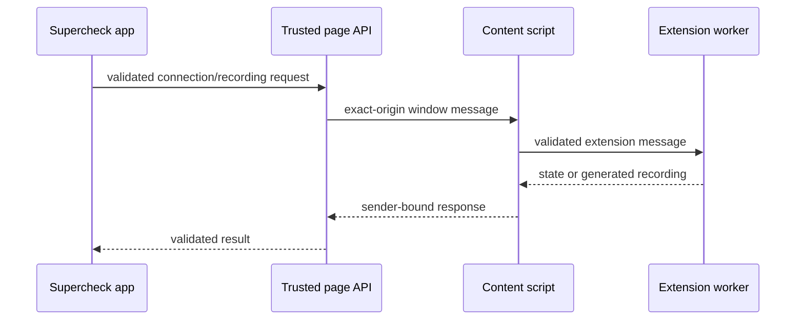
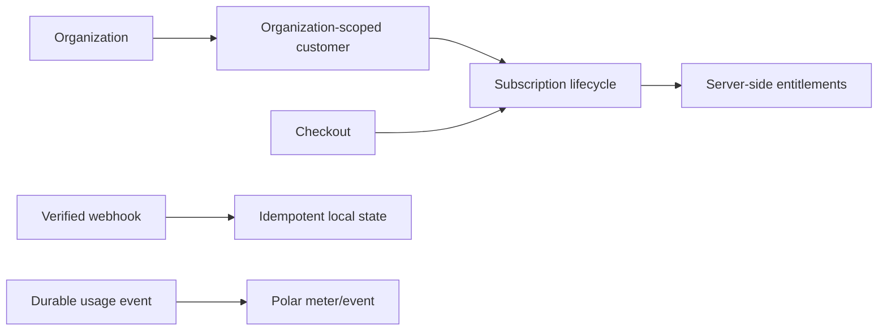

# Supercheck integrations and extensions

## Recorder architecture

The recorder is an Apache-2.0 browser extension built from Playwright CRX and vendored Playwright source. Supercheck-specific app integration lets users record browser interactions and save generated Playwright tests.

### Source and build map

| Path | Responsibility |
|---|---|
| `recorder/src` | Playwright CRX library/client/server implementation |
| `recorder/playwright` | Vendored build-required Playwright source and licenses |
| `recorder/examples/recorder-crx` | Supercheck recorder extension |
| `recorder/examples/todomvc-crx` | Library example |
| `recorder/tests` | Unit, extension, and browser suites |
| `app/src/components/recorder` | App UI and auto-connect bridge |
| `app/src/app/api/extension` | Extension-facing API |
| `app/src/app/api/recordings` | Recording persistence API |

### Security contract

- The page bridge/content script accepts only `event.source === window`, parsed allowed origins, expected protocol/hostname, and schema-valid messages.
- Allow HTTPS Supercheck origins, exact HTTP localhost development, and the exact configured self-hosted origin—never arbitrary HTTP/HTTPS pages.
- Use `window.location.origin` or another verified exact origin as `postMessage` target; never `*` for privileged data.
- Bind return/callback URLs to the verified sender origin and restrict navigated/recorded target protocols.
- Inject the page API only on trusted Supercheck pages. Do not add broad `externally_connectable` access.
- Keep extension permissions/host permissions minimal and validate all background/content/page boundaries independently.
- Retry only idempotent API methods and preserve authentication/error behavior without exposing tokens.

### Licensing and release

- Preserve `recorder/LICENSE`, `recorder/NOTICE`, `recorder/playwright/LICENSE`, `recorder/playwright/NOTICE`, and upstream file headers.
- Do not relicense Playwright-derived recorder files as AGPL. App, worker, CLI, and docs remain AGPL-3.0-only.
- The vendored source must be enough for a clean reproducible build without another private checkout.
- Build lint, vendored bundles, generated types, CRX library, recorder/TodoMVC examples, and test extension.
- Run unit security and browser suites. Local browser fixture limitations must be disclosed; CI/Linux and manual installed-extension acceptance remain release gates.
- Chrome and Edge store descriptions/assets/certification are separate. Edge submission copy must not describe the product as a Chrome extension.
- Store publishing requires manual account/2FA/reviewer gates and uses canonical listing IDs/URLs from current public docs.

## Polar billing

- Polar customer identity is organization-scoped, using the current organization external identity. Never collapse multiple organizations under a user-scoped customer.
- Checkout and customer portal requests authenticate the user, resolve the organization, authorize billing management (normally organization owner), and use configured product/price references.
- Webhooks verify signatures, deduplicate by provider event identity, tolerate retries/reordering, and update local state transactionally/idempotently.
- Subscription status, plan, period, cancellation, and entitlement behavior come from durable server state synchronized from verified provider events.
- Entitlements and limits are enforced server-side. UI labels/buttons are not authorization.
- Usage is durably recorded server-side before or atomically with provider delivery and retried safely without duplicate billing.
- Use whole-cent currency arithmetic and explicit units. Never rely on floating-point money or silently mix credits/events/cents.
- Polling stops on success, terminal failure, cancellation/navigation, and timeout.
- Never automatically mutate live products/prices, attach overage prices, migrate customers, or make paid actions without explicit authorization and invoice/recovery analysis.
- Provider product IDs, prices, tax settings, limits, and UI are drift-prone; verify them in the provider environment.

### Billing acceptance

- Test organization isolation, shared-user/multiple-org customer identity, checkout, webhook replay/reordering, upgrade/downgrade, cancellation, expiry, recovery, portal, invoice, usage retries, and entitlement transitions.
- Automated/local tests do not replace sandbox/live provider acceptance and invoice inspection.

## Customer support chat and third parties

- Load support scripts only when configured and under applicable consent/privacy policy.
- Keep tokens and identity-verification secrets server-side. Do not send tenant secrets, auth tokens, sensitive route data, or private incident content to chat by default.
- Verify inbound signatures, validate payloads, rate-limit callbacks, and make processing idempotent.
- Provider plan, branding, pricing, privacy, and hosting claims change; verify current terms before product decisions.

## Verify

- Test every trust boundary and cross-tenant denial.
- Test provider retries, malformed/signed-invalid callbacks, cancellation, cleanup, and redaction.
- Separate source/unit evidence from browser store, provider account, invoice, and production acceptance.
