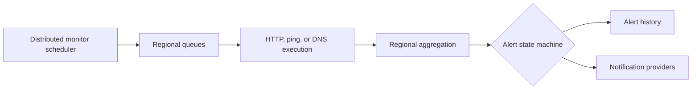

# Supercheck monitoring and alerts

## Monitor definition and execution

- Monitor definitions are tenant-owned configuration; executions and regional results are immutable observations.
- Preserve URL/host, method/type, headers/body, timeout, expected response/assertions, interval, retry, enabled state, locations, and notification relationships across schema, APIs, UI, scheduler, queue, and worker.
- Monitor destinations are untrusted. Apply input validation and SSRF-safe resolution at configuration time and again at execution, including redirects and DNS changes.
- Scheduling is safe across multiple app replicas using the current distributed coordination mechanism. Restarts or overlapping scheduler ticks must not duplicate dispatch.
- Location selection maps deterministically to worker queues and rejects unknown/unavailable locations deliberately.

## Aggregation

- A regional result and aggregate monitor state are separate. Never infer global health from one region.
- Define how missing, late, timed-out, and conflicting regional results affect aggregate status; preserve that rule across dashboards, APIs, and alert evaluation.
- Use consistent units and boundaries for latency, uptime, thresholds, and time windows.
- Store enough immutable evidence to explain why an alert transitioned without retaining secrets or unrestricted response bodies.

## Alert state and history

- Model transitions explicitly using the current states and consecutive-failure/recovery policy.
- Persist transition history before or atomically with outbound notification scheduling.
- Deduplicate repeated failing observations while preserving meaningful reminders/escalations configured by the product.
- Recovery closes/resolves the active condition once and sends at most the intended recovery notifications.
- Acknowledgement or manual state changes require permission, tenant scope, audit events, and race-safe updates.

## Notification providers

- Provider definitions are scoped to their owning tenant and secrets remain encrypted/redacted.
- Render messages from bounded, escaped data. Do not leak headers, variables, tokens, raw response bodies, or internal errors.
- Email, Slack, PagerDuty, and webhook delivery use bounded timeouts and retries only when safe.
- Webhook destinations use SSRF protection. Inbound callbacks verify signatures when applicable.
- Record delivery outcome and safe provider diagnostics without blocking the monitor’s terminal persistence indefinitely.

## Verify

- Unit-test threshold boundaries, state transitions, deduplication, recovery, and partial/missing region behavior.
- Integration-test scheduler ownership, queue routing, worker output, and provider retry/idempotency.
- Test cross-tenant provider/monitor access and secret redaction.
- Use disposable provider endpoints and clean them up; live delivery acceptance remains separate from automated tests.
