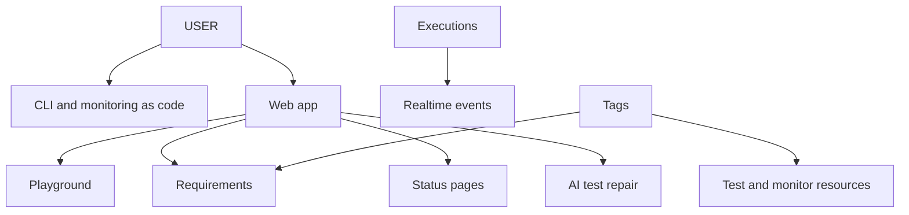

# Supercheck platform features

## CLI

- Source: `cli`; package: `@supercheck/cli`; binary: `supercheck`; license: AGPL-3.0-only; supported Node runtime begins at 18 unless package metadata changes.
- Config is declarative monitoring-as-code. Config loading validates schema and rejects embedded live/test/trigger token patterns, including legacy trigger formats.
- Secret variable values become environment references; file variables are excluded from generated config and use supported multipart/dashboard paths.
- Authentication storage must use the platform-appropriate protected location and never print tokens.
- Preserve interactive and non-interactive behavior for login, init, validate, diff, deploy, pull, destroy, doctor, health, jobs, tests, monitors, alerts, runs, tags, variables, notifications, and upgrade commands.
- Human output goes to readable terminal streams; `--json` output must remain machine-parseable without progress/noise on stdout.
- Subprocess signal termination and command failures return nonzero status. Retry only idempotent network requests.
- Reusable CI distinguishes a job trigger key from the CLI token required for polling/waiting. Bind workflow inputs through environment variables/quoted arrays, not shell interpolation.
- Verify with typecheck, lint, all Jest suites, build, and `npm pack --dry-run`; inspect packaged files and executable entrypoint.

## Realtime SSE

- Authenticate and authorize private subscriptions before opening streams; bind each stream to the permitted tenant/resource/run.
- Use dedicated blocking Redis connections where QueueEvents is involved.
- Emit typed, bounded events and heartbeats; preserve event ordering/identity expected by clients.
- Close subscriptions, timers, listeners, and Redis resources on abort, completion, timeout, navigation, and errors.
- Reconnection/resubscription must not leak other resources or create duplicate UI state.

## Requirements

- Requirements are traceability and coverage objects. They are never executed and do not own an independent pass/fail state.
- Coverage is derived from linked test executions and must remain explainable.
- Requirement, document, test, and tag links are tenant-scoped and protected against cross-project IDOR.
- Browser requirements follow the recorder-first authoring path where applicable.
- AI requirement processing uses sanitized bounded content and validated structured output.

## Tags

- Tags are scoped by organization and project and use consistent normalization/color/uniqueness rules.
- Resource joins preserve tenant scope. Filtering semantics remain aligned across API, UI, CLI, and reports.
- Deletion checks all supported relationships and returns conflict when a tag is still in use if that is the current contract.

## Status pages

- Public status endpoints expose an explicit safe field allowlist; admin APIs require RBAC and ownership.
- Support public/private status, service associations, incidents/maintenance, branding policy, and verified custom domains according to current schema.
- Custom-domain verification and any outbound DNS/HTTP checks use hardened resolution and SSRF controls.
- Preserve cloud and self-hosted routing, CNAME guidance, TLS behavior, and branding configuration.

## AI test repair and providers

- Sanitize scripts, errors, logs, and user instructions before model use; defend against prompt injection and secret inclusion.
- Keep provider credentials server-side and separate provider namespaces from storage credentials (notably Bedrock AWS versus S3/R2).
- Validate generated code/patch structure and run it only through normal script validation and isolated execution.
- Apply timeout, cancellation, retry, usage accounting, model allowlisting, and safe error behavior across supported providers.

## Web playground

- Playground execution is untrusted and ephemeral: enforce strict resource/time limits, isolation, rate limits, result bounds, and short retention.
- It must not bypass normal script validation, SSRF policy, capacity controls, or secret boundaries.
- Preserve zero-install UX while keeping durable project resources separate from temporary runs.

## Verify

- Test tenant/RBAC denial and malformed input for every feature API.
- Test SSE disconnect cleanup and cross-tenant isolation.
- Test CLI compatibility and JSON output as public contracts.
- Use browser tests for recorder-first, status-domain, and realtime UI behavior that unit tests cannot prove.
