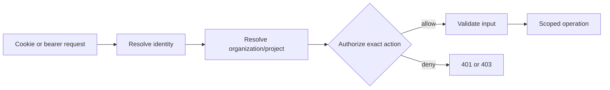

# Supercheck security and authentication

## Authentication

- Better Auth owns browser sessions, users, organizations, and membership. Do not add NextAuth patterns.
- Browser routes may use session cookies. CLI and API-key routes require bearer-compatible auth context.
- Never use a cookie-only permission helper in an API route that supports CLI bearer tokens.
- Return `401` when identity is absent/invalid and `403` when an authenticated identity lacks permission.
- Session cookies retain secure, HTTP-only, same-site, domain, expiration, revocation, and proxy-aware behavior.
- OAuth redirect URLs must exactly match provider configuration. GitHub applications require access to user email; Google requires configured consent and callback URLs.

## Roles, membership, and scope

- Read canonical resources, actions, and roles from `app/src/lib/rbac`; never recreate role strings or a second permission matrix.
- Resolve tenant context before data access. IDs supplied by clients are selectors, not proof of ownership.
- Organization resources scope to the authenticated organization. Project resources additionally verify project ownership/membership.
- Project admins/editors require the applicable project membership relationship. Organization-wide privileges apply only through central RBAC rules.
- Invitations validate organization/project, role eligibility, normalized email, expiry, reuse/acceptance state, and inviter authority.
- Super-admin routes require explicit global-admin authorization and must not reuse ordinary tenant authorization as a shortcut.
- Security, membership, secret, administration, and billing mutations produce redacted audit events.

## API and trigger keys

- CLI/session API tokens, test keys, and job trigger keys are different credential classes. Validate type, prefix/current format, expiry, enabled state, scope, and allowed operation.
- Store credential material according to the current one-time-display/hash design; never make plaintext recoverable through list/get APIs.
- Token lists expose safe metadata only. Creation returns a plaintext token only at the intended one-time boundary.
- Rate-limit authentication and credential-sensitive endpoints and return useful retry metadata where supported.
- Do not put tokens in repository config, URLs, logs, analytics, error messages, queue payloads, or client persistence beyond the intended secure store.

## Project variables and encryption

- Encrypt secret values server-side with the current scoped encryption context and split keys.
- List/read APIs return redacted metadata for secrets. Decryption occurs only immediately before authorized isolated execution.
- Never enqueue decrypted variables or persist them in capacity/job payloads.
- File variables use the supported upload path and size/type controls. They are not serialized into CLI config.
- Playwright and k6 variable/file semantics differ. In k6, `readFile()` is unsupported; use `open(getFile('KEY'))` during init.
- Redact resolved secret values from stdout, stderr, execution logs, notifications, traces, and error objects.

## Input, browser, and network security

- Use shared Zod schemas and size/shape bounds for all untrusted data.
- User-controlled outbound URLs use the shared pinned-public-fetch/SSRF policy. Validate protocol, resolution, every redirect, and final connection target; block private/reserved ranges and metadata endpoints, including IPv4/IPv6 transition forms.
- Browser messages require `event.source`, exact parsed origin, allowed protocol/hostname, and schema-valid payloads. Use exact `targetOrigin`, never `*`, for privileged communication.
- Preserve CSRF, CSP, origin, proxy-header, upload, and response-field allowlisting protections.
- Provider/webhook signatures are verified before parsing side effects; webhook processing is idempotent and tenant-bound.

## Required negative tests

- Cross-organization and cross-project reads/writes.
- Cookie versus bearer callers for dual-auth routes.
- Wrong role/action, revoked/expired/wrong-type keys, reused invitations, and super-admin denial.
- Secret redaction in API output, logs, queues, and failures.
- SSRF through redirects, DNS rebinding, alternate IP forms, localhost/private/metadata targets.
- Forged browser origins/sources and malformed messages.
