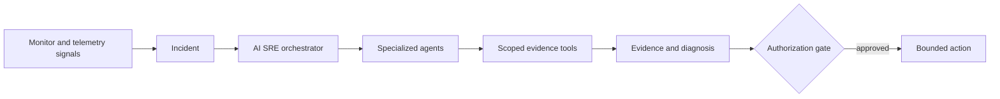

# Supercheck SRE operations

## AI SRE architecture

- AI SRE source is split between `app/src/sre`, `app/src/lib/sre`, API routes, components, and matching worker schema/types.
- Incidents, services, connectors, private agents, conversations, messages, evidence, tool calls, and usage remain scoped to their owning organization/project.
- Authorization is enforced server-side for every tool call and persisted resource. Model instructions and UI visibility are not authorization.
- Prefer read-only evidence gathering. Mutations require explicit user authority, least-privilege credentials, bounded targets, audit records, and observable outcomes.
- Kubernetes access uses namespace-scoped service accounts and allowed resources/actions; never grant `cluster-admin`.
- Preserve stable assistant/user message identity through streaming, persistence, polling/reconciliation, retries, and reloads.
- Connector and private-agent credentials stay encrypted/server-side and are never placed in prompts, browser payloads, logs, or model-visible errors.

## Tool and provider behavior

- Tool schemas validate inputs and bound output size. Treat provider/tool output as untrusted evidence.
- Cancellation and timeout propagate through model streams, tools, polling, persistence, and UI state.
- Retry only transient/idempotent operations; prevent duplicate messages, actions, tool records, usage events, and charges.
- Provider fallback must preserve tenant scope, safety policy, model allowlists, usage accounting, and error semantics.
- Redact secrets and sensitive telemetry before model invocation and persisted transcripts.

## Resilience

- External calls have explicit connection/operation timeouts and abort handling.
- Use exponential backoff with jitter for safe transient retries and circuit breakers for sustained dependency failure.
- Fallbacks degrade explicitly and never bypass authentication, authorization, capacity, billing, or audit controls.
- Redis connections intentionally survive failover; QueueEvents blocking connections remain isolated from normal command timeout behavior.
- Distributed schedulers/locks use ownership tokens and bounded leases so one instance cannot release another’s lock.

## Memory and performance

- Bound transcripts, evidence, logs, tool output, arrays, caches, queue payloads, and export/result sizes.
- Stream large responses/artifacts and paginate growing datasets.
- Clean up timers, listeners, subscriptions, AbortControllers, child processes, temporary files, and browser contexts on every terminal path.
- Optimize database access from measured query plans/cardinality; preserve exact React Query cache-key parity between prefetch and hooks.
- Do not trade tenant/security checks for caching or performance.

## Environment configuration

- Environment access is centralized through current config/schema helpers where available.
- Keep app, worker, deployment manifests, examples, docs, and health/config diagnostics synchronized.
- Validate required production values and fail closed when security-critical settings are missing.
- Never expose secrets through health endpoints, startup logs, client-prefixed variables, build output, or configuration APIs.
- Use distinct credentials/key namespaces for auth, encryption, object storage, AI providers, billing, email, and infrastructure.
- BullMQ Redis requires `noeviction`; production execution requires gVisor/isolation settings.

## Release management

- Use semantic project versions and immutable image tags/digests; never deploy `main`, another branch name, or `latest` to production.
- Review database compatibility before rollout and order app/worker/migration changes for version skew.
- CI must not use `pull_request_target` with untrusted contributor code or expose secrets to fork builds.
- A successful build/deploy workflow is not release acceptance. Verify deployed SHA, health, migrations, browser flows, RBAC/flags, workers/control plane, provider/billing gates, and cleanup.
- Keep changelog, package versions, deployment defaults, docs, and release evidence synchronized.

## Verify

- Cover tenant/RBAC denial before model/provider/tool execution.
- Cover cancellation, provider failure, transcript identity, retries, audit, usage/billing exactly-once behavior, and connector/private-agent boundaries.
- Use disposable non-production fixtures. Never inject failures into production, use customer credentials/data, exhaust limits, or spend quota only to repeat a proven scenario.
