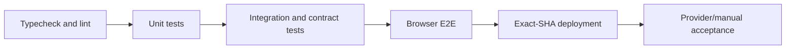
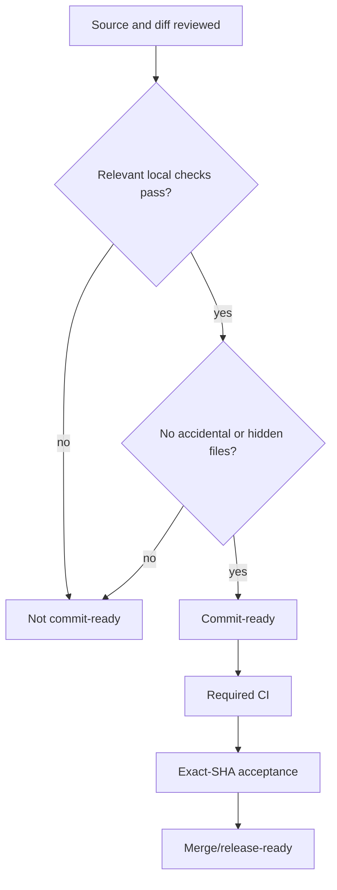

# Supercheck testing and quality assurance

## Package boundaries

- Run app commands from `app`, worker commands from `worker`, CLI commands from `cli`, recorder commands from `recorder`, and docs commands from `docs`.
- Inspect each package’s current scripts instead of assuming command names.
- Start with the narrowest test proving the changed behavior, then broaden based on blast radius.
- App/worker shared contracts require producer and consumer coverage. Schema changes require generated migration and schema-contract verification.
- CLI changes require typecheck, lint, Jest, build, and package-content validation.
- Recorder changes require unit/security tests, lint, vendored Playwright/CRX/example/test-extension builds, and browser suite acceptance.

## Test design

- Test observable behavior and invariants, not implementation wording.
- Include happy path, validation failure, authorization denial, tenant isolation, dependency failure, timeout/cancellation, retries/idempotency, and cleanup where applicable.
- Use deterministic clocks/IDs/providers where useful without bypassing production logic.
- Do not weaken assertions, add unconditional retries, inflate timeouts, or disable security controls merely to obtain green output.
- Browser tests cover routing, auth, focus/accessibility, streaming, extension messaging, and integrated user flows that lower-level tests cannot prove.

## Evidence

- Record exact command, revision/worktree state, pass/fail/skip counts, relevant environment, and artifacts.
- A test that did not execute is not a pass. Classify application regression, fixture defect, sandbox/network limitation, browser/platform incompatibility, or external-account gate.
- Screenshots, traces, reports, and logs are evidence only when tied to the tested revision and scenario.
- Confirm generated outputs, reports, coverage, auth state, and temporary fixtures are ignored/removed before commit.

## AI SRE acceptance

- Use disposable non-production incidents, services, connectors, provider accounts, and scoped users.
- Prove RBAC and tenant denial before provider/tool execution.
- Cover streaming/persisted message identity, connector and private-agent behavior, cancellation, provider/tool failure, rate limits, durable usage, billing exactly-once behavior, and cleanup.
- Never use customer data/credentials, grant cluster-admin, disrupt production, exhaust quotas, or repeat a paid scenario with no new decision value.

## Readiness gates

- Commit readiness requires reviewed changes, relevant local checks, docs/skill parity, clean diff checks, and disclosed test boundaries.
- Merge requires required CI and review policy.
- Release/GA additionally requires exact deployed SHA, migration health, zero unexpected acceptance failures, browser evidence, RBAC/flags, worker/control-plane observation, provider/billing acceptance where relevant, and fixture cleanup.
