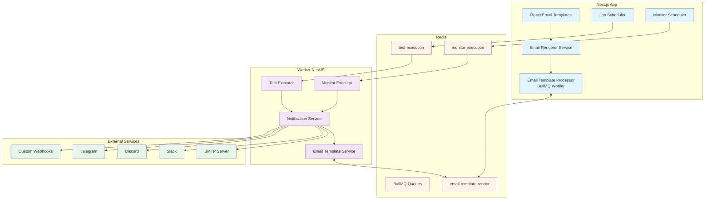
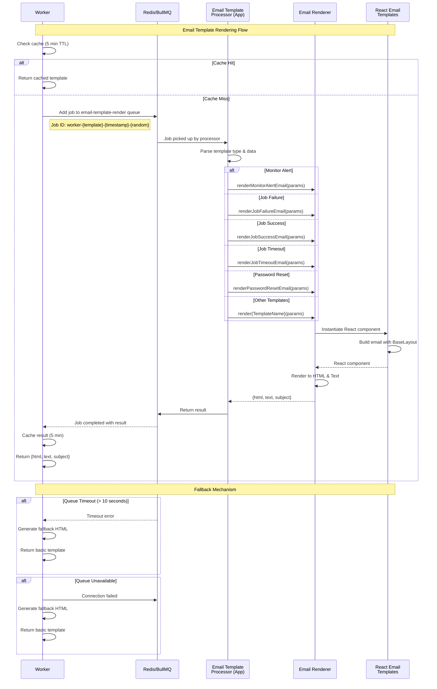
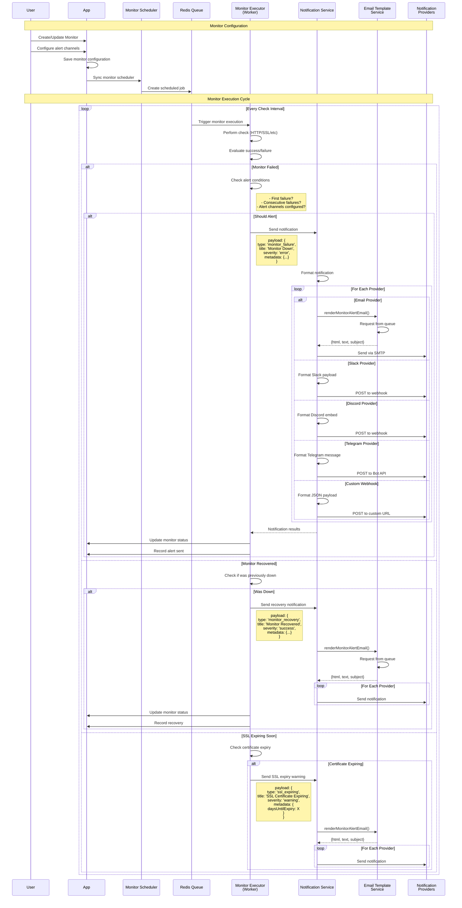
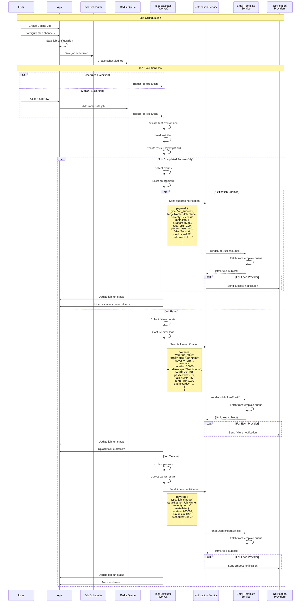
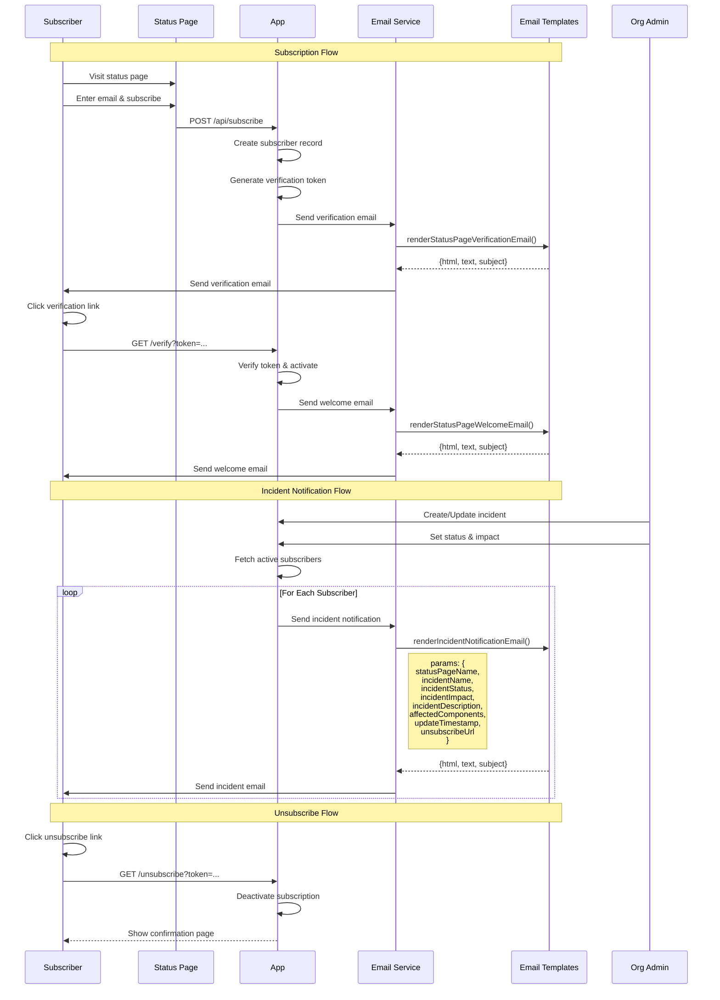
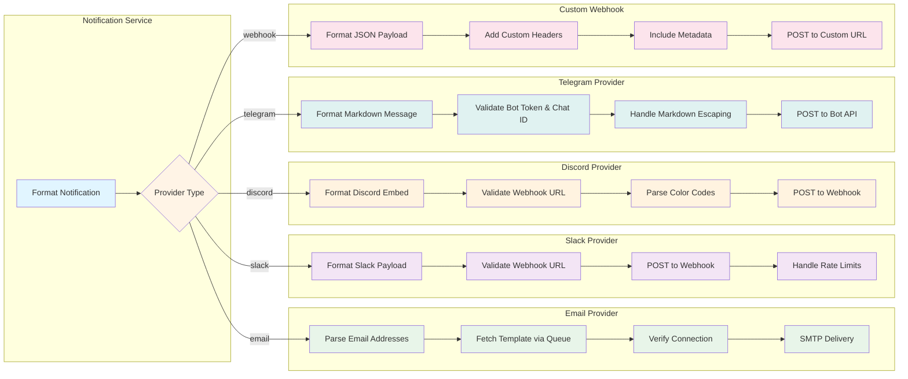
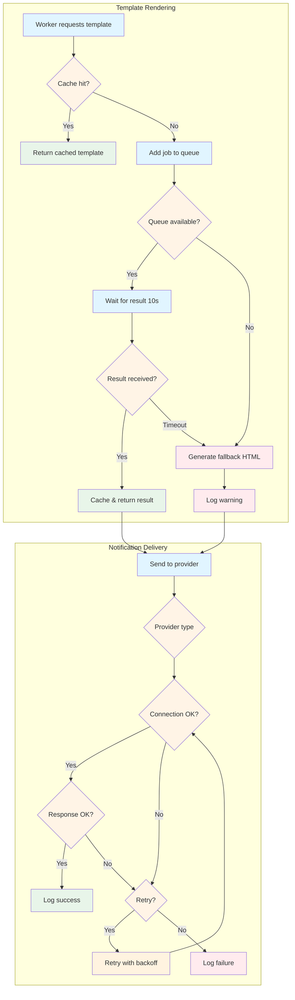

# Alerts and Notifications System - Technical Specification

This document provides a comprehensive overview of the Alerts and Notifications system in Supercheck, including architecture diagrams, sequence flows, and end-to-end functionality descriptions.

## Table of Contents

1. [System Overview](#system-overview)
2. [Architecture Components](#architecture-components)
3. [Email Template System](#email-template-system)
4. [Monitor Alerts Flow](#monitor-alerts-flow)
5. [Job Notifications Flow](#job-notifications-flow)
6. [Status Page Notifications Flow](#status-page-notifications-flow)
7. [Notification Providers](#notification-providers)
8. [Reliability and Fallback Mechanisms](#reliability-and-fallback-mechanisms)

---

## System Overview



**Legend:**
- 🔵 **Blue**: Next.js App components (frontend, schedulers, processors)
- 🟡 **Orange**: Redis & BullMQ queues (message broker)
- 🟣 **Purple**: Worker (NestJS) components (execution, notification)
- 🟢 **Green**: External notification providers (email, chat, webhooks)

---

## Architecture Components

### 1. Next.js App (Frontend & Schedulers)

**Purpose:** User interface, scheduling, and email template processing

**Key Components:**
- **React Email Templates** (`/app/src/emails`): Professional email templates built with react-email
- **Email Renderer Service** (`/app/src/lib/email-renderer.ts`): Direct template rendering for app usage
- **Email Template Processor** (`/app/src/lib/processors/email-template-processor.ts`): BullMQ worker that processes template rendering requests from the worker
- **Job Scheduler** (`/app/src/lib/job-scheduler.ts`): Schedules periodic test executions based on cron expressions
- **Monitor Scheduler** (`/app/src/lib/monitor-scheduler.ts`): Schedules monitor checks based on frequency

**Responsibilities:**
- Manage user interface and configuration
- Schedule jobs and monitors using BullMQ Job Schedulers
- Process email template rendering requests via BullMQ
- Render professional emails using react-email templates

### 2. Redis & BullMQ

**Purpose:** Message broker and job queue system

**Key Queues:**
- **email-template-render**: Worker → App communication for email rendering
- **test-execution**: Scheduled test execution jobs
- **monitor-execution**: Scheduled monitor check jobs

**Features:**
- Persistent job storage (survives restarts)
- Job retries and failure handling
- Delayed/scheduled jobs
- Priority queues
- Real-time job progress tracking

### 3. Worker (NestJS)

**Purpose:** Execute tests/monitors and send notifications

**Key Components:**
- **Test Executor**: Runs Playwright/K6 tests
- **Monitor Executor**: Performs monitor checks (HTTP, SSL, etc.)
- **Notification Service** (`/worker/src/notification/notification.service.ts`): Routes notifications to providers
- **Email Template Service** (`/worker/src/email-template/email-template.service.ts`): Fetches rendered templates via BullMQ

**Responsibilities:**
- Execute tests and monitors
- Evaluate alert conditions
- Request email templates from app via queue
- Send notifications to configured providers
- Handle notification failures and retries

### 4. External Notification Providers

**Supported Providers:**
- **Email (SMTP)**: Professional templated emails
- **Slack**: Webhook-based notifications with rich formatting
- **Discord**: Webhook-based embeds
- **Telegram**: Bot API messages
- **Custom Webhooks**: JSON payloads to any endpoint

---

## Email Template System



**Email Template Flow:**

1. **Cache Check**: Worker first checks its in-memory cache (5-minute TTL)
2. **Queue Job**: If not cached, worker adds a rendering job to the `email-template-render` queue
3. **Template Processing**: App's email template processor picks up the job and routes to appropriate renderer
4. **React Rendering**: Template is rendered using react-email components with BaseLayout
5. **Result Return**: Rendered HTML, text, and subject are returned via queue
6. **Caching**: Worker caches the result to avoid repeated rendering
7. **Fallback**: If queue fails or times out, worker generates basic HTML as fallback

**Available Email Templates:**
- **Monitor Alert**: Generic alert template with customizable fields and colors
- **Job Failure**: Dedicated template for failed test runs with error details
- **Job Success**: Success notification with test statistics
- **Job Timeout**: Timeout-specific notification
- **Password Reset**: User authentication emails
- **Organization Invitation**: Team collaboration emails
- **Status Page Emails**: Verification, welcome, incident notifications
- **Test Email**: SMTP configuration testing

---

## Monitor Alerts Flow



**Monitor Alert Types:**

1. **Monitor Failure** (`monitor_failure`)
   - Triggered when monitor check fails
   - Includes response time, status code, error details
   - Red color theme (#dc2626)
   - Can include retry information

2. **Monitor Recovery** (`monitor_recovery`)
   - Triggered when monitor recovers after failure
   - Includes downtime duration
   - Green color theme (#22c55e)
   - Shows last failure details

3. **SSL Certificate Expiring** (`ssl_expiring`)
   - Triggered when SSL cert expires within threshold
   - Shows expiration date and days remaining
   - Yellow/orange color theme (#f59e0b)
   - Configurable warning period

**Alert Conditions:**
- **First Failure**: Alert immediately on first failure
- **Consecutive Failures**: Alert after N consecutive failures
- **Recovery**: Always alert on recovery if monitor was down
- **SSL Warning**: Alert at configurable days before expiry (e.g., 30, 7, 1 days)

**Notification Fields:**
- Monitor name and type
- Project name
- Status (up/down)
- Response time (for HTTP monitors)
- Error message (for failures)
- Target URL
- Dashboard link (direct link to monitor details page)
- Timestamp

---

## Job Notifications Flow



**Job Notification Types:**

1. **Job Success** (`job_success`)
   - Triggered when all tests pass
   - Green color theme (#22c55e)
   - Includes test statistics, duration, dashboard link
   - Optional: Only send for scheduled runs, not manual

2. **Job Failure** (`job_failed`)
   - Triggered when one or more tests fail
   - Red color theme (#dc2626)
   - Includes error message, test statistics, failed test count
   - Dashboard link to detailed results and artifacts

3. **Job Timeout** (`job_timeout`)
   - Triggered when job exceeds maximum execution time
   - Red color theme (#dc2626)
   - Shows timeout duration and job name
   - Dashboard link to partial results

**Notification Fields:**
- Job name
- Project name
- Execution status
- Duration (in milliseconds, formatted as minutes:seconds)
- Total tests
- Passed tests
- Failed tests
- Run ID (unique identifier)
- Dashboard URL (direct link to run details)
- Trigger type (scheduled/manual)
- Error message (for failures)

**Conditional Notifications:**
- Users can configure to receive notifications only on failure
- Users can configure to receive all notifications (success + failure)
- Timeout always triggers a notification

---

## Status Page Notifications Flow



**Status Page Email Types:**

1. **Verification Email** (`status-page-verification`)
   - Sent immediately after subscription
   - Contains verification link (24-hour expiry)
   - Blue color theme (#667eea)
   - Explains subscription benefits

2. **Welcome Email** (`status-page-welcome`)
   - Sent after successful verification
   - Green color theme (#22c55e)
   - Includes status page link
   - Lists notification types subscriber will receive
   - Contains unsubscribe link

3. **Incident Notification** (`incident-notification`)
   - Sent on incident creation/update
   - Color varies by impact level:
     - Critical: Red (#dc2626)
     - Major: Orange (#f59e0b)
     - Minor: Yellow (#fbbf24)
     - None: Blue (#3b82f6)
   - Shows incident status badge
   - Lists affected components
   - Includes incident description and updates
   - Contains unsubscribe link

**Incident Statuses:**
- **Investigating**: Initial response, issue being investigated
- **Identified**: Root cause found, working on fix
- **Monitoring**: Fix deployed, monitoring for stability
- **Resolved**: Issue fully resolved

**Impact Levels:**
- **Critical**: Complete outage, all users affected
- **Major**: Major degradation, most users affected
- **Minor**: Partial degradation, some users affected
- **None**: Maintenance or resolved issue

---

## Notification Providers



### Email Provider (SMTP)

**Configuration Required:**
- Email addresses (comma-separated)
- SMTP host, port, username, password
- From email address

**Features:**
- Professional react-email templates
- HTML + plain text versions
- Queue-based template rendering
- 5-minute template cache
- Fallback to basic HTML if queue fails
- Connection verification before sending
- TLS/SSL support
- Timeout protection (10 seconds)

**Email Structure:**
- Subject line based on alert type
- Professional header with branding
- Alert status badge
- Color-coded alert sections
- Detailed information table
- Dashboard action button
- Footer with branding and disclaimer

### Slack Provider (Webhook)

**Configuration Required:**
- Webhook URL

**Features:**
- Rich message formatting with attachments
- Color-coded message borders
- Field-based data display (short/long fields)
- Footer with timestamp
- Link support in messages
- Emoji support
- 10-second request timeout
- Retry on transient failures

**Message Structure:**
- Main text (title)
- Attachment with:
  - Color bar (matches alert severity)
  - Message text
  - Fields (key-value pairs)
  - Footer
  - Timestamp

### Discord Provider (Webhook)

**Configuration Required:**
- Discord webhook URL

**Features:**
- Rich embed formatting
- Color-coded embeds
- Field-based layout (inline/block fields)
- Footer with timestamp
- Link support
- 10-second request timeout
- Color code conversion (hex to decimal)

**Embed Structure:**
- Title
- Description (main message)
- Color (based on severity)
- Fields array (name, value, inline)
- Footer
- Timestamp

### Telegram Provider (Bot API)

**Configuration Required:**
- Bot token
- Chat ID

**Features:**
- Markdown formatting
- Bold text for field titles
- Newline-separated fields
- Link support
- Emoji support (native)
- API rate limiting handling

**Message Structure:**
- Title
- Blank line
- Message text
- Blank line
- Fields (bold title: value)

### Custom Webhook Provider

**Configuration Required:**
- Target URL
- HTTP method (POST/PUT/PATCH)
- Custom headers (optional)

**Features:**
- Flexible JSON payload
- Custom header support
- Includes formatted notification
- Includes original payload
- Version information
- 10-second request timeout

**Payload Structure:**
```json
{
  "title": "Alert title",
  "message": "Alert message",
  "fields": [...],
  "color": "#dc2626",
  "footer": "sent by supercheck",
  "timestamp": 1234567890,
  "originalPayload": {...},
  "provider": "webhook",
  "version": "1.0"
}
```

---

## Reliability and Fallback Mechanisms



### Template Rendering Reliability

**1. Caching Strategy**
- **Worker-side cache**: 5-minute TTL, 100 entry max
- **Cache key**: Template type + parameters (JSON stringified)
- **Benefit**: Reduces queue load for repeated alerts
- **Example**: Monitor checking every minute uses cached template

**2. Queue Timeout Protection**
- **Timeout**: 10 seconds maximum wait
- **Dual timeout**: Both Promise.race and queue waitUntilFinished
- **Prevents**: Worker blocking indefinitely
- **Fallback**: Generate basic HTML template

**3. Fallback Template Generation**
- **Trigger**: Queue unavailable or timeout
- **Output**: Basic but functional HTML email
- **Structure**: Simple table layout with all alert data
- **Text version**: Plain text with line breaks
- **Ensures**: Notifications always sent, even if templates fail

**4. Queue Health Monitoring**
- **Health check method**: Returns queue status and job counts
- **Metrics**: Waiting jobs, active jobs, failed jobs
- **Logging**: Detailed logs for queue operations
- **Alerts**: Warnings logged when falling back

### Notification Delivery Reliability

**1. Provider Validation**
- **Pre-send check**: Validate provider configuration
- **Email**: Regex validation of email addresses
- **Webhooks**: URL format validation
- **API tokens**: Presence check
- **Benefit**: Fail fast with clear error messages

**2. Connection Verification**
- **SMTP**: Verify connection before sending
- **Timeout**: 10-second connection timeout
- **TLS**: Support for secure connections
- **Error handling**: Catch connection errors

**3. Retry Logic (Provider-Specific)**
- **HTTP requests**: Automatic retry on network errors
- **SMTP**: Connection retry on transient failures
- **Logging**: Track retry attempts
- **Backoff**: Exponential backoff for rate limiting

**4. Timeout Protection**
- **All HTTP requests**: 10-second timeout
- **SMTP**: Connection and greeting timeouts
- **Abort controllers**: Clean cancellation of requests
- **Prevents**: Indefinite hangs

**5. Error Logging**
- **Detailed errors**: Full error message and stack trace
- **Provider context**: Which provider failed
- **Alert context**: Which alert triggered notification
- **Success tracking**: Log successful deliveries

**6. Parallel Delivery**
- **Multiple providers**: Notifications sent in parallel
- **Independent failures**: One provider failure doesn't block others
- **Promise.allSettled**: All providers attempted
- **Result aggregation**: Success/failure counts returned

### Data Persistence

**1. Alert History**
- **Database records**: All alerts stored in database
- **Status tracking**: Monitor status changes recorded
- **Alert tracking**: When alerts were sent
- **Recovery tracking**: When monitors recovered

**2. Job Results**
- **Run records**: Every job run stored
- **Test results**: Detailed test outcomes
- **Artifacts**: Screenshots, traces, videos uploaded to S3
- **Cleanup**: Optional lifecycle management for old data

**3. Notification Logs**
- **Delivery status**: Success/failure per provider
- **Timestamps**: When notifications were attempted
- **Error details**: Failure reasons logged
- **Audit trail**: Complete notification history

### Graceful Degradation

**1. Queue Failure**
- **Template service**: Falls back to basic HTML
- **Notification still sent**: Email delivery continues
- **User impact**: Emails less polished but functional
- **Auto-recovery**: Resumes normal operation when queue available

**2. SMTP Failure**
- **Other providers work**: Slack, Discord, etc. still deliver
- **Error logged**: SMTP failures tracked
- **User notification**: Users see delivery failures in logs
- **Retry**: Can retry notifications manually

**3. Redis Failure**
- **Scheduler impact**: Scheduled jobs won't trigger
- **Manual execution**: Users can still manually run jobs
- **Queue recovery**: Jobs resume when Redis available
- **Persistence**: Jobs persisted across Redis restarts

---

## Summary

The Supercheck Alerts and Notifications system is designed with reliability and user experience as top priorities:

**Key Strengths:**
1. **Professional Templates**: All emails use react-email for consistent, beautiful design
2. **Flexible Providers**: Support for email, Slack, Discord, Telegram, and custom webhooks
3. **Reliable Delivery**: Multiple fallback mechanisms ensure notifications always get through
4. **Scalable Architecture**: BullMQ queue system handles high volumes efficiently
5. **Comprehensive Alerts**: Monitors, jobs, and status pages all fully integrated
6. **User Control**: Granular configuration of alert channels and conditions

**Reliability Features:**
- Template caching reduces queue load
- Queue timeout prevents blocking
- Fallback HTML ensures delivery
- Parallel provider delivery
- Connection verification
- Detailed error logging
- Graceful degradation at every layer

**End-to-End Flows:**
1. **Monitor Alerts**: Scheduled checks → Alert evaluation → Template rendering → Multi-provider delivery
2. **Job Notifications**: Test execution → Result analysis → Template rendering → Multi-provider delivery
3. **Status Page**: Subscription → Verification → Incident updates → Email delivery

All flows use the centralized email template system with BullMQ for worker-to-app communication, ensuring consistent professional notifications across all alert types.
