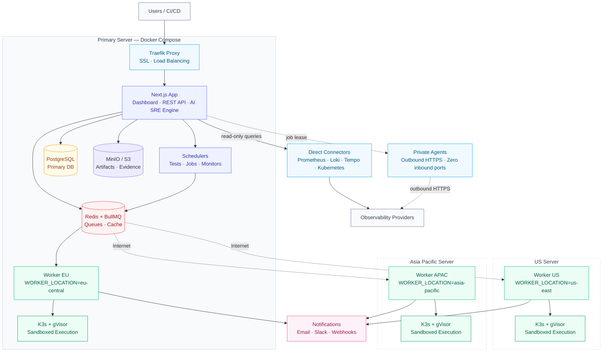

<h1> Supercheck</h1>

**Open-source testing, monitoring, and AI SRE — as code.**

Supercheck brings Playwright test automation, k6 performance testing, uptime and synthetic monitoring, incident investigation, and public status communication into one platform. Use the web application, manage resources from the CLI, and record browser tests with the Supercheck Recorder.

[](https://supercheck.io)
[](https://supercheck.io/docs/app/welcome)
[](https://www.npmjs.com/package/@supercheck/cli)
[](LICENSE)

## What Supercheck includes

- **Test automation:** browser, API, database, custom, and k6 performance tests, with AI-assisted creation and failure analysis.
- **Monitoring:** HTTP, website and SSL, ping, port, and scheduled synthetic browser checks across configured execution locations.
- **Investigation:** run logs, screenshots, traces, linked artifacts, and read-only AI SRE investigation over Supercheck evidence and configured connectors.
- **Communication:** alerts through email, Slack, Discord, Telegram, Microsoft Teams, and webhooks, plus public status pages and subscriber notifications.
- **Governance:** organizations, projects, six RBAC roles, API keys, audit trails, requirements traceability, and coverage snapshots.
- **Secure execution:** ephemeral Kubernetes Jobs, gVisor isolation, network policies, and resource limits for Playwright and k6 workloads.

## Competitive landscape

Supercheck combines capabilities that are commonly split across test automation, synthetic monitoring, load testing, status communication, and incident-investigation products. The comparison below describes each product's primary, natively documented scope; integrations or adjacent products may extend it.

| Platform | Primary focus | Pricing | Test automation | Synthetic / uptime | Load testing | Status pages | AI SRE |
| --- | --- | --- | :---: | :---: | :---: | :---: | :---: |
| **Supercheck** | Unified reliability | Open source | ✅ | ✅ | ✅ | ✅ | ✅ |
| [Checkly](https://www.checklyhq.com/pricing/) | Synthetic monitoring & testing | Free + paid | ✅ | ✅ | — | ✅ | Partial |
| [Datadog](https://www.datadoghq.com/pricing/?product=synthetic-monitoring) | Observability & synthetics | Usage-based SaaS | Partial | ✅ | — | — | Partial |
| [Better Stack](https://betterstack.com/pricing) | Observability & incident management | Free + paid | — | ✅ | — | ✅ | Partial |
| [UptimeRobot](https://uptimerobot.com/pricing/) | Uptime monitoring | Free + paid | — | ✅ | — | ✅ | — |
| [BrowserStack](https://www.browserstack.com/pricing) | Browser & device cloud | Capacity-based SaaS | ✅ | Partial | — | — | Partial |
| [Sauce Labs](https://saucelabs.com/pricing) | Browser & device cloud | Capacity-based SaaS | ✅ | Partial | — | — | Partial |
| [Cypress Cloud](https://www.cypress.io/pricing) | Cypress orchestration | Free + paid | ✅ | — | — | — | Partial |
| [Grafana k6](https://grafana.com/pricing/) | Performance & load testing | Free + usage-based | — | Partial | ✅ | — | Partial |
| [Azure](https://azure.microsoft.com/en-us/pricing/details/app-testing/) | Cloud test execution | Usage-based | ✅ | — | ✅ | — | — |
| [Statuspage](https://www.atlassian.com/software/statuspage/pricing) | Status communication | Free + paid | — | — | — | ✅ | — |
| [Instatus](https://instatus.com/pricing) | Status pages & uptime | Free + paid | — | ✅ | — | ✅ | Partial |
| [HolmesGPT](https://github.com/HolmesGPT/holmesgpt) | AI SRE investigation | Open source | — | Partial | — | — | ✅ |
| [PagerDuty](https://www.pagerduty.com/platform/aiops/) | Event intelligence & response | Commercial SaaS | — | — | — | — | ✅ |
| [Resolve AI](https://resolve.ai/) | AI production ops | Commercial | — | — | — | — | ✅ |

## Get started

### Self-host Supercheck

Production self-hosting requires a Linux server with Docker Compose v2. Supercheck uses local K3s and gVisor for isolated test execution; macOS, Windows, and WSL2 are not supported deployment targets.

```bash
git clone https://github.com/supercheck-io/supercheck.git
cd supercheck/deploy/docker
./init-secrets.sh
sudo bash setup-k3s.sh
KUBECONFIG_FILE=/etc/rancher/k3s/supercheck-worker.kubeconfig docker compose up -d
```

Open `http://localhost:3000`, or follow the [self-hosting guide](https://supercheck.io/docs/app/deployment/self-hosted) to configure HTTPS, optional integrations, backups, and multi-location workers.

### Install the CLI

The CLI requires Node.js 20 or later.

```bash
npm install -g @supercheck/cli
supercheck init
```

Create a token under **Organization Admin > CLI Tokens**, then authenticate:

```bash
supercheck login --token sck_live_...
supercheck pull
supercheck diff
supercheck deploy
```

On-call engineers can also work with AI SRE from the terminal:

```bash
supercheck incident list
supercheck sre triage <incident-id>
supercheck sre investigate <incident-id> --live-connectors
supercheck sre ask "Summarize the strongest evidence" --incident <incident-id>
```

See the [CLI guide](cli/) and [command reference](https://supercheck.io/docs/cli/commands) for resource management, local execution, and CI/CD usage.

### Install the recorder

Record browser interactions and save Playwright tests directly to Supercheck:

- [Chrome Web Store](https://chromewebstore.google.com/detail/supercheck-recorder/gfmbcelfhhfmifdkccnbgdadibdfhioe)
- [Microsoft Edge Add-ons](https://microsoftedge.microsoft.com/addons/detail/supercheck-recorder/0rdckc265vb9)
- [Source and build instructions](recorder/)
- [Recorder documentation](https://supercheck.io/docs/recorder)

## Architecture


```mermaid
flowchart TB
    Users["Users / CI/CD"]

    subgraph PRIMARY["Primary Server — Docker Compose"]
        T["Traefik Proxy<br/>SSL · Load Balancing"]
        App["Next.js App<br/>Dashboard · REST API · AI SRE Engine"]
        Scheduler["Schedulers<br/>Tests · Jobs · Monitors"]
        DB[("PostgreSQL<br/>Primary DB")]
        Redis[("Redis + BullMQ<br/>Queues · Cache")]
        S3[("MinIO / S3<br/>Artifacts · Evidence")]
        W_EU["Worker EU<br/>WORKER_LOCATION=eu-central"]
        K3S_EU["K3s + gVisor<br/>Sandboxed Execution"]

        T --> App
        App --> Scheduler
        App --> DB
        App --> Redis
        App --> S3
        Scheduler --> Redis
        Redis --> W_EU
        W_EU --> K3S_EU
    end

    subgraph US["US Server"]
        W_US["Worker US<br/>WORKER_LOCATION=us-east"] --> K3S_US["K3s + gVisor<br/>Sandboxed Execution"]
    end

    subgraph APAC["Asia Pacific Server"]
        W_APAC["Worker APAC<br/>WORKER_LOCATION=asia-pacific"] --> K3S_APAC["K3s + gVisor<br/>Sandboxed Execution"]
    end

    Users --> T
    Redis -.->|"Internet"| W_US
    Redis -.->|"Internet"| W_APAC
    App -->|"read-only queries"| Direct["Direct Connectors<br/>Prometheus · Loki · Tempo · Kubernetes"]
    App -.->|"job lease"| Private["Private Agents<br/>Outbound HTTPS · Zero inbound ports"]
    Direct --> Providers["Observability Providers"]
    Private -.->|"outbound HTTPS"| Providers
    W_EU --> Notify["Notifications<br/>Email · Slack · Webhooks"]
    W_US --> Notify
    W_APAC --> Notify

    classDef proxy fill:#f0f9ff,stroke:#0ea5e9,color:#075985
    classDef app fill:#eef2ff,stroke:#6366f1,color:#3730a3
    classDef data fill:#fffbeb,stroke:#f59e0b,color:#92400e
    classDef queue fill:#fef2f2,stroke:#ef4444,color:#991b1b
    classDef worker fill:#ecfdf5,stroke:#10b981,color:#065f46
    classDef sandbox fill:#ecfdf5,stroke:#059669,color:#065f46
    classDef connector fill:#f0f9ff,stroke:#0ea5e9,color:#075985
    classDef external fill:#f8fafc,stroke:#64748b,color:#334155
    classDef notify fill:#fdf2f8,stroke:#ec4899,color:#9d174d

    class Users,Providers external
    class T proxy
    class App,Scheduler app
    class DB data
    class Redis queue
    class W_EU,W_US,W_APAC worker
    class K3S_EU,K3S_US,K3S_APAC sandbox
    class Direct,Private connector
    class Notify notify
    style PRIMARY fill:#f8fafc,stroke:#cbd5e1,color:#334155
    style US fill:#ffffff,stroke:#cbd5e1,stroke-dasharray: 4 4,color:#334155
    style APAC fill:#ffffff,stroke:#cbd5e1,stroke-dasharray: 4 4,color:#334155
```

The application stores platform data in PostgreSQL, schedules work through Redis and BullMQ, and keeps execution artifacts in S3-compatible storage such as MinIO. Workers consume location-aware queues and run Playwright or k6 workloads as ephemeral Kubernetes Jobs in a restricted execution namespace. Deploy one local worker or add workers for other configured locations. The AI SRE engine runs inside the app and worker processes and reaches external observability systems through read-only Direct Connectors or outbound-only Private Agents, optionally using a gVisor-sandboxed agent workspace.

## Repository layout

| Path | Purpose | License |
| --- | --- | --- |
| [`app/`](app/) | Next.js web application and API | AGPL-3.0-only |
| [`worker/`](worker/) | NestJS orchestration and execution worker | AGPL-3.0-only |
| [`cli/`](cli/) | `@supercheck/cli` source and documentation | AGPL-3.0-only |
| [`recorder/`](recorder/) | Browser recorder based on Playwright CRX | Apache-2.0 |
| [`docs/`](docs/) | Product and deployment documentation | AGPL-3.0-only |
| [`deploy/`](deploy/) | Docker Compose deployment assets | AGPL-3.0-only |

## Documentation

- [Welcome](https://supercheck.io/docs/app/welcome)
- [Deployment](https://supercheck.io/docs/app/deployment)
- [Automate: tests, jobs, and runs](https://supercheck.io/docs/app/automate)
- [Monitor](https://supercheck.io/docs/app/monitor)
- [Investigate with AI SRE](https://supercheck.io/docs/app/investigate)
- [Communicate: alerts and status pages](https://supercheck.io/docs/app/communicate)
- [Administration](https://supercheck.io/docs/app/admin)
- [CLI](https://supercheck.io/docs/cli/commands)
- [Recorder](https://supercheck.io/docs/recorder)

## Contributing and security

Contributions are welcome. Before opening a pull request, read [CONTRIBUTING.md](CONTRIBUTING.md) and follow the [Code of Conduct](CODE_OF_CONDUCT.md). Governance and release expectations are described in [GOVERNANCE.md](GOVERNANCE.md), and help is listed in [SUPPORT.md](SUPPORT.md).

Use the [issue chooser](https://github.com/supercheck-io/supercheck/issues/new/choose) for reproducible bugs, documentation fixes, and feature requests, and [GitHub Discussions](https://github.com/supercheck-io/supercheck/discussions) for proposals and questions.

Please report vulnerabilities privately as described in [SECURITY.md](SECURITY.md).

## Community integrations

| Integration | Description |
| --- | --- |
| [Azure DevOps](https://marketplace.visualstudio.com/items?itemName=ClinicalSupportSystems.supercheck-integration) | Community-maintained pipeline tasks and dashboard widget |

Community integrations are maintained outside the core Supercheck repository. If you have built one, open a [Discussion](https://github.com/supercheck-io/supercheck/discussions) to share it.

## License

The Supercheck app, worker, CLI, documentation, and deployment assets are licensed under the [GNU Affero General Public License v3.0 only](LICENSE). The recorder remains Apache-2.0; see [`recorder/LICENSE`](recorder/LICENSE), [`recorder/NOTICE`](recorder/NOTICE), and its retained upstream attribution.

## Community

[](https://discord.gg/UVe327CSbm)
[](https://github.com/supercheck-io/supercheck/issues)
[](https://github.com/supercheck-io/supercheck/discussions)
