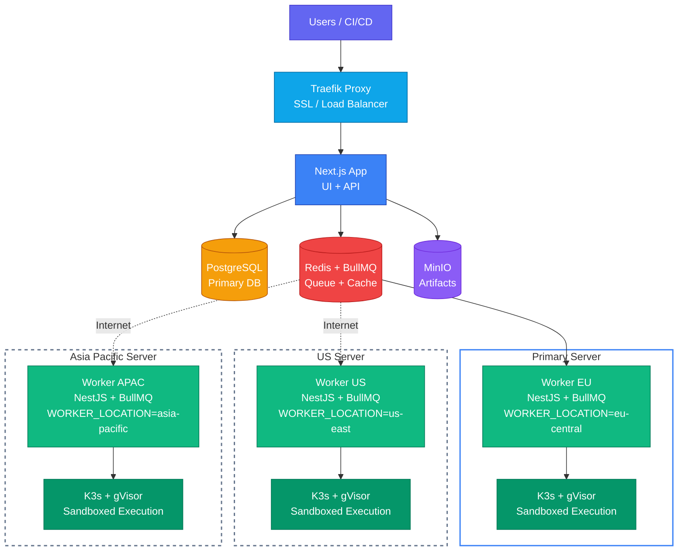

<h1> Supercheck</h1>

**Open-Source Testing, Monitoring, and Reliability — as Code**

The unified platform for AI-powered Playwright testing, multi-region k6 load testing, uptime monitoring, and subscriber-ready status pages.

## Why Supercheck?

Supercheck combines **test automation**, **synthetic + uptime monitoring**, **performance testing**, and **status communication** in one self-hosted platform.

### Competitive landscape

Supercheck is an open-source reliability platform that combines test automation, synthetic and uptime monitoring, k6 performance testing, status pages, and read-only AI SRE investigation. Some competitors cover parts of this workflow, but they usually specialize in one layer: synthetic monitoring, browser/device clouds, load testing, status communication, incident response, or AI incident investigation.

Public pricing changes frequently; check the linked vendor pages for the latest details.

| Platform | Primary focus | Public pricing / model | Test automation | Synthetic / uptime | Load testing | Status pages | AI SRE / incident investigation | Unified AISRE loop | Self-hosted OSS | Notes |
|----------|---------------|------------------------|:---------------:|:------------------:|:------------:|:------------:|:-------------------------------:|:----------------:|:---------------:|-------|
| **Supercheck** | Unified reliability | **Open-source, self-hosted** | ✅ | ✅ | ✅ | ✅ | ✅ | ✅ | ✅ | Tests, monitors, k6, incidents, status communication, native evidence, and read-only AI SRE investigation in one platform. |
| [Checkly](https://www.checklyhq.com/pricing/) | Synthetic monitoring | Free; Starter $24/mo; Team $64/mo when billed annually | ✅ | ✅ | — | ✅ | Partial | — | — | Strong Playwright/API synthetic monitoring and AI root-cause analysis for check failures; not a self-hosted OSS testing + load + SRE platform. |
| [Datadog Synthetic Monitoring](https://www.datadoghq.com/pricing/?product=synthetic-monitoring) | Observability + synthetics | API tests from $5/10K runs; browser tests from $12/1K runs when billed annually | Partial | ✅ | — | — | Partial | — | — | Broad observability suite with synthetics and AI features; pricing and deployment span multiple Datadog products. |
| [Better Stack](https://betterstack.com/pricing) | Incident management + observability | Incident management starts at $29/license/mo when billed annually | — | ✅ | — | ✅ | Partial | — | — | Uptime, on-call, status pages, logs/traces/metrics, and AI SRE/postmortem features; not a test automation or load testing platform. |
| [UptimeRobot](https://uptimerobot.com/pricing/) | Uptime monitoring | Free; Solo from $7/mo; Team from $29/mo when billed annually | — | ✅ | — | ✅ | — | — | — | Affordable uptime/API/status-page monitoring; limited synthetic browser and no native test/load execution. |
| [BrowserStack](https://www.browserstack.com/pricing) | Browser/device cloud | Paid by product and parallel capacity | ✅ | — | — | — | — | — | — | Cross-browser and real-device execution infrastructure; does not own monitoring, incidents, status pages, or AI SRE workflows. |
| [Sauce Labs](https://saucelabs.com/pricing) | Browser/device cloud | Virtual Device Cloud from $149/mo for 1 parallel test when billed annually | ✅ | — | — | — | — | — | — | Automated/manual cross-browser and mobile testing; not a monitoring/status/AISRE system. |
| [Cypress Cloud](https://www.cypress.io/pricing) | Cypress test orchestration | Free; Team from $67/mo; Business from $267/mo when billed annually | ✅ | — | — | — | — | — | — | CI orchestration, analytics, flake detection, and AI test-generation support for Cypress projects. |
| [Grafana k6 Cloud](https://grafana.com/pricing/) | Load testing | Free/paid Grafana Cloud tiers; usage-based k6 capacity | — | Partial | ✅ | — | — | — | — | Excellent load testing and observability integration; does not provide Supercheck's browser/API test, incident, and status-page workflow. |
| [Azure App Testing](https://azure.microsoft.com/en-us/pricing/details/app-testing/) | Cloud test execution | Usage-based Virtual User Hours and Playwright test minutes | ✅ | — | ✅ | — | — | — | — | Azure-native Playwright workspaces and load testing; not a standalone self-hosted reliability platform. |
| [Statuspage](https://www.atlassian.com/software/statuspage/pricing) | Status communication | Free; Hobby $29/mo; Startup $99/mo; Business $399/mo | — | — | — | ✅ | — | — | — | Mature hosted status pages and subscriber communication; monitoring/investigation require other tools. |
| [Instatus](https://instatus.com/pricing) | Status pages + monitoring | Free; paid plans by monitor/status-page capacity | — | ✅ | — | ✅ | — | — | — | Lightweight status pages, on-call, and monitoring; not a test/load/AISRE platform. |
| [HolmesGPT](https://github.com/HolmesGPT/holmesgpt) | AI SRE agent | Open-source | — | Partial | — | — | ✅ | — | ✅ | CNCF Sandbox SRE agent for incident investigation across observability tools; not a testing, monitoring, load, and status-page product. |
| [PagerDuty AIOps](https://www.pagerduty.com/platform/aiops/) | Incident response + AIOps | SaaS; trial / sales-led plans | — | — | — | — | Partial | — | — | Alert correlation, event enrichment, automation, and incident response; depends on external monitors/tests. |
| [Resolve AI](https://resolve.ai/) | AI SRE / production agents | Sales-led | — | — | — | — | ✅ | — | — | AI agents for on-call, incidents, and operational tasks; focused on production investigation/operations rather than Supercheck's test-monitor-verify loop. |

## Features

### Test Automation

- **Browser Tests** — Playwright UI automation with screenshots, traces, and video
- **API Tests** — HTTP/GraphQL request + response validation
- **Database Tests** — SQL/DB validation workflows in custom test scripts
- **Performance Tests** — k6 load testing with regional execution support
- **Custom Tests** — Node.js-based custom test logic

### Monitoring

- **HTTP / Website** — Endpoint monitoring with SSL certificate tracking
- **Ping / Port** — Network-level availability checks
- **Synthetic Monitors** — Scheduled Playwright browser journeys
- **Multi-Region** — US East, EU Central, Asia Pacific execution options

### AI Workflows

- **AI Create** — Generate tests from natural language
- **AI Fix** — Analyze failures and propose fixes
- **AI Analyze** — Analyze monitor, job, and performance run outcomes
- **AI SRE Investigation** — Read-only triage over native evidence, connectors, incidents, monitor history, and execution artifacts

### Debugging & Reporting

- **Screenshots, traces, video, and logs** for fast failure diagnosis
- **Report artifacts** stored in object storage with run linkage

### Communication

- **Alerts** — Email, Slack, Discord, Telegram, Teams, and Webhooks
- **Status Pages** — Public-facing service status with incident workflows
- **Dashboards** — Real-time visibility into run and monitor health

### Administration & Governance

- **Organizations + Projects** — Multi-tenant workspace model
- **RBAC** — 6 role levels from `super_admin` to `project_viewer`
- **API Keys** — Programmatic access
- **Audit Trails** — Change and action history

### Execution Security

- **gVisor Sandboxing** — Test execution runs in ephemeral Kubernetes Jobs under gVisor for kernel-level syscall isolation
- **Network Segmentation** — Execution pods are restricted from accessing internal services and cloud metadata endpoints
- **Resource Quotas** — Per-namespace limits prevent runaway test pods from exhausting cluster resources

### Requirements Management

- **AI extraction** from requirement documents (PDF, DOCX, text)
- **Coverage snapshots** linked to test execution outcomes
- **Requirement-to-test linking** with traceability metadata

### Browser Extensions

Record Playwright tests directly from your browser:

- [Chrome Extension](https://chromewebstore.google.com/detail/supercheck-recorder/gfmbcelfhhfmifdkccnbgdadibdfhioe)
- [Edge Extension](https://microsoftedge.microsoft.com/addons/detail/supercheck-recorder/0rdckc265vb9)

## Architecture

```mermaid
flowchart TB
    Users[Users / CI/CD] --> T[Traefik Proxy<br/>SSL / Load Balancer]
    T --> App[Next.js App<br/>UI + API]
    App --> DB[(PostgreSQL<br/>Primary DB)] & Redis[(Redis + BullMQ<br/>Queue + Cache)] & S3[(MinIO<br/>Artifacts)]

    Redis --> W_EU
    Redis -.->|Internet| W_US
    Redis -.->|Internet| W_APAC

    subgraph PRIMARY["Primary Server"]
        W_EU[Worker EU<br/>NestJS + BullMQ<br/>WORKER_LOCATION=eu-central] --> K3S_EU[K3s + gVisor<br/>Sandboxed Execution]
    end

    subgraph US["US Server"]
        W_US[Worker US<br/>NestJS + BullMQ<br/>WORKER_LOCATION=us-east] --> K3S_US[K3s + gVisor<br/>Sandboxed Execution]
    end

    subgraph APAC["Asia Pacific Server"]
        W_APAC[Worker APAC<br/>NestJS + BullMQ<br/>WORKER_LOCATION=asia-pacific] --> K3S_APAC[K3s + gVisor<br/>Sandboxed Execution]
    end

    style Users fill:#6366f1,stroke:#4338ca,color:#fff
    style T fill:#0ea5e9,stroke:#0369a1,color:#fff
    style App fill:#3b82f6,stroke:#1e40af,color:#fff
    style DB fill:#f59e0b,stroke:#b45309,color:#fff
    style Redis fill:#ef4444,stroke:#b91c1c,color:#fff
    style S3 fill:#8b5cf6,stroke:#6d28d9,color:#fff
    style W_EU fill:#10b981,stroke:#047857,color:#fff
    style W_US fill:#10b981,stroke:#047857,color:#fff
    style W_APAC fill:#10b981,stroke:#047857,color:#fff
    style K3S_EU fill:#059669,stroke:#047857,color:#fff
    style K3S_US fill:#059669,stroke:#047857,color:#fff
    style K3S_APAC fill:#059669,stroke:#047857,color:#fff
    style PRIMARY fill:none,stroke:#3b82f6,stroke-width:2px
    style US fill:none,stroke:#64748b,stroke-width:2px,stroke-dasharray: 5 5
    style APAC fill:none,stroke:#64748b,stroke-width:2px,stroke-dasharray: 5 5
```

Each server runs its own local [K3s](https://k3s.io) cluster with [gVisor](https://gvisor.dev/) sandboxing. Workers consume jobs from Redis via BullMQ and execute each test as an ephemeral Kubernetes Job in a sandboxed execution namespace. Remote workers connect to the primary server's Redis, PostgreSQL, and MinIO over the network. Deploy workers in a [single location](https://supercheck.io/docs/app/deployment/self-hosted) or across [multiple regions](https://supercheck.io/docs/app/deployment/multi-location).

## Deployment

Self-host Supercheck on your own infrastructure. Docker Compose handles the app, worker, and data services while a local K3s cluster provides gVisor-sandboxed test execution:

| Option | Description | Guide |
|--------|-------------|-------|
|  | Docker Compose + K3s self-hosted deployment | [Read guide](https://supercheck.io/docs/app/deployment/self-hosted) |

## Documentation

Official docs:

- [Welcome](https://supercheck.io/docs/app/welcome)
- [Deployment](https://supercheck.io/docs/app/deployment)
- [Automate (Tests, Jobs, Runs)](https://supercheck.io/docs/app/automate)
- [Monitor](https://supercheck.io/docs/app/monitor)
- [Investigate (AI SRE)](https://supercheck.io/docs/app/investigate)
- [Communicate (Alerts, Status Pages)](https://supercheck.io/docs/app/communicate)
- [Admin](https://supercheck.io/docs/app/admin)
- [CLI Reference](https://supercheck.io/docs/cli/commands)
- [Contributing](CONTRIBUTING.md)

## Supercheck CLI

Install and manage Supercheck resources from the command line with `@supercheck/cli`:

- [npm package](https://www.npmjs.com/package/@supercheck/cli)
- [source](cli/)

## Supercheck Recorder

Record browser interactions and save Playwright tests directly to Supercheck:

- [Chrome Web Store](https://chromewebstore.google.com/detail/supercheck-recorder/gfmbcelfhhfmifdkccnbgdadibdfhioe)
- [source and build instructions](recorder/)

## Community Integrations

Community-built tools and extensions that extend Supercheck:

| Integration | Description |
|-------------|-------------|
| [Azure DevOps](https://marketplace.visualstudio.com/items?itemName=ClinicalSupportSystems.supercheck-integration) | Azure DevOps pipeline tasks and a dashboard widget |

This extension is community-built and maintained outside the core Supercheck repository.

> Built an integration? Open a [Discussion](https://github.com/supercheck-io/supercheck/discussions) and we'll add it here.

## Support

If Supercheck is useful to your team:

- ⭐ Star this repository
- 💡 Suggest features in [Discussions](https://github.com/supercheck-io/supercheck/discussions)
- 🐞 Report issues in [Issues](https://github.com/supercheck-io/supercheck/issues)

## License and Contributions

The Supercheck app, worker, CLI, and documentation are open source under the [GNU Affero General Public License v3.0 only](LICENSE). The recorder remains Apache-2.0; its license and upstream attribution are in [`recorder/LICENSE`](recorder/LICENSE) and [`recorder/NOTICE`](recorder/NOTICE). We welcome external contributions. Use [GitHub Discussions](https://github.com/supercheck-io/supercheck/discussions) for proposals and [GitHub Issues](https://github.com/supercheck-io/supercheck/issues) for reproducible bugs. See [CONTRIBUTING.md](CONTRIBUTING.md) for contribution guidance and [SECURITY.md](SECURITY.md) for private vulnerability reporting.

## Community

