<div align="center">
  
  
  # Supercheck

**Automation & Monitoring Platform for Modern Applications**

</div>

[Supercheck](https://supercheck.io) is a modern distributed platform built for scalability, reliability, and enterprise-grade security. It enables comprehensive automation testing with real-time monitoring, intelligent job scheduling, and parallel test execution, giving teams a robust and resilient solution to accelerate quality and delivery.

[](./docker-compose.yml)
[](LICENSE)

## 🚀 Quick Start

### Prerequisites

- [Docker Desktop](https://www.docker.com/products/docker-desktop/) (or alternative like [Orbstack](https://orbstack.dev))
- At least 4GB of available RAM
- At least 10GB of available disk space

### 1. Clone and Setup

```bash
git clone https://github.com/supercheck-io/supercheck.git
cd supercheck
```

### 2. Start Application Services

```bash
# Start the full application stack
docker-compose up -d
```

### 3. Access the Application

```bash
# Main app
http://localhost:3000
```

### 4. Stop Application Services

```bash
# Stop the full application stack
docker-compose down
```

## ⚙️ Configuration

### Important Environment Variables

Key configuration options in `docker-compose.yml`:

```bash
# Capacity Management
RUNNING_CAPACITY=5     # Max concurrent test/job executions (visible in app header)
QUEUED_CAPACITY=50     # Max queued jobs
TEST_EXECUTION_TIMEOUT_MS=120000    # Test execution timeout in milliseconds (2 mins)
JOB_EXECUTION_TIMEOUT_MS=900000     # Job execution timeout in milliseconds (15 mins)

# Security
SUPER_ADMIN_EMAILS=admin@example.com   # Comma-separated super admin emails

# Monitor Configuration
RECENT_MONITOR_RESULTS_LIMIT=5000   # Checks limit for 'Recent Check Results' table

# Playwright Configuration
PLAYWRIGHT_RETRIES=1
PLAYWRIGHT_TRACE=on         # Other options - 'off', 'on-first-retry'
PLAYWRIGHT_SCREENSHOT=on    # Other options - 'off', 'on-first-retry'
PLAYWRIGHT_VIDEO=on         # Other options - 'off', 'on-first-retry'

# Browser support (disabled by default for performance)
ENABLE_FIREFOX=false
ENABLE_WEBKIT=false
ENABLE_MOBILE=false

# SMTP Email Configuration
SMTP_HOST=smtp.gmail.com
SMTP_PORT=587
SMTP_USER=test@gmail.com
SMTP_PASSWORD=your-app-password
SMTP_FROM_EMAIL=test@gmail.com

# Notification Channel Limits
MAX_JOB_NOTIFICATION_CHANNELS=10
MAX_MONITOR_NOTIFICATION_CHANNELS=10
NEXT_PUBLIC_MAX_JOB_NOTIFICATION_CHANNELS=10       # Same variable but required by browser client hence has NEXT_PUBLIC prefix
NEXT_PUBLIC_MAX_MONITOR_NOTIFICATION_CHANNELS=10
```

### Production Security

**Critical Security Variables (Must Change in Production):**

- `REDIS_PASSWORD`
- `BETTER_AUTH_SECRET`
- `VARIABLES_ENCRYPTION_KEY`
- `CREDENTIAL_ENCRYPTION_KEY`
- `SMTP_PASSWORD`

## 📚 Usage

### 🧪 Creating Tests

1. Navigate to the Tests section
2. Click "New Test" to create a Playwright test
3. Write your test script or use the recorder
4. Run the test
5. If test passes you will be able to save test

### 📊 Setting Up Monitoring

1. Go to the Monitors section
2. Choose a Monitor type (HTTP Request, Website, Port or Ping) and fill form
3. Configure check intervals and alert thresholds
4. Set up notification channels (email, webhooks, Slack etc)

### 📈 Using the Dashboard

1. Navigate to the main Dashboard for system overview
2. View overall project status and metrics
3. Monitor system health and performance indicators
4. Track recent activity across tests, jobs, and monitors

### ⏰ Managing Jobs

1. Go to the Jobs section to schedule automated test execution
2. Create new jobs with cron-based scheduling (optional)
3. Link jobs to existing test/tests
4. Monitor job run execution history and status

### 📋 Viewing Test Runs

1. Navigate to the Runs section for execution history
2. Filter runs by test, status, date range, or execution type
3. View detailed run reports with logs and artifacts
4. View Playwright report, video and traces
5. Analyze performance trends and failure patterns

### 🎮 Using the Playground

1. Access the Playground for interactive test creation
2. Choose test type=Browser Test, API Test, Database Test, or Custom Test
3. Write or edit test scripts with real-time syntax highlighting
4. Run tests immediately with live feedback
5. Save successful tests to your test library or Delete tests

### 🏢 Organization Administration

1. Access the Organization Admin panel at `/org-admin`
2. Manage organization members and their roles
3. Configure organization-wide settings and preferences
4. Monitor organization usage and capacity

### 🔧 Super Admin Management

1. Access the Super Admin Dashboard at `/super-admin`
2. View system-wide statistics and user activity
3. Manage user roles and permissions across all organizations
4. Impersonate users for support and testing purposes

### ♾️ CI/CD Remote Job Trigger

```bash
# Get API key from the Jobs section by editing a specific job
curl -H "Authorization=Bearer your-api-key" \
     -X POST http://localhost:3000/api/jobs/[job-id]/trigger \
     -H "Content-Type=application/json"
```

## 🔐 Security Features

### Role-Based Access Control (RBAC)

### The 6 Unified Roles

1. **SUPER_ADMIN** (`super_admin`) - System-wide access
2. **ORG_OWNER** (`org_owner`) - Full organization control
3. **ORG_ADMIN** (`org_admin`) - Organization management
4. **PROJECT_ADMIN** (`project_admin`) - Full project administration within assigned projects
5. **PROJECT_EDITOR** (`project_editor`) - Project-specific editing
6. **PROJECT_VIEWER** (`project_viewer`) - Read-only access

### Role Hierarchy & Access Levels


### Current Permission Matrix

| Resource              | Super Admin | Org Owner | Org Admin | Project Admin          | Project Editor         | Project Viewer         |
| --------------------- | ----------- | --------- | --------- | ---------------------- | ---------------------- | ---------------------- |
| Users (ban/unban)     | ✅          | ❌        | ❌        | ❌                     | ❌                     | ❌                     |
| Organizations         | ✅          | ✅ (own)  | ✅ (own)  | 👁️ (view)              | 👁️ (view)              | 👁️ (view)              |
| Organization Members  | ✅          | ✅        | ✅        | 👁️ (view)              | 👁️ (view)              | 👁️ (view)              |
| Projects              | ✅          | ✅        | ✅        | ✅ (assigned)          | 👁️ (assigned)          | 👁️ (assigned)          |
| Project Members       | ✅          | ✅        | ✅        | ✅ (assigned projects) | 👁️ (assigned projects) | 👁️ (assigned projects) |
| Jobs                  | ✅          | ✅        | ✅        | ✅ (assigned projects) | ✏️ (assigned projects) | 👁️ (assigned projects) |
| Tests                 | ✅          | ✅        | ✅        | ✅ (assigned projects) | ✏️ (assigned projects) | 👁️ (assigned projects) |
| Monitors              | ✅          | ✅        | ✅        | ✅ (assigned projects) | ✏️ (assigned projects) | 👁️ (assigned projects) |
| Runs                  | ✅          | ✅        | ✅        | ✅ (assigned projects) | 👁️ (assigned projects) | 👁️ (assigned projects) |
| API Keys              | ✅          | ✅        | ✅        | ✅ (assigned projects) | ✏️ (assigned projects) | ❌                     |
| Notifications         | ✅          | ✅        | ✅        | ✅ (assigned projects) | ✏️ (assigned projects) | 👁️ (assigned projects) |
| Tags                  | ✅          | ✅        | ✅        | ✅ (assigned projects) | ✏️ (assigned projects) | 👁️ (assigned projects) |
| **Variables/Secrets** |
| Variable Create/Edit  | ✅          | ✅        | ✅        | ✅ (assigned projects) | ✅ (assigned projects) | ❌                     |
| Variable Delete       | ✅          | ✅        | ✅        | ✅ (assigned projects) | ❌                     | ❌                     |
| Secret Values View    | ✅          | ✅        | ✅        | ✅ (assigned projects) | ❌                     | ❌                     |

Legend=✅ = Full Access, ✏️ = Create/Edit Only (no delete), 👁️ = View Only, ❌ = No Access

### Security Best Practices

- Database audit logging for all security events
- Rate limiting on admin operations
- Session token hashing and validation
- Comprehensive permission checking
- Secure impersonation with context switching

## 🏢 Organization and Project System

### Overview

Supercheck uses a hierarchical multi-tenancy model with organizations containing projects. This provides secure resource isolation and flexible team collaboration while maintaining proper data segregation.

### Architecture

#### **Three-Level Hierarchy**

```
System Level → Organization Level → Project Level
     ↓              ↓                    ↓
Super Admin → Org Owner/Admin → Project Admin/Editor/Viewer
```

#### **Automatic Setup**

- **New User Registration**=Automatically creates a default organization and project
- **Default Organization**=Named after the user or custom name
- **Default Project**=Named "Default Project" within the organization
- **Role Assignment**=User becomes the owner of both organization and project

### Organization Management

#### **Key Features**

- **Multi-Organization Support**=Users can belong to multiple organizations
- **Organization Switching**=Session-based context switching between organizations
- **Member Management**=Invite, manage, and assign roles to organization members
- **Resource Isolation**=Complete data separation between organizations
- **Admin Oversight**=Super admins can view and manage all organizations

#### **Organization Roles**

- **Org Owner** (`org_owner`)=Full organization control including deletion
- **Org Admin** (`org_admin`)=Organization management without deletion rights

### Project Management

#### **Key Features**

- **Project-Scoped Resources**=Tests, jobs, monitors, variables are scoped to projects
- **Project Switching**=Session-based context switching within the active organization
- **Member Assignment**=Granular assignment of users to specific projects
- **Default Project**=Every organization has a default project for immediate use
- **Resource Limits**=Configurable limits on projects per organization

#### **Project Roles**

- **Project Admin** (`project_admin`)=Full project control and member management
- **Project Editor** (`project_editor`)=Create and edit resources, no delete permissions
- **Project Viewer** (`project_viewer`)=Read-only access to all project resources

### Session-Based Context Management

#### **Active Context**

- **Active Organization**=Current organization in user session
- **Active Project**=Current project within the active organization
- **Context Switching**=API endpoints for switching between organizations and projects
- **Impersonation Support**=Admin impersonation preserves organization and project context

### Data Scoping and Security

#### **Resource Isolation**

- **Organization Isolation**=Complete data separation between organizations
- **Project Scoping**=All resources (tests, jobs, monitors, variables) scoped to projects
- **Cross-Project Protection**=No accidental access to resources across projects
- **Audit Trail**=Complete tracking of all organization and project activities

#### **Permission Inheritance**

- **Organization Roles**=Higher organization roles inherit project permissions
- **Project Assignment**=Project-specific roles only apply to assigned projects
- **Super Admin Override**=System-level access bypasses organization/project restrictions

### Configuration Limits

```bash
# Organization & Project Limits (Configurable)
MAX_PROJECTS_PER_ORG=10                  # Maximum projects per organization (default=10)

# Default Settings
DEFAULT_PROJECT_NAME="Default Project"   # Name for auto-created projects
```

## 🔑 Variables and Secrets Management

### Overview

Supercheck provides a comprehensive variable and secret management system for secure handling of configuration data and sensitive information across your testing and monitoring projects.

### Key Features

- **Project-Scoped Variables**=Variables are isolated within projects for better organization
- **Encrypted Secrets**=Sensitive data is encrypted using AES-256-GCM encryption
- **Role-Based Access Control**=Different permission levels for viewing, creating, editing, and deleting variables
- **Audit Trail**=Complete tracking of variable creation and modifications
- **Test Integration**=Easy access to variables in test scripts using helper functions

### Variable Types

#### **Regular Variables**

- Plain text configuration values
- Visible to all project members with appropriate permissions
- Used for non-sensitive configuration like URLs, usernames, timeouts

#### **Secret Variables**

- Encrypted at rest using AES-256-GCM encryption
- Values masked in the UI for security
- Only visible to users with management permissions
- Used for sensitive data like passwords, API keys, tokens

### Access Control Matrix

| Role               | View Variables         | Create/Edit Variables  | Delete Variables       | View Secret Values     |
| ------------------ | ---------------------- | ---------------------- | ---------------------- | ---------------------- |
| **Super Admin**    | ✅                     | ✅                     | ✅                     | ✅                     |
| **Org Owner**      | ✅                     | ✅                     | ✅                     | ✅                     |
| **Org Admin**      | ✅                     | ✅                     | ✅                     | ✅                     |
| **Project Admin**  | ✅ (assigned projects) | ✅ (assigned projects) | ✅ (assigned projects) | ✅ (assigned projects) |
| **Project Editor** | ✅ (assigned projects) | ✅ (assigned projects) | ❌                     | ❌                     |
| **Project Viewer** | ✅ (assigned projects) | ❌                     | ❌                     | ❌                     |

### Usage in Tests

Variables can be accessed in Playwright test scripts using built-in helper functions:

```javascript
// Access regular variables
const apiUrl = await getVariable("API_URL");
const timeout = await getVariable("REQUEST_TIMEOUT");

// Access encrypted secrets
const apiKey = await getSecret("API_KEY");
const password = await getSecret("USER_PASSWORD");

// Use in your tests
await page.goto(apiUrl);
await page.fill('[name="password"]', password);
```

## 🚨 Alerts and Notifications System

### Overview

Supercheck includes a sophisticated multi-channel alerting system that keeps your team informed about job failures, monitor status changes, and system events through various notification providers.

### Supported Notification Providers

#### **Email**

- **Configuration**=SMTP-based email delivery

#### **Slack**

- **Configuration**=Webhook URL and channel configuration

#### **Webhook**

- **Configuration**=Custom URL, HTTP method, headers, and payload

#### **Telegram**

- **Configuration**=Bot token and chat ID

#### **Discord**

- **Configuration**=Discord webhook URL

### Alert Types

#### **Monitor Alerts**

- **Failure Alerts**=Sent when monitors change from 'up' to 'down' status
- **Recovery Alerts**=Sent when monitors return from 'down' to 'up' status
- **SSL Expiration Alerts**=Warnings for expiring SSL certificates

#### **Job Alerts**

- **Failure Alerts**=Triggered when test jobs fail
- **Success Alerts**=Confirmation when critical jobs complete successfully
- **Timeout Alerts**=Notifications for jobs that exceed time limits

### Smart Alert Management

#### **Threshold-Based Alerting**

- **Failure Threshold**=Number of consecutive failures before alerting (prevents false positives)
- **Recovery Threshold**=Number of consecutive successes before recovery alerts
- **Configurable Sensitivity**=Different thresholds for different monitors/jobs

#### **Alert Limiting**

- **Maximum 3 failure alerts** per failure sequence to prevent notification spam
- **Unlimited recovery alerts** to ensure resolution visibility
- **Status change detection** for intelligent alert triggers

### Alert History and Monitoring

- **Complete audit trail** of all sent notifications
- **Delivery status tracking** for each notification provider
- **Failed delivery logging** with error details and retry information
- **Alert frequency analysis** to optimize threshold settings

# Core Service Interactions

## ⚙️ **Test Execution Workflow (Playground)**

```mermaid
sequenceDiagram
    participant U as 👤 User
    participant F as 🖥️ Next.js Frontend
    participant V as 🔍 Validation API
    participant Q as 📨 Redis/BullMQ
    participant W as ⚡ NestJS Worker
    participant E as ⚙️ Execution Service
    participant P as 🎭 Playwright Runner
    participant D as 🗄️ PostgreSQL
    participant S as 📦 MinIO/S3 Storage
    participant R as 🚥 Redis Pub/Sub

    Note over U,R: Single Test Execution Flow (Playground)

    %% Script Validation Phase
    U->>F: Write test code & click "Run Test"
    F->>V: POST /api/validate-script
    V-->>F: Validation response

    alt Script validation fails
        F-->>U: Show validation errors
    else Script validation passes
        %% Test Creation & Queuing
        F->>F: Generate unique testId
        F->>D: Create test record (status: pending)
        F->>Q: Add to 'test-execution' queue
        Q-->>F: Job queued successfully
        F-->>U: Test started (show loading state)

        %% SSE Connection Setup
        F->>F: Open SSE /api/test-status/events/[testId]
        F->>R: Subscribe to test channels
        R-->>F: SSE connection established

        %% Worker Processing
        Q->>W: TestExecutionProcessor picks up job
        activate W
        W->>D: Update test status (running)
        W->>R: Publish status event
        R-->>F: SSE: status='running'
        F-->>U: Update UI (running state)

        %% Test Execution
        W->>E: Call runSingleTest()
        activate E
        E->>E: Create unique run directory
        E->>E: Generate test script file
        E->>E: Configure Playwright settings
        E->>P: Execute test with Playwright
        activate P
        P->>P: Run browser automation
        P->>P: Generate screenshots/videos
        P->>P: Create HTML report
        P->>P: Generate trace files
        P-->>E: Execution results
        deactivate P

        %% Result Processing
        E->>E: Process test artifacts
        E->>S: Upload report & artifacts
        S-->>E: Upload complete
        E->>D: Create report record
        E-->>W: Test execution complete
        deactivate E

        %% Completion & Cleanup
        W->>D: Update test status (completed/failed)
        W->>R: Publish completion event
        deactivate W
        R-->>F: SSE: test complete
        F->>F: Close SSE connection
        F-->>U: Show completion toast

        %% Report Viewing
        U->>F: Click "View Report"
        F->>F: GET /api/test-results/[...path]
        F->>S: Fetch report files
        S-->>F: Report content
        F-->>U: Display interactive report
    end
```



## 🕒 **Job Execution Workflow (Multi-Test Jobs)**

```mermaid
sequenceDiagram
    participant U as 👤 User
    participant F as 🖥️ Next.js Frontend
    participant A as 🔐 Auth Service
    participant V as 🔧 Variable Resolver
    participant Q as 📨 Redis/BullMQ
    participant W as ⚡ NestJS Worker
    participant E as ⚙️ Execution Service
    participant P as 🎭 Playwright Runner
    participant D as 🗄️ PostgreSQL
    participant S as 📦 MinIO/S3 Storage
    participant R as 🚥 Redis Pub/Sub
    participant N as 📢 Notification Service

    Note over U,N: Multi-Test Job Execution Flow

    %% Job Initiation
    U->>F: Select job & click "Run Job"
    F->>A: Validate user session
    A-->>F: User authorized

    %% Job Setup & Validation
    F->>D: Fetch job details & associated tests
    D-->>F: Job configuration & test list
    F->>V: Resolve project variables/secrets
    V->>D: Fetch project variables
    D-->>V: Variable data
    V-->>F: Resolved variables & secrets

    %% Capacity Check & Queuing
    F->>Q: Check queue capacity
    alt Capacity exceeded
        Q-->>F: HTTP 429 - Too Many Requests
        F-->>U: Show capacity limit error
    else Capacity available
        F->>D: Create run record (status: pending)
        F->>Q: Add to 'job-execution' queue
        Q-->>F: Job queued (runId)
        F-->>U: Job started (loading state)

        %% SSE Connection
        F->>F: Open SSE /api/job-status/events/[runId]
        F->>R: Subscribe to job channels
        R-->>F: SSE connection established

        %% Worker Processing
        Q->>W: JobExecutionProcessor picks up job
        activate W
        W->>D: Update run status (running)
        W->>R: Publish job status event
        R-->>F: SSE: status='running'
        F-->>U: Update UI (running state)

        %% Parallel Test Execution
        loop For each test in job
            W->>E: Execute individual test
            activate E
            E->>E: Create test run directory
            E->>E: Inject resolved variables
            E->>E: Apply job configuration
            E->>P: Execute test with Playwright
            activate P
            P->>P: Run browser automation
            P->>P: Generate test artifacts
            P-->>E: Individual test result
            deactivate P
            E->>S: Upload test artifacts
            E->>D: Save individual test result
            E->>R: Publish test progress
            R-->>F: SSE: individual test status
            F-->>U: Update test progress
            deactivate E
        end

        %% Job Completion Processing
        W->>E: Generate consolidated job report
        E->>S: Upload job report
        E->>D: Update run status (completed/failed)

        %% Notification Processing
        alt Job has alert configuration
            W->>N: Process job notifications
            activate N
            N->>D: Fetch notification providers
            N->>N: Generate alert messages
            N->>N: Send notifications (email/slack/webhook)
            N->>D: Log notification history
            deactivate N
        end

        W->>R: Publish job completion
        deactivate W
        R-->>F: SSE: job complete
        F->>F: Close SSE connection
        F-->>U: Show completion notification

        %% Report Access
        U->>F: View job results
        F->>D: Fetch run details & test results
        D-->>F: Consolidated job data
        F->>S: Fetch job report files
        S-->>F: Report artifacts
        F-->>U: Display job results dashboard
    end
```



## 🌐 **Monitor Execution Workflow (Automated Monitoring)**

```mermaid
sequenceDiagram
    participant S as ⏰ Job Scheduler
    participant Q as 📨 Redis/BullMQ
    participant W as ⚡ NestJS Worker
    participant M as 👀 Monitor Service
    participant H as 🌐 HTTP Client
    participant P as 📡 Ping Service
    participant T as 🔌 Port Scanner
    participant D as 🗄️ PostgreSQL
    participant R as 🚥 Redis Pub/Sub
    participant A as 📢 Alert Service
    participant N as 📧 Notification Providers

    Note over S,N: Automated Monitor Execution Flow

    %% Scheduled Trigger
    S->>S: Cron schedule triggers
    S->>Q: Add monitor job to 'monitor-execution' queue
    Q->>W: MonitorProcessor picks up job

    activate W
    W->>D: Fetch monitor configuration
    D-->>W: Monitor settings & alert config

    %% Check if Monitor is Active
    alt Monitor is paused or disabled
        W->>W: Skip execution
        W-->>Q: Job completed (skipped)
    else Monitor is active
        W->>M: Execute monitor check
        activate M

        %% Different Monitor Types
        alt Monitor type: HTTP Request
            M->>H: Perform advanced HTTP/HTTPS request
            activate H
            H->>H: Send request with custom headers/auth
            H->>H: Support custom methods (GET/POST/PUT/etc)
            H->>H: Validate custom status codes
            H->>H: Check keyword in response
            H->>H: Measure response time
            H-->>M: HTTP check results
            deactivate H

        else Monitor type: Website
            M->>H: Perform simplified website check
            activate H
            H->>H: GET request to URL (default)
            H->>H: Check response with 200-299 status
            H->>H: Verify SSL certificate (if enabled)
            H->>H: Measure response time
            H-->>M: Website check results
            deactivate H

        else Monitor type: Ping Host
            M->>P: Perform ICMP ping
            activate P
            P->>P: Send ping packets
            P->>P: Measure response time
            P->>P: Calculate packet loss
            P-->>M: Ping results
            deactivate P

        else Monitor type: Port Check
            M->>T: Check port accessibility
            activate T
            T->>T: Attempt TCP/UDP connection
            T->>T: Measure connection time
            T-->>M: Port check results
            deactivate T
        end

        %% Result Processing
        M->>M: Process monitor results
        M->>D: Fetch previous monitor status
        D-->>M: Historical status data
        M->>M: Determine status change (up/down)
        M->>D: Save monitor result
        M->>D: Update monitor status
        deactivate M

        %% Alert Processing
        alt Status change detected OR Alert conditions met
            W->>A: Trigger alert processing
            activate A
            A->>D: Fetch alert configuration
            A->>A: Check failure/recovery thresholds
            A->>A: Evaluate alert conditions

            alt Alert should be sent
                A->>D: Fetch notification providers
                D-->>A: Provider configurations

                loop For each notification provider
                    A->>N: Send notification
                    activate N
                    N->>N: Format alert message
                    N->>N: Send via provider (email/slack/webhook)
                    N-->>A: Delivery status
                    deactivate N
                end

                A->>D: Log alert history
                A->>D: Update alert counters
            end
            deactivate A
        end

        %% Real-time Updates (if applicable)
        W->>R: Publish monitor status update
        R-->>R: Notify active SSE connections

        %% SSL Certificate Alerts (if enabled)
        alt SSL certificate expiring soon
            W->>A: Trigger SSL expiration alert
            A->>N: Send SSL warning notifications
            A->>D: Log SSL alert
        end
    end

    deactivate W
    Q-->>S: Monitor execution complete
    S->>S: Schedule next monitor execution
```



## 🙏 Acknowledgments

Special thanks to the exceptional open-source projects that make Supercheck possible:

- [Next.js](https://nextjs.org/) - Full-stack React framework for building fast, scalable web applications
- [NestJS](https://nestjs.com/) - Scalable framework for server-side applications
- [Playwright](https://playwright.dev/) - End-to-end testing framework
- [PostgreSQL](https://postgresql.org/) - Advanced relational database
- [Redis](https://redis.io/) - In-memory database
- [BullMQ](https://bullmq.io/) - Robust job/message queue for Node.js
- [MinIO](https://min.io/) - S3-compatible object storage
- [Shadcn/ui](https://ui.shadcn.com/) - UI components
- [Better Auth](https://better-auth.com/) - Authentication system

---
