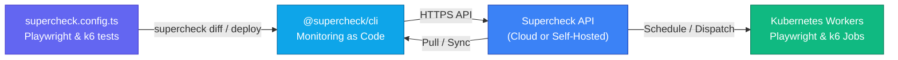

<h1> Supercheck CLI</h1>

**Open-source testing, monitoring, and AI SRE — as code.**

The Supercheck CLI provides a first-class command-line interface for managing testing and monitoring infrastructure as code. Designed for CI/CD pipelines, GitOps workflows, and local development, it enables teams to version, validate, and deploy monitors, tests, scheduled jobs, variables, tags, and status pages alongside their application source code.

[](https://supercheck.io)
[](https://supercheck.io/docs/cli/commands)
[](https://www.npmjs.com/package/@supercheck/cli)
[](../LICENSE)

---

## What the Supercheck CLI includes

- **Monitoring-as-Code**: Define monitors, Playwright tests, k6 load tests, jobs, and status pages in TypeScript with full type safety (`supercheck.config.ts`).
- **GitOps & Declarative Sync**: Preview changes with `supercheck diff`, apply updates with `supercheck deploy`, and pull existing cloud state with `supercheck pull`.
- **CI/CD Automation**: Trigger scheduled or on-demand jobs with trigger keys and poll execution results directly from GitHub Actions, GitLab CI, or Jenkins (`supercheck job trigger --wait`).
- **Unified Resource Management**: Complete command suite for tests, monitors, jobs, execution runs, variables, secrets, tags, and notification providers.
- **Local Validation & Execution**: Run Playwright and k6 tests locally against local or staging endpoints before deploying (`supercheck test run`).
- **Security-First Architecture**: Server-side token hashing, zero secret storage in plain text, client-side secret obfuscation, and strict pre-deploy token scanning.
- **Enterprise Network Support**: Full HTTP/HTTPS proxy support with `NO_PROXY` awareness via `undici`.
- **Diagnostics & Self-Healing**: Environment check with `supercheck doctor` and API diagnostics with `supercheck health`.
- **AI SRE for On-Call**: Triage and investigate incidents, stream grounded Copilot answers, and inspect service topology from the terminal.

---

## Architecture



---

## Installation

Requires Node.js 20 or later.

```bash
npm install -g @supercheck/cli
```

Or run directly without global installation using `npx`:

```bash
npx @supercheck/cli --help
```

### Upgrading

Upgrade the CLI to the latest release:

```bash
supercheck upgrade
```

---

## Quick start

1. **Initialize a new project**:
   ```bash
   supercheck init
   ```
   This generates a `supercheck.config.ts` file and scaffold directories under `_supercheck_/playwright` and `_supercheck_/k6`.

2. **Authenticate**:
   ```bash
   supercheck login --token sck_live_...
   ```
   Generate a CLI token in your Supercheck Dashboard under **Organization Admin > CLI Tokens**.
   The server stores only the token hash. In CI/CD pipelines, export `SUPERCHECK_TOKEN` in your environment secrets.

3. **Pull existing cloud resources**:
   ```bash
   supercheck pull
   ```

4. **Preview & deploy changes**:
   ```bash
   supercheck diff
   supercheck deploy
   ```

5. **Validate test scripts locally**:
   ```bash
   supercheck validate
   ```
   Validation runs automatically during deploy and guarantees that scripts pass linting and bundling checks.

6. **Run tests locally**:
   ```bash
   supercheck test run --file _supercheck_/playwright/homepage-check.pw.ts
   supercheck test run --all --type browser
   supercheck test run --all --type performance
   ```

   For remote execution with persisted run history, trigger a job:
   ```bash
   supercheck job run --id <job-id>
   # or via CI/CD trigger key:
   SUPERCHECK_TRIGGER_KEY=sck_trigger_... supercheck job trigger <job-id> --wait
   ```

---

## Command reference

### Authentication

| Command | Description |
|---|---|
| `supercheck login --token <token>` | Authenticate with a CLI token |
| `supercheck logout` | Clear stored credentials |
| `supercheck whoami` | Show current authentication context |

### Monitoring-as-code

| Command | Description |
|---|---|
| `supercheck init` | Initialize a new project with config and example tests |
| `supercheck pull` | Sync cloud resources to local config (`--dry-run`, `--force`, `--tests-only`, `--config-only`) |
| `supercheck diff` | Preview changes between local config and cloud |
| `supercheck deploy` | Apply local config changes to the cloud (`--dry-run`, `--force`, `--no-delete`) |
| `supercheck validate` | Validate local test scripts (same rules as Playground) |
| `supercheck destroy` | Remove all managed resources from the cloud (`--dry-run`, `--force`) |
| `supercheck config validate` | Validate your `supercheck.config.ts` |
| `supercheck config print` | Print resolved `supercheck.config.ts` |

> In the current API, status pages are readable and deletable from CLI sync flows. Create and update endpoints will be available in an upcoming release.

### Jobs & runs

| Command | Description |
|---|---|
| `supercheck job list` | List all jobs |
| `supercheck job get <id>` | Get job details |
| `supercheck job create --name <name> --tests <test-id...>` | Create a new job with tests (`--dry-run`) |
| `supercheck job update <id> --name ...` | Update job fields (`--dry-run`) |
| `supercheck job delete <id>` | Delete a job |
| `supercheck job keys <jobId>` | List trigger keys for a job |
| `supercheck job keys create <jobId> --name <name>` | Create a trigger key |
| `supercheck job keys delete <jobId> <keyId>` | Revoke a trigger key |
| `supercheck job run --id <job-id>` | Run a job immediately in the cloud |
| `supercheck job run --local` | Run a job locally using local test files |
| `supercheck job trigger <id> --wait` | Trigger a job with a trigger key and wait for completion (CI/CD) |
| `supercheck run list` | List recent execution runs (`--job`, `--status`, `--page`, `--limit`) |
| `supercheck run get <id>` | Get run details |
| `supercheck run status <id>` | Get run status |
| `supercheck run permissions <id>` | Get run permissions |
| `supercheck run stream <id>` | Stream live console output |
| `supercheck run cancel <id>` | Cancel a running execution |

### Tests & monitors

| Command | Description |
|---|---|
| `supercheck test list` | List all tests (`--search`, `--type`, `--page`, `--limit`) |
| `supercheck test get <id>` | Get test details (`--include-script`) |
| `supercheck test create` | Create a new test (`--dry-run`) |
| `supercheck test update <id>` | Update a test (`--dry-run`) |
| `supercheck test delete <id>` | Delete a test |
| `supercheck test validate` | Validate local test scripts |
| `supercheck test run` | Run tests locally (`--file`, `--all`, `--type`) |
| `supercheck test tags <id>` | List tags for a test |
| `supercheck test status <id>` | Stream live status events for a test |
| `supercheck monitor list` | List all monitors |
| `supercheck monitor get <id>` | Get monitor details |
| `supercheck monitor results <id>` | Get monitor check results |
| `supercheck monitor stats <id>` | Get monitor statistics |
| `supercheck monitor status <id>` | Get current monitor status |
| `supercheck monitor create ...` | Create a monitor (`--interval-minutes`, `--dry-run`) |
| `supercheck monitor update <id> ...` | Update a monitor (`--interval-minutes`, `--dry-run`) |
| `supercheck monitor delete <id>` | Delete a monitor |

> **Dry run support:** `test create`, `test update`, `job create`, `job update`, `monitor create`, `monitor update`, `pull`, `deploy`, and `destroy` support `--dry-run`. `upgrade --dry-run` prints the package-manager command without running it.

### Variables, tags & notifications

| Command | Description |
|---|---|
| `supercheck var list / get / set / delete` | Manage project variables (`var set` supports `--value-stdin` for secrets) |
| `supercheck tag list / create / delete` | Manage tags |
| `supercheck notification list / get / create / update / delete / test` | Manage notification providers |
| `supercheck alert history` | View alert history |
| `supercheck audit` | View audit logs (admin) |

```bash
# Test an ad-hoc notification provider before saving:
supercheck notification test --type slack --payload '{"webhookUrl":"https://hooks.slack.com/..."}'
```

### AI SRE

| Command | Description |
|---|---|
| `supercheck incident list` | List incidents; optionally filter by `--status` or `--severity` |
| `supercheck incident get <id>` | Inspect an incident and its current RCA summary |
| `supercheck incident timeline <id>` | View the incident timeline |
| `supercheck incident resolve <id> --comment <text>` | Resolve with confirmation and an audited comment |
| `supercheck sre triage <incident-id>` | Correlate alerts and classify an incident |
| `supercheck sre investigate <incident-id>` | Start an asynchronous deep investigation |
| `supercheck sre ask <question>` | Stream a read-only Copilot answer, optionally scoped with `--incident` |
| `supercheck sre brief <incident-id>` | Generate and stream an evidence brief |
| `supercheck service list / get / health / dependencies` | Inspect the service catalog and topology |

### Utilities

| Command | Description |
|---|---|
| `supercheck health` | Check API health and subsystem statuses |
| `supercheck locations` | List available execution locations |
| `supercheck doctor` | Validate local CLI dependencies and config (`--fix`) |
| `supercheck upgrade` | Upgrade the CLI to the latest release |

---

## Configuration

The `supercheck.config.ts` file is the source of truth for your project configuration:

```typescript
import { defineConfig } from '@supercheck/cli'

export default defineConfig({
  schemaVersion: '1.0',
  project: {
    organization: 'my-org-id',
    project: 'my-project-id',
  },
  tests: {
    playwright: {
      testMatch: '_supercheck_/playwright/**/*.pw.ts',
    },
    k6: {
      testMatch: '_supercheck_/k6/**/*.k6.ts',
    },
  },
  monitors: [
    {
      name: 'API Health',
      type: 'http_request',
      target: 'https://api.example.com/health',
      frequencyMinutes: 5,
    },
  ],
})
```

---

## CI/CD integration

### GitHub Actions

```yaml
name: Supercheck E2E Tests
on: [push, pull_request]

jobs:
  test:
    runs-on: ubuntu-latest
    steps:
      - uses: actions/checkout@v4
      - name: Run Supercheck Job
        run: npx @supercheck/cli --json job trigger ${{ secrets.SUPERCHECK_JOB_ID }} --wait
        env:
          SUPERCHECK_TRIGGER_KEY: ${{ secrets.SUPERCHECK_TRIGGER_KEY }}
          SUPERCHECK_TOKEN: ${{ secrets.SUPERCHECK_TOKEN }}
```

### GitLab CI

```yaml
test:
  image: node:20
  script:
    - npm install -g @supercheck/cli
    - supercheck job trigger $SUPERCHECK_JOB_ID --wait
  variables:
    SUPERCHECK_TRIGGER_KEY: $SUPERCHECK_TRIGGER_KEY
    SUPERCHECK_TOKEN: $SUPERCHECK_TOKEN
```

### Docker

Build and run the CLI inside a container:

```bash
docker build -t supercheck-cli cli
docker run --rm -e SUPERCHECK_TOKEN supercheck-cli whoami
```

---

## Environment variables & global options

| Variable | Description |
|---|---|
| `SUPERCHECK_TOKEN` | CLI token for authentication (`sck_live_*`) |
| `SUPERCHECK_TRIGGER_KEY` | Trigger key for `job trigger` (`sck_trigger_*`) |
| `SUPERCHECK_URL` | API base URL for self-hosted instances |
| `SUPERCHECK_ORG` | Override organization ID from config |
| `SUPERCHECK_PROJECT` | Override project ID from config |
| `HTTPS_PROXY` | Proxy URL for HTTPS requests |
| `HTTP_PROXY` | Proxy URL for HTTP requests |
| `NO_PROXY` | Comma-separated hosts to bypass proxy |

| Flag | Description |
|---|---|
| `--json` | Output in JSON format (or NDJSON for streams) |
| `--quiet` | Suppress non-essential output (IDs and errors only) |
| `--debug` | Enable debug logging |
| `-v, --version` | Show CLI version |

---

## Documentation & links

- [Official Website](https://supercheck.io)
- [CLI Command Documentation](https://supercheck.io/docs/cli/commands)
- [Platform Documentation](https://supercheck.io/docs/app/welcome)
- [GitHub Repository](https://github.com/supercheck-io/supercheck)

---

## Contributing and security

Contributions are welcome. Please read [CONTRIBUTING.md](../CONTRIBUTING.md) before opening a pull request and follow the [Code of Conduct](../CODE_OF_CONDUCT.md).

Report security vulnerabilities privately as described in [SECURITY.md](../SECURITY.md).

---

## License

The Supercheck CLI is open source under the [GNU Affero General Public License v3.0 only](LICENSE), matching the app and worker.

---

## Community

[](https://discord.gg/UVe327CSbm)
[](https://github.com/supercheck-io/supercheck/issues)
[](https://github.com/supercheck-io/supercheck/discussions)
