# Supercheck on Coolify

[](./README.md) 

Deploy Supercheck on [Coolify](https://coolify.io) using Docker Compose.

> [!NOTE]
> **Help us reach the Official Coolify Template Catalog!**
> Coolify requires **1,000+ GitHub stars** for official template inclusion. [⭐ Star the repo](https://github.com/supercheck-io/supercheck) to help us reach this milestone! ([see PR](https://github.com/coollabsio/coolify/pull/7962))

---

## Quick Start

### Create a Service Stack

1. Navigate to your **Coolify Dashboard**.
2. Go to **Projects** → Select your project → **+ New Resource**.
3. Choose **Docker Compose** and select **Empty Compose**.

### Configure the Stack

1. Click on **Edit Compose File**.
2. Copy and paste the contents of [`supercheck.yaml`](./supercheck.yaml).
3. Click **Save**.

### Deployment

1. Click **Deploy**.
2. Monitor the deployment until all services show **Running (healthy)**.
3. Access your instance using the generated URL next to the **App** service.

---

## Post-Deployment Setup

### OAuth Configuration (Required)

Supercheck uses OAuth for account creation and authentication.

#### GitHub OAuth Setup
1. Visit [GitHub Developer Settings](https://github.com/settings/developers) and click **New OAuth App**.
2. Configure the following:
   - **Application name:** `Supercheck`
   - **Homepage URL:** Your App URL (e.g., `http://app-xxx-xxx-xxx.sslip.io`)
   - **Callback URL:** `http://app-xxx-xxx-xxx.sslip.io/api/auth/callback/github`
3. Copy the **Client ID** and generate a **Client Secret**.
4. In Coolify, go to **Environment Variables** and add:
   ```env
   GITHUB_CLIENT_ID=your_client_id
   GITHUB_CLIENT_SECRET=your_client_secret
   ```
5. **Save** and **Restart** the App service to apply changes.

### Create Super Admin (Optional)

1. **Sign Up**: Log in to your Supercheck instance using GitHub.
2. **Promote to Super Admin**:
   - Open the **Terminal** for the `app` service in your Coolify dashboard.
   - Run the following command (replace with your email):
     ```bash
     npm run setup:admin your-email@example.com
     ```

---

### Future Updates (Optional)

Update the image tag for `app` and `worker` services if you want a specific version other than `latest` (e.g., `1.2.2-canary.25`) and redeploy.

For the **latest stable version**, simply redeploy.

> **Note:** Ensure both `app` and `worker` services use the same image tag.

---

## Configuration

| Variable | Description | Default |
|:---|:---|:---|
| `GITHUB_CLIENT_ID` | GitHub OAuth Client ID | Required |
| `GITHUB_CLIENT_SECRET` | GitHub OAuth Client Secret | Required |
| `SMTP_HOST` | SMTP Server Host | - |
| `SMTP_FROM_EMAIL` | Sender Email Address | - |
| `OPENAI_API_KEY` | OpenAI API Key for AI features | - |
| `RUNNING_CAPACITY` | Max concurrent tests | `2` |

---

## Troubleshooting

| Issue | Resolution |
|:---|:---|
| **OAuth Error** | Ensure the Callback URL matches exactly. |
| **Connection Timeout** | Check if ports 80/443 are open on your server firewall. |
| **Health Check Failure** | Review the service logs in the Coolify dashboard for specific errors. |

---

## Limitations

> **External Status Pages**
> are not supported out-of-the-box in this deployment method due to Coolify's Traefik proxy limitations with sub-domain routing. If you require this feature, we recommend using our [Standard Docker Compose](https://supercheck.io/docs/deployment/self-hosted) method. You can still use the internal status pages provided by Supercheck.

---

## Support & Community

- [GitHub Issues](https://github.com/supercheck-io/supercheck/issues) - Report bugs and feature requests.
- [Discord Community](https://discord.com/channels/1454737396884312210/1454824456139837580) - Get help and connect with other users.

---

## Screenshots

<div align="center">
  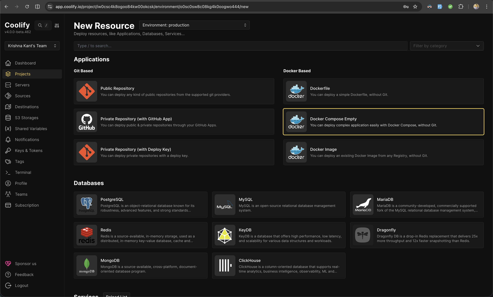
  <p><em>Choose Docker Compose Empty</em></p>
  
  <br />
  
  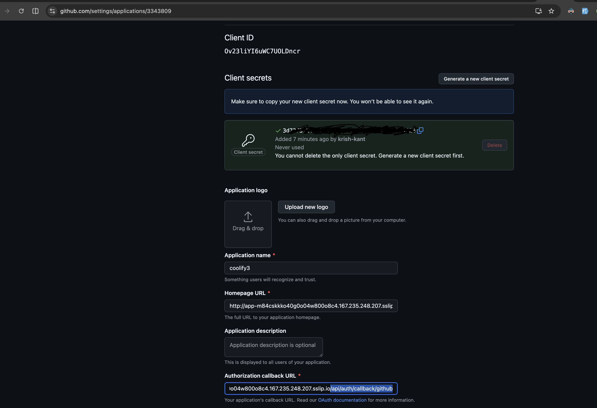
  <p><em>App URL after deployment</em></p>
  
  <br />
  
  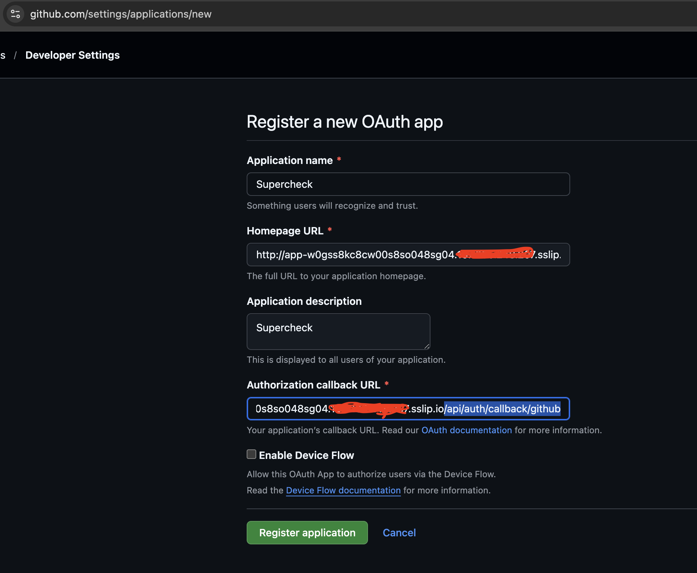
  <p><em>Add correct URLs in Github OAuth Settings</em></p>
  
  <br />
  
  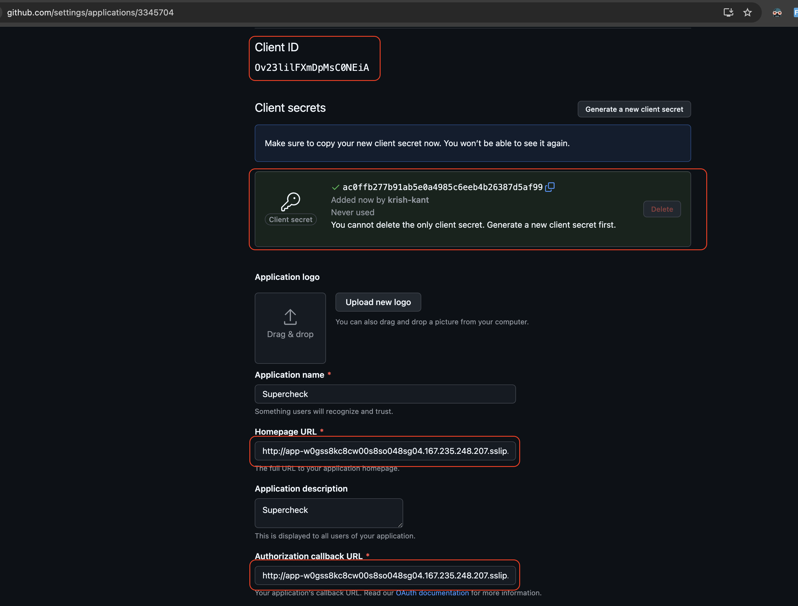
  <p><em>Copy Client ID and Client Secret from Github OAuth Settings</em></p>
  
  <br />
  
  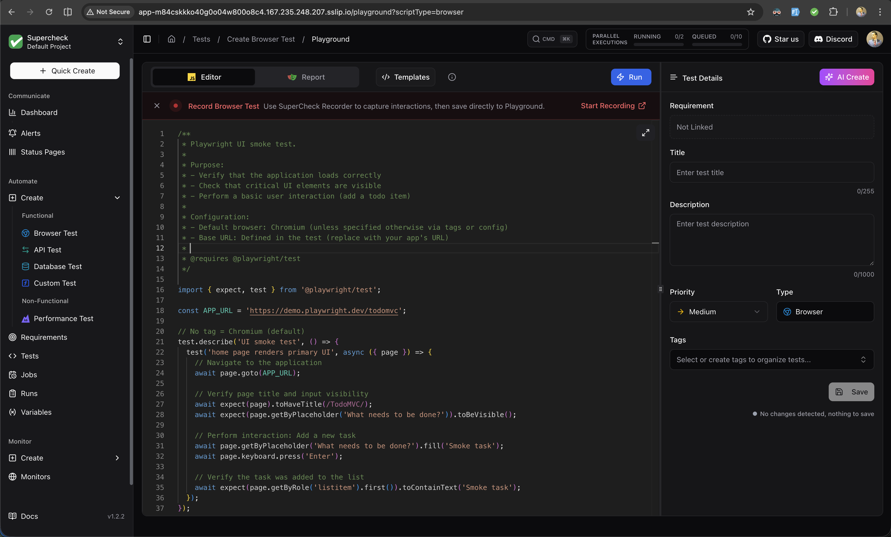
  <p><em>Paste Client ID and Client Secret in Environment Variables and Update</em></p>
  
  <br />
  
  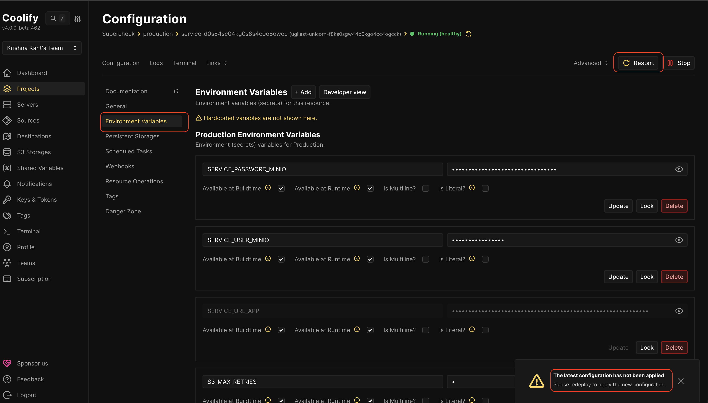
  <p><em>Restart deployment after configuration</em></p>
  
  <br />
  
  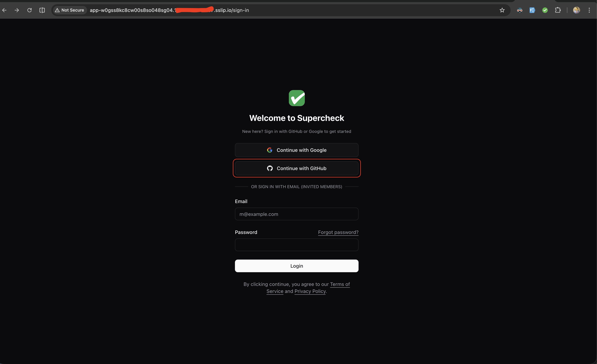
  <p><em>Login to Supercheck with Github</em></p>

  <br />

  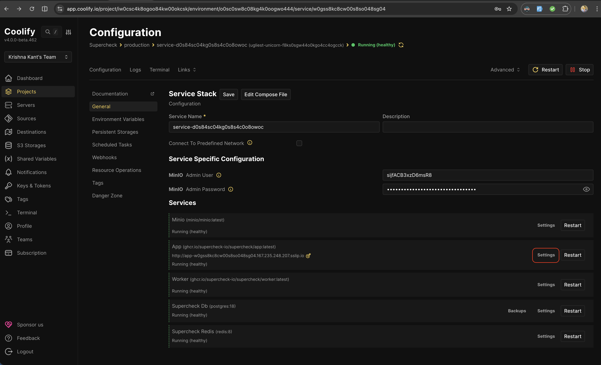
  <p><em>Super Admin Setup (Optional): Open app container terminal</em></p>

  <br />

  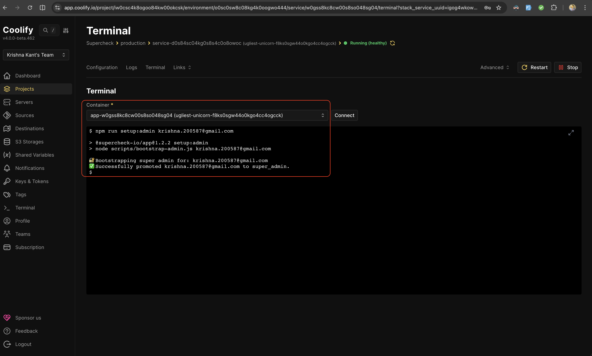
  <p><em>Super Admin Setup (Optional): Run setup command to create super admin</em></p>

  <br />

  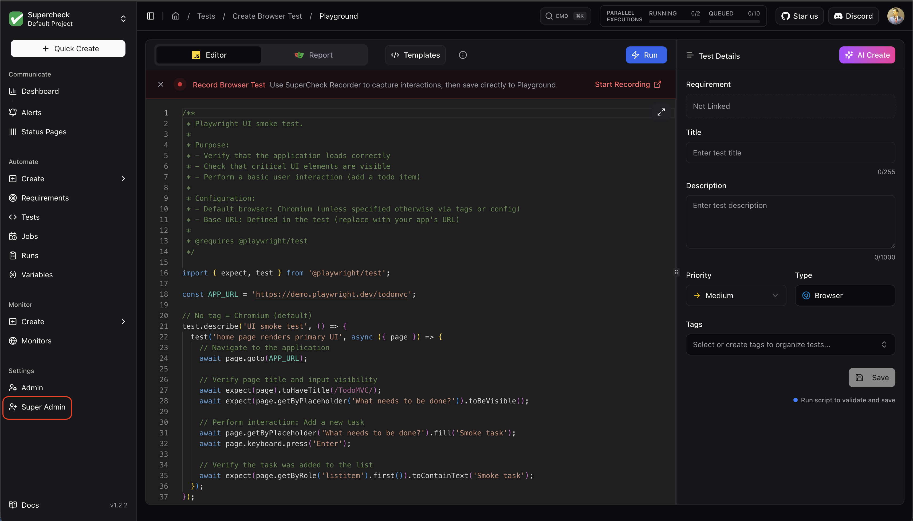
  <p><em>Super Admin Setup (Optional): Super admin created successfully</em></p>

  <br />

  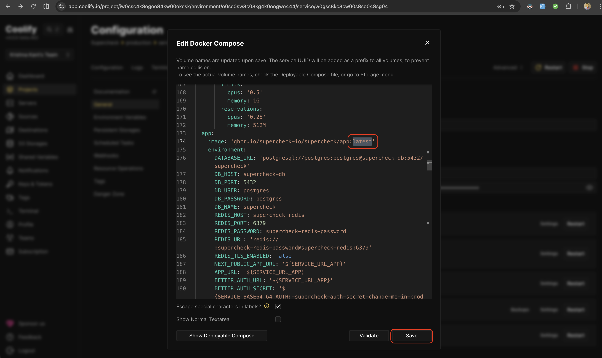
  <p><em>Future Updates (Optional): Update image tag for app and worker if you want specific version other than latest and redeploy, for latest stable version just redeploy. </em></p>


  <br />

  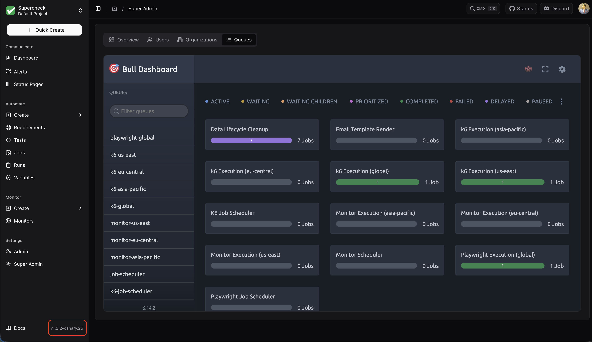
  <p><em>Check deployed version after deployment</em></p>
</div>