Supercheck uses a **6-role RBAC system** with granular permissions across organizations and projects. This page provides a complete reference of what each role can do.

## Role Overview

<Callout type="info">
**Access Scope**: Organization-level roles (Super Admin, Org Owner, Org Admin) have access to **all projects** in the organization. Project-level roles (Project Admin, Project Editor) are limited to **assigned projects only**. Project Viewer has read-only access to all projects.
</Callout>

| Role | Level | Description |
|------|-------|-------------|
| **Super Admin** | System | Platform-wide control, user management, and impersonation |
| **Org Owner** | Organization | Full organization control including deletion and billing |
| **Org Admin** | Organization | Organization management without deletion rights |
| **Project Admin** | Project | Full control of assigned projects |
| **Project Editor** | Project | Create and edit resources in assigned projects |
| **Project Viewer** | Organization | Read-only access to all projects |

## Role Hierarchy

```mermaid
graph TD
    SA["🔴 Super Admin<br/>System-wide Control"]
    OO["🟠 Org Owner<br/>Organization Control"]
    OA["🟡 Org Admin<br/>Organization Management"]
    PA["🟣 Project Admin<br/>Assigned Projects"]
    PE["🔵 Project Editor<br/>Assigned Projects"]
    PV["⚪ Project Viewer<br/>Read-Only All Projects"]

    SA --> OO
    SA --> OA
    OO --> PA
    OA --> PA
    PA --> PE
    PE --> PV
```

## Permission Matrix

<Tabs items={['Organization', 'Project', 'Tests & Jobs', 'Monitors & Status Pages', 'Test Runs', 'API Keys', 'Notifications', 'Tags']}>
<Tab value="Organization">

| Resource | Super Admin | Org Owner | Org Admin | Project Admin | Project Editor | Project Viewer |
|----------|:-----------:|:---------:|:---------:|:-------------:|:--------------:|:--------------:|
| **View organization** | ✅ | ✅ | ✅ | ✅ | ✅ | ✅ |
| **Update organization** | ✅ | ✅ | ✅ | ❌ | ❌ | ❌ |
| **Delete organization** | ✅ | ✅ | ❌ | ❌ | ❌ | ❌ |
| **Invite members** | ✅ | ✅ | ✅ | ❌ | ❌ | ❌ |
| **Manage members** | ✅ | ✅ | ✅ | ❌ | ❌ | ❌ |
| **Remove members** | ✅ | ✅ | ✅ | ❌ | ❌ | ❌ |

</Tab>
<Tab value="Project">

| Resource | Super Admin | Org Owner | Org Admin | Project Admin* | Project Editor* | Project Viewer |
|----------|:-----------:|:---------:|:---------:|:--------------:|:---------------:|:--------------:|
| **View projects** | ✅ | ✅ | ✅ | ✅ | ✅ | ✅ |
| **Create projects** | ✅ | ✅ | ✅ | ❌ | ❌ | ❌ |
| **Update projects** | ✅ | ✅ | ✅ | ❌ | ❌ | ❌ |
| **Delete projects** | ✅ | ✅ | ✅ | ❌ | ❌ | ❌ |
| **Manage project members** | ✅ | ✅ | ✅ | ✅ | ❌ | ❌ |

<Callout type="note">
*\* Project Admin and Project Editor permissions apply only to their assigned projects.*
</Callout>

</Tab>
<Tab value="Tests & Jobs">

| Action | Super Admin | Org Owner | Org Admin | Project Admin* | Project Editor* | Project Viewer |
|--------|:-----------:|:---------:|:---------:|:--------------:|:---------------:|:--------------:|
| **View** | ✅ | ✅ | ✅ | ✅ | ✅ | ✅ |
| **Create** | ✅ | ✅ | ✅ | ✅ | ✅ | ❌ |
| **Edit** | ✅ | ✅ | ✅ | ✅ | ✅ | ❌ |
| **Delete** | ✅ | ✅ | ✅ | ✅ | ❌ | ❌ |
| **Run/Trigger** | ✅ | ✅ | ✅ | ✅ | ✅ | ❌ |

</Tab>
<Tab value="Monitors & Status Pages">

| Action | Super Admin | Org Owner | Org Admin | Project Admin* | Project Editor* | Project Viewer |
|--------|:-----------:|:---------:|:---------:|:--------------:|:---------------:|:--------------:|
| **View** | ✅ | ✅ | ✅ | ✅ | ✅ | ✅ |
| **Create** | ✅ | ✅ | ✅ | ✅ | ✅ | ❌ |
| **Edit** | ✅ | ✅ | ✅ | ✅ | ✅ | ❌ |
| **Pause/Resume** | ✅ | ✅ | ✅ | ✅ | ✅ | ❌ |
| **Delete** | ✅ | ✅ | ✅ | ✅ | ❌ | ❌ |

</Tab>
<Tab value="Test Runs">

| Action | Super Admin | Org Owner | Org Admin | Project Admin* | Project Editor* | Project Viewer |
|--------|:-----------:|:---------:|:---------:|:--------------:|:---------------:|:--------------:|
| **View** | ✅ | ✅ | ✅ | ✅ | ✅ | ✅ |
| **Cancel** | ✅ | ✅ | ✅ | ✅ | ✅ | ❌ |
| **Delete** | ✅ | ✅ | ✅ | ✅ | ❌ | ❌ |

</Tab>
<Tab value="API Keys">

| Action | Super Admin | Org Owner | Org Admin | Project Admin* | Project Editor* | Project Viewer |
|--------|:-----------:|:---------:|:---------:|:--------------:|:---------------:|:--------------:|
| **View** | ✅ | ✅ | ✅ | ✅ | ✅ | ❌ |
| **Create** | ✅ | ✅ | ✅ | ✅ | ✅ | ❌ |
| **Edit** | ✅ | ✅ | ✅ | ✅ | ✅ | ❌ |
| **Delete** | ✅ | ✅ | ✅ | ✅ | ❌ | ❌ |

</Tab>
<Tab value="Notifications">

| Action | Super Admin | Org Owner | Org Admin | Project Admin* | Project Editor* | Project Viewer |
|--------|:-----------:|:---------:|:---------:|:--------------:|:---------------:|:--------------:|
| **View** | ✅ | ✅ | ✅ | ✅ | ✅ | ✅ |
| **Create** | ✅ | ✅ | ✅ | ✅ | ✅ | ❌ |
| **Edit** | ✅ | ✅ | ✅ | ✅ | ✅ | ❌ |
| **Delete** | ✅ | ✅ | ✅ | ✅ | ❌ | ❌ |

</Tab>
<Tab value="Tags">

| Action | Super Admin | Org Owner | Org Admin | Project Admin* | Project Editor* | Project Viewer |
|--------|:-----------:|:---------:|:---------:|:--------------:|:---------------:|:--------------:|
| **View** | ✅ | ✅ | ✅ | ✅ | ✅ | ✅ |
| **Create** | ✅ | ✅ | ✅ | ✅ | ✅ | ❌ |
| **Edit** | ✅ | ✅ | ✅ | ✅ | ✅ | ❌ |
| **Delete** | ✅ | ✅ | ✅ | ✅ | ❌ | ❌ |

</Tab>
</Tabs>

## Variables & Secrets

Variables and secrets have special permission rules to balance usability with security.

| Action | Super Admin | Org Owner | Org Admin | Project Admin* | Project Editor* | Project Viewer |
|--------|:-----------:|:---------:|:---------:|:--------------:|:---------------:|:--------------:|
| **View variables** | ✅ | ✅ | ✅ | ✅ | ✅ | ✅ |
| **Create variables** | ✅ | ✅ | ✅ | ✅ | ✅ | ❌ |
| **Edit variables** | ✅ | ✅ | ✅ | ✅ | ✅ | ❌ |
| **Delete variables** | ✅ | ✅ | ✅ | ✅ | ❌ | ❌ |
| **View secret values** | ✅ | ✅ | ✅ | ✅ | ✅ | ❌ |

<Callout type="warning">
**Project Editors** can create/edit variables and view secret values (needed to use secrets in tests), but **cannot delete** variables. This prevents accidental data loss while allowing productive work.
</Callout>

## System Administration

These permissions are exclusive to **Super Admin** users:

| Capability | Description |
|------------|-------------|
| **User Management** | View, ban, and unban any user |
| **User Impersonation** | Log in as any user for troubleshooting |
| **View All Organizations** | Access any organization's data |
| **Queue Monitoring** | View and manage BullMQ job queues |
| **System Statistics** | View platform-wide metrics |

## Access Scope Details

### Organization-Wide Access

The following roles can access **all projects** in their organization without explicit assignment:

- **Super Admin** — All organizations, all projects
- **Org Owner** — All projects in owned organizations
- **Org Admin** — All projects in administered organizations
- **Project Viewer** — Read-only access to all projects (intentional for monitoring roles)

### Project-Limited Access

These roles only have access to **explicitly assigned projects**:

- **Project Admin** — Full control, but only for assigned projects
- **Project Editor** — Create/edit permissions, but only for assigned projects

<Callout type="tip">
**Why is Project Viewer organization-wide?** This design enables oversight and monitoring roles to view all projects without needing individual assignments. They cannot modify anything, making it safe for read-only visibility.
</Callout>

## Quick Reference

| If you need to... | Minimum Role Required |
|-------------------|----------------------|
| View tests and runs | Project Viewer |
| Run tests manually | Project Editor |
| Create new tests | Project Editor |
| Delete tests | Project Admin |
| Invite team members | Org Admin |
| Delete the organization | Org Owner |
| Ban/unban users | Super Admin |
