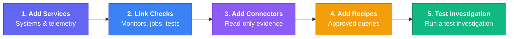

Project administrators configure AI SRE from **Organization Admin**. Responders use **Alerts**, **Incidents**, **Investigation Map**, and **Copilot** during an incident.

Select **Setup guide** beside **Add service**, **Add connector**, or **Add recipe** to review setup status. The guide opens only when selected and does not open another form automatically.

<Callout type="info">
**Self-Hosted Requirement**: AI SRE requires an AI provider configured in your `.env` and `SRE_INVESTIGATION_AGENT_ENABLED=true`. See [Self-Hosted AI SRE Features](/docs/app/deployment/self-hosted#optional-configuration) for details.
</Callout>

## Services

Use **Services** to define the systems responders recognize, such as `checkout-api` or `payments-worker`.

For each service, add its owner, environment, repository, and telemetry name. The service detail page manages:

- Trusted dependencies
- Linked monitors, jobs, tests, k6 runs, and status components
- Recent incident and alert activity
- Topology suggestions awaiting approval

Suggested relationships do not enter the Investigation Map until an authorized user approves them.

## Integrations

Use **Integrations** to add read-only evidence sources. Each connector has a service scope, validation status, execution mode, and output limits.

Use the narrowest credential and service scope that supports your investigation queries. Validate the connector after setup. See [Connectors](/docs/app/investigate/connectors) for supported providers and query examples.

Connectors are optional. AI SRE can investigate native Supercheck monitor, test,
job, alert, and incident evidence without Grafana, Tempo, or another external
observability system. Add only the evidence sources your team already operates
or intentionally provisions for testing.

## Diagnostic Recipes

Use **Diagnostic Recipes** to save approved, repeatable investigation queries. Recipes are connector-scoped and enforce row, byte, time, and allowlist limits.

Start with high-value checks such as service error rate, latency, recent error logs, or slow traces.

## Private Agents

Use **Private Agents** only when Supercheck cannot reach a supported source directly. Private Agents connect outbound over HTTPS and return bounded, sanitized evidence summaries. They do not apply fixes or require inbound firewall access.

Supercheck Cloud intentionally blocks direct connectors to private IP addresses,
reserved ranges, cluster-only DNS names, localhost, cleartext HTTP, non-HTTP(S)
schemes, and endpoint URLs containing credentials. Use a Private Agent for
Prometheus, Grafana, Loki, Tempo, Kubernetes, or other APIs that are reachable
only inside your network, and keep credentials in the dedicated encrypted
credential fields.

## Setup Order

1. Add the services responders use during incidents.
2. Link native monitors, jobs, tests, or status components.
3. Add and validate read-only connectors.
4. Add diagnostic recipes for common checks.
5. Verify alert channels and run a test investigation.

## Permissions

- Connector configuration permission is required for integrations, recipes, and Private Agents.
- Service update permission is required for service metadata, dependencies, and resource links.
- Service configure permission is required to approve topology suggestions.
- Incident permissions control incident creation and investigation.
