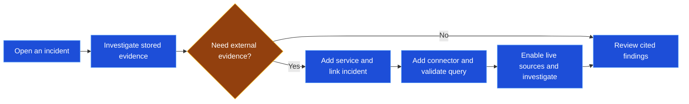

Project Admins and organization-level administrators configure AI SRE from **Organization Admin**. Responders start from **Alerts** or **Investigate → Incidents**. **Copilot** and **Services** are grouped under **Investigate**; the map is an optional link from an incident or service.

Select **Setup guide** beside **Add service**, **Add connector**, or **Add recipe** to review setup status.

<Callout type="info">
**Self-Hosted Requirement**: AI SRE and alert-triggered automation are enabled by default with a configured AI provider. No enable flag is required. Set `SRE_AUTOMATION_ENABLED=false` for manual-only AI work, or `SRE_ENABLED=false` to disable AI SRE. Recreate the affected app and worker containers after changing `.env`. See [Self-Hosted AI SRE Features](/docs/app/deployment/self-hosted#optional-configuration).
</Callout>

## Services

Use **Services** to define the systems responders recognize, such as `checkout-service` or `payment-gateway`.


Click **Add service** to register a service with its metadata, environment, and tier:


For each service, add its owner, environment, repository, and telemetry name. The service detail page manages:

- **Activity** opens first with recent incidents, alerts, and deployments.
- **Resources** links monitors, jobs, tests, k6 runs, and status components.
- **Dependencies** shows service relationships. Expand **Suggested dependencies** to approve or reject discoveries and review past decisions.

Service health shows its status and explanation. Nonzero incident and alert counts remain visible; expand **Service details** for tier, owner, available health score, and calculation time.

Suggested relationships do not enter the Investigation Map until an authorized user approves them.

## Integrations

Use **Organization Admin → Integrations** to add read-only evidence sources. Each connector has a service scope, validation status, execution mode, and output limits.


Click **Add connector** to connect external telemetry providers like Prometheus, Grafana, Loki, or GitHub:


Use the narrowest credential and service scope that supports your investigation queries. Validate the connector after setup. See [Connectors](/docs/app/investigate/connectors) for supported providers and query examples.

Connectors are optional. Start with stored Supercheck evidence, then add external sources your team needs.

## Diagnostic Recipes

Use **Diagnostic Recipes** to save approved, repeatable investigation queries. Choose a connector, define the approved query, and set output and time limits.

Start with high-value checks such as service error rate, latency, recent error logs, or slow traces.

## Private Agents

Use a Private Agent when a supported provider is reachable only inside your network. For Supercheck Cloud, you keep using the cloud dashboard and run only the agent locally.

1. Register the agent in **Organization Admin → Private Agents**.
2. [Run it with Docker Compose](/docs/app/deployment/private-agent) inside your network and confirm it shows **connected**.
3. Add a connector in **Organization Admin → Integrations**, choose **Private Agent**, and select the registered agent.
4. Validate the connector, then enable live sources in an incident investigation when you need its evidence.

Keep provider credentials in the connector's dedicated credential fields. No inbound firewall access is required.

## Setup Order

<p className="text-sm">Scroll horizontally on smaller screens to view all steps.</p>

<div className="overflow-x-auto" role="region" aria-label="AI SRE setup workflow" tabIndex={0}>
<div className="min-w-[84rem]">


```mermaid
%%{init: {"flowchart":{"nodeSpacing":20,"rankSpacing":24,"padding":12,"wrappingWidth":140}}}%%
flowchart LR
    Incident[Open an incident] --> Native[Investigate stored evidence]
    Native --> Need{Need external evidence?}
    Need -->|No|Review[Review cited findings]
    Need -->|Yes|Services[Add service and link incident]
    Services --> Connectors[Add connector and validate query]
    Connectors --> Live[Enable live sources and investigate]
    Live --> Review

    classDef action fill:#1d4ed8,stroke:#60a5fa,color:#fff
    classDef decision fill:#92400e,stroke:#fbbf24,color:#fff
    class Incident,Native,Services,Connectors,Live,Review action
    class Need decision
```

</div>
</div>

1. Investigate an incident using stored Supercheck evidence.
2. Add service context when you need service links, dependencies, or live connectors.
3. Optionally add connectors for external evidence. If a provider is private, deploy a Private Agent before selecting it in the connector.
4. Add diagnostic recipes for questions you need to repeat.
5. Validate each connector and run an investigation with live sources enabled before relying on it during an incident.

## Permissions

| Task | Required permission |
|---|---|
| Manage integrations, recipes, or Private Agents | Connector configure |
| Edit service metadata, dependencies, or links | Service update |
| Approve topology suggestions | Service configure |
| Create or investigate incidents | Matching incident permission |

## Optional Slack and Teams incident commands

Slack/Teams command handling is separate from normal dashboard and CLI SRE use. Skip this setup unless you want responders to acknowledge, resolve, or investigate incidents from chat.

From your deployment directory, configure only the integration you use in `.env`:

```bash
# Slack commands and replies
SLACK_SIGNING_SECRET=your-slack-signing-secret
SLACK_BOT_TOKEN=your-slack-bot-token
# Or Teams outgoing webhook commands
TEAMS_OUTGOING_WEBHOOK_SECRET=your-teams-webhook-secret
# Required for either provider: comma-separated external user IDs
SRE_COLLABORATION_ALLOWED_RESPONDER_IDS=U123,U456
```

Add the optional overlay to your usual Compose command:

```bash
curl -fsSLO https://raw.githubusercontent.com/supercheck-io/supercheck/main/deploy/docker/docker-compose-collaboration.yml
docker compose -f docker-compose.yml -f docker-compose-collaboration.yml up -d --force-recreate app
```

Use your installation's main Compose filename if it differs. Slack sends signed requests to `/api/webhooks/slack`; Teams uses `/api/webhooks/teams`. Requests require valid provider signatures and responders on the allowlist. Empty allowlists deny commands. Collaboration investigations use stored evidence; use an authenticated dashboard or CLI session with explicit live-source consent to query telemetry connectors. These commands never grant live connector access or enable provider writes.

Existing custom deployments can continue supplying the legacy `SRE_SLACK_*` or `SRE_TEAMS_*` credential aliases directly; the new optional overlay uses the provider names above. Move these credentials out of normal installation settings when upgrading.
