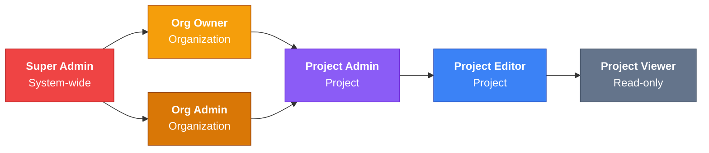

Choose a role based on the tasks a teammate needs. Use the tables below to check permissions.

## Role Overview

<Callout type="info">
Members can view all active projects in their organization. **Project Admin** and **Project Editor** gain additional permissions only in assigned projects; their access to other projects remains read-only. Organization administrators manage all projects in their organization.
</Callout>

| Role | Level | Description |
|------|-------|-------------|
| **Super Admin** | System | Platform-wide control, user management, and impersonation |
| **Org Owner** | Organization | Full organization control including deletion |
| **Org Admin** | Organization | Organization management without deletion rights |
| **Project Admin** | Project | Full control of assigned projects |
| **Project Editor** | Project | Create and edit resources in assigned projects |
| **Project Viewer** | Organization | Read-only access to all projects |

## Role Overview Diagram

Scroll horizontally to view the full diagram.

Use the matrix below for each role's exact permissions and project scope.

## Permission Matrix

<Tabs items={['Organization', 'Project', 'Tests & Jobs', 'Monitors & Status Pages', 'Test Runs', 'CLI Tokens', 'Notifications', 'Tags', 'AI SRE']}>
<Tab value="Organization">

| Resource | Super Admin | Org Owner | Org Admin | Project Admin | Project Editor | Project Viewer |
|----------|:-----------:|:---------:|:---------:|:-------------:|:--------------:|:--------------:|
| **View organization** | ✅ | ✅ | ✅ | ✅ | ✅ | ✅ |
| **Update organization** | ✅ | ✅ | ✅ | ❌ | ❌ | ❌ |
| **Delete organization** | ✅ | ✅ | ❌ | ❌ | ❌ | ❌ |
| **Invite members** | ✅ | ✅ | ✅ | ❌ | ❌ | ❌ |
| **Manage members** | ✅ | ✅ | ✅ | ❌ | ❌ | ❌ |
| **Remove members** | ✅ | ✅ | ✅ | ❌ | ❌ | ❌ |

</Tab>
<Tab value="Project">

| Resource | Super Admin | Org Owner | Org Admin | Project Admin* | Project Editor* | Project Viewer |
|----------|:-----------:|:---------:|:---------:|:--------------:|:---------------:|:--------------:|
| **View projects** | ✅ | ✅ | ✅ | ✅ | ✅ | ✅ |
| **Create projects** | ✅ | ✅ | ✅ | ❌ | ❌ | ❌ |
| **Update projects** | ✅ | ✅ | ✅ | ✅ | ❌ | ❌ |
| **Delete projects** | ✅ | ✅ | ✅ | ❌ | ❌ | ❌ |
| **Manage project members** | ✅ | ✅ | ✅ | ✅ | ❌ | ❌ |

<Callout type="info">
*\* Additional permissions apply only to assigned projects. Other active projects remain readable.*
</Callout>

</Tab>
<Tab value="Tests & Jobs">

| Action | Super Admin | Org Owner | Org Admin | Project Admin* | Project Editor* | Project Viewer |
|--------|:-----------:|:---------:|:---------:|:--------------:|:---------------:|:--------------:|
| **View** | ✅ | ✅ | ✅ | ✅ | ✅ | ✅ |
| **Create** | ✅ | ✅ | ✅ | ✅ | ✅ | ❌ |
| **Edit** | ✅ | ✅ | ✅ | ✅ | ✅ | ❌ |
| **Delete** | ✅ | ✅ | ✅ | ✅ | ❌ | ❌ |
| **Run/Trigger** | ✅ | ✅ | ✅ | ✅ | ✅ | ❌ |

</Tab>
<Tab value="Monitors & Status Pages">

| Action | Super Admin | Org Owner | Org Admin | Project Admin* | Project Editor* | Project Viewer |
|--------|:-----------:|:---------:|:---------:|:--------------:|:---------------:|:--------------:|
| **View** | ✅ | ✅ | ✅ | ✅ | ✅ | ✅ |
| **Create** | ✅ | ✅ | ✅ | ✅ | ✅ | ❌ |
| **Edit** | ✅ | ✅ | ✅ | ✅ | ✅ | ❌ |
| **Pause/Resume** | ✅ | ✅ | ✅ | ✅ | ✅ | ❌ |
| **Delete** | ✅ | ✅ | ✅ | ✅ | ❌ | ❌ |

</Tab>
<Tab value="Test Runs">

| Action | Super Admin | Org Owner | Org Admin | Project Admin* | Project Editor* | Project Viewer |
|--------|:-----------:|:---------:|:---------:|:--------------:|:---------------:|:--------------:|
| **View** | ✅ | ✅ | ✅ | ✅ | ✅ | ✅ |
| **Cancel** | ✅ | ✅ | ✅ | ✅ | ✅ | ❌ |
| **Delete** | ✅ | ✅ | ✅ | ✅ | ❌ | ❌ |

</Tab>
<Tab value="CLI Tokens">

| Action | Super Admin | Org Owner | Org Admin | Project Admin* | Project Editor* | Project Viewer |
|--------|:-----------:|:---------:|:---------:|:--------------:|:---------------:|:--------------:|
| **View** | ✅ | ✅ | ✅ | ✅ | ✅ | ❌ |
| **Create** | ✅ | ✅ | ✅ | ✅ | ✅ | ❌ |
| **Edit** | ✅ | ✅ | ✅ | ✅ | ✅ | ❌ |
| **Delete** | ✅ | ✅ | ✅ | ✅ | ❌ | ❌ |

</Tab>
<Tab value="Notifications">

| Action | Super Admin | Org Owner | Org Admin | Project Admin* | Project Editor* | Project Viewer |
|--------|:-----------:|:---------:|:---------:|:--------------:|:---------------:|:--------------:|
| **View** | ✅ | ✅ | ✅ | ✅ | ✅ | ✅ |
| **Create** | ✅ | ✅ | ✅ | ✅ | ✅ | ❌ |
| **Edit** | ✅ | ✅ | ✅ | ✅ | ✅ | ❌ |
| **Delete** | ✅ | ✅ | ✅ | ✅ | ❌ | ❌ |

</Tab>
<Tab value="Tags">

| Action | Super Admin | Org Owner | Org Admin | Project Admin* | Project Editor* | Project Viewer |
|--------|:-----------:|:---------:|:---------:|:--------------:|:---------------:|:--------------:|
| **View** | ✅ | ✅ | ✅ | ✅ | ✅ | ✅ |
| **Create** | ✅ | ✅ | ✅ | ✅ | ✅ | ❌ |
| **Edit** | ✅ | ✅ | ✅ | ✅ | ✅ | ❌ |
| **Delete** | ✅ | ✅ | ✅ | ✅ | ❌ | ❌ |

</Tab>
<Tab value="AI SRE">

| Action | Super Admin | Org Owner | Org Admin | Project Admin* | Project Editor* | Project Viewer |
|--------|:-----------:|:---------:|:---------:|:--------------:|:---------------:|:--------------:|
| **View services & incidents** | ✅ | ✅ | ✅ | ✅ | ✅ | ✅ |
| **Create & update services** | ✅ | ✅ | ✅ | ✅ | ✅ | ❌ |
| **Delete services** | ✅ | ✅ | ✅ | ✅ | ❌ | ❌ |
| **Create & update incidents** | ✅ | ✅ | ✅ | ✅ | ✅ | ❌ |
| **Delete incidents** | ✅ | ✅ | ✅ | ✅ | ❌ | ❌ |
| **Investigate stored evidence** | ✅ | ✅ | ✅ | ✅ | ✅ | ❌ |
| **Configure & investigate live connectors** | ✅ | ✅ | ✅ | ✅ | ❌ | ❌ |
| **Approve topology suggestions** | ✅ | ✅ | ✅ | ✅ | ❌ | ❌ |

<Callout type="info">
*\* Project Admin and Project Editor permissions apply only to their assigned projects. Project Editors can investigate stored evidence and manage incidents, but cannot query or configure live external connectors (`sre_connector:investigate`).*
</Callout>

</Tab>
</Tabs>

## Variables & Secrets

Variables and secrets have special permission rules to balance usability with security.

| Action | Super Admin | Org Owner | Org Admin | Project Admin* | Project Editor* | Project Viewer |
|--------|:-----------:|:---------:|:---------:|:--------------:|:---------------:|:--------------:|
| **View variables** | ✅ | ✅ | ✅ | ✅ | ✅ | ✅ |
| **Create variables** | ✅ | ✅ | ✅ | ✅ | ✅ | ❌ |
| **Edit variables** | ✅ | ✅ | ✅ | ✅ | ✅ | ❌ |
| **Delete variables** | ✅ | ✅ | ✅ | ✅ | ❌ | ❌ |
| **View secret values** | ✅ | ✅ | ✅ | ✅ | ✅ | ❌ |

<Callout type="warn">
**Project Editors** can create and edit variables and reveal secret values in assigned projects. They cannot delete variables. Keep revealed values out of chat, logs, and shared documents.
</Callout>

## System Administration

These permissions are exclusive to **Super Admin** users:

| Capability | Description |
|------------|-------------|
| **User Management** | View, ban, and unban any user |
| **User Impersonation** | Log in as any user for troubleshooting |
| **View All Organizations** | Access any organization's data |
| **Queue Monitoring** | View and manage BullMQ job queues |
| **System Statistics** | View platform-wide metrics |

## Access Scope Details

### Organization-Wide Access

The following roles can access **all projects** in their organization without explicit assignment:

- **Super Admin** — All organizations, all projects
- **Org Owner** — All projects in owned organizations
- **Org Admin** — All projects in administered organizations
- **Project Viewer** — Read-only access to all projects (intentional for monitoring roles)

### Assigned Project Permissions

These roles have additional permissions in **assigned projects** and read-only access to other active projects:

- **Project Admin** — Full control, but only for assigned projects
- **Project Editor** — Create/edit permissions, but only for assigned projects

<Callout type="tip">
**Why is Project Viewer organization-wide?** This design enables oversight and monitoring roles to view all projects without needing individual assignments. They cannot modify anything, making it safe for read-only visibility.
</Callout>

## Quick Reference

| If you need to... | Minimum Role Required |
|-------------------|----------------------|
| View tests and runs | Project Viewer |
| Run tests manually | Project Editor |
| Create new tests | Project Editor |
| Delete tests | Project Admin |
| Invite team members | Org Admin |
| Delete the organization | Org Owner |
| Ban/unban users | Super Admin |
