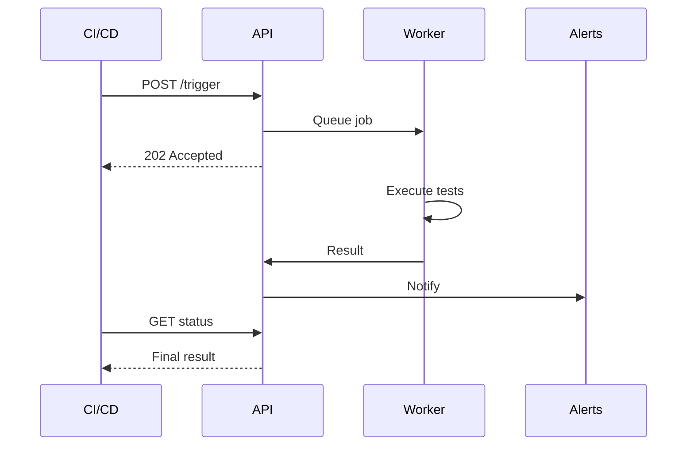

Jobs let you group tests together and run them automatically on a schedule or trigger them from your CI/CD pipeline. Use jobs to automate regression testing, smoke tests, and continuous validation of your applications.


## What Jobs Do

A job is a collection of tests that run together. When a job executes:

1. All selected tests run in sequence
2. Results are collected and aggregated
3. Alerts are sent if any test fails
4. Reports are generated with full details

**Use jobs for:**
- **Scheduled regression tests** — Run nightly or hourly to catch issues early
- **Smoke tests** — Quick validation after deployments
- **CI/CD integration** — Trigger tests from your build pipeline
- **Monitoring** — Regular checks of critical user flows

## Creating a Job


### Step 1: Basic Information

1. Go to **Create → Job**
2. Enter a descriptive **name** (e.g., "Nightly Regression Suite")
3. Add an optional **description** explaining what the job tests

### Step 2: Select Tests

Choose which tests to include in the job. You can select any combination of:
- Browser tests (Playwright)
- API tests
- Database tests
- Custom tests


<Callout type="info">
Tests run in the order you select them. Put critical tests first so failures are detected early.

**Note:** While tests in a job execute sequentially one-by-one, individual Playwright tests may use internal parallelism (workers) to run faster. This doesn't affect the order of test execution within the job.

The Playwright HTML report will display tests in their execution order, making it easy to trace through the test sequence.
</Callout>

### Step 3: Configure Schedule

Choose when and how the job runs:

| Schedule Type | Description | Best For |
|---------------|-------------|----------|
| **Interval** | Run every X minutes or hours | Regular health checks |
| **Cron** | Custom cron expression for precise timing | Specific schedules (nightly, weekly) |
| **Manual** | Run only when triggered manually | On-demand testing |
| **API Trigger** | Run via HTTP API call | CI/CD integration |

**Common cron examples:**

| Schedule | Cron Expression |
|----------|-----------------|
| Every hour | `0 * * * *` |
| Every day at midnight | `0 0 * * *` |
| Every Monday at 9 AM | `0 9 * * 1` |
| Every 6 hours | `0 */6 * * *` |

### Step 4: Configure Alerts

Set up notifications for job results:


| Setting | Description |
|---------|-------------|
| **Alert on Failure** | Notify when any test in the job fails |
| **Alert on Success** | Notify when all tests pass (optional) |
| **Alert on Timeout** | Notify if job exceeds maximum execution time |
| **Notification Channels** | Select Slack, email, Discord, Telegram, or webhook |

## Parallel Execution

Run multiple jobs or tests simultaneously to reduce total execution time. The parallel execution panel in the header shows real-time status of all running and queued executions across your organization.


**How it works:**
- Jobs are queued and processed by available workers
- Multiple jobs can run in parallel up to your plan's capacity limit
- View all running executions across your organization in real-time
- Cancel any running job if needed

**Capacity limits:**

| Installation Type | Concurrent Jobs | Queued Jobs |
|------|-----------------|-------------|
| **Self-hosted** | Configurable | Configurable |

<Callout type="info">
The parallel execution indicator appears in the top navigation bar showing **RUNNING** and **QUEUED** counts. Click it to view details and manage executions.
</Callout>

## CI/CD Integration

Trigger jobs from your CI/CD pipeline to run tests after every deployment.



### Setting Up API Triggers

1. Open the job you want to trigger
2. Go to the **CI/CD** tab
3. Click **Generate API Key**


4. Copy the trigger URL and API key


### Triggering from CI/CD

<Tabs items={['cURL', 'GitHub Actions', 'GitLab CI']}>
<Tab value="cURL">

**Basic trigger:**

```bash
curl -X POST https://your-instance.com/api/jobs/{jobId}/trigger \
  -H "Authorization: Bearer YOUR_API_KEY"
```

</Tab>
<Tab value="GitHub Actions">

**GitHub Actions example:**

```yaml
- name: Run Supercheck Tests
  run: |
    curl -X POST ${{ secrets.SUPERCHECK_TRIGGER_URL }} \
      -H "Authorization: Bearer ${{ secrets.SUPERCHECK_API_KEY }}"
```

</Tab>
<Tab value="GitLab CI">

**GitLab CI example:**

```yaml
test:
  script:
    - curl -X POST $SUPERCHECK_TRIGGER_URL -H "Authorization: Bearer $SUPERCHECK_API_KEY"
```

</Tab>
</Tabs>

### API Key Security

- **Generate unique keys** for each CI/CD pipeline
- **Store keys as secrets** in your CI/CD platform
- **Rotate keys periodically** for security
- **Revoke keys** when no longer needed

## Job Execution

### Running Jobs Manually

1. Go to **Jobs** list
2. Click the **Run** button on any job
3. View real-time progress in the execution dialog
4. Results appear when complete

### Canceling Jobs

You can cancel a running job at any time:

1. Click the **Cancel** button on the running job
2. Confirm the cancellation
3. All running tests are stopped immediately
4. Partial results are saved

### Viewing Results

After a job completes:

- **Summary** — Pass/fail status, duration, test count
- **Test Results** — Individual test outcomes with details
- **Reports** — Screenshots, traces, and logs for each test
- **History** — Previous runs for comparison

## Job Notifications

Jobs send notifications through your configured alert channels:

### Failure Notifications

When a job fails, notifications include:
- Job name and project
- Which tests failed
- Error summary
- Link to full report
- Execution duration

### Success Notifications (Optional)

When enabled, success notifications include:
- Job name and project
- All tests passed confirmation
- Execution duration
- Link to report

### Timeout Notifications

If a job exceeds the maximum execution time:
- Job is automatically stopped
- Timeout notification is sent
- Partial results are saved

<Callout type="info">
**Execution Time Limits:**
- **Playwright Jobs:** Maximum runtime of **60 minutes** for the entire job execution
- **K6 Performance Jobs:** Maximum runtime of **60 minutes** per job execution
- **Individual Tests:** Each test within a job is also subject to its own timeout (5 minutes for Playwright, 60 minutes for K6)
</Callout>
