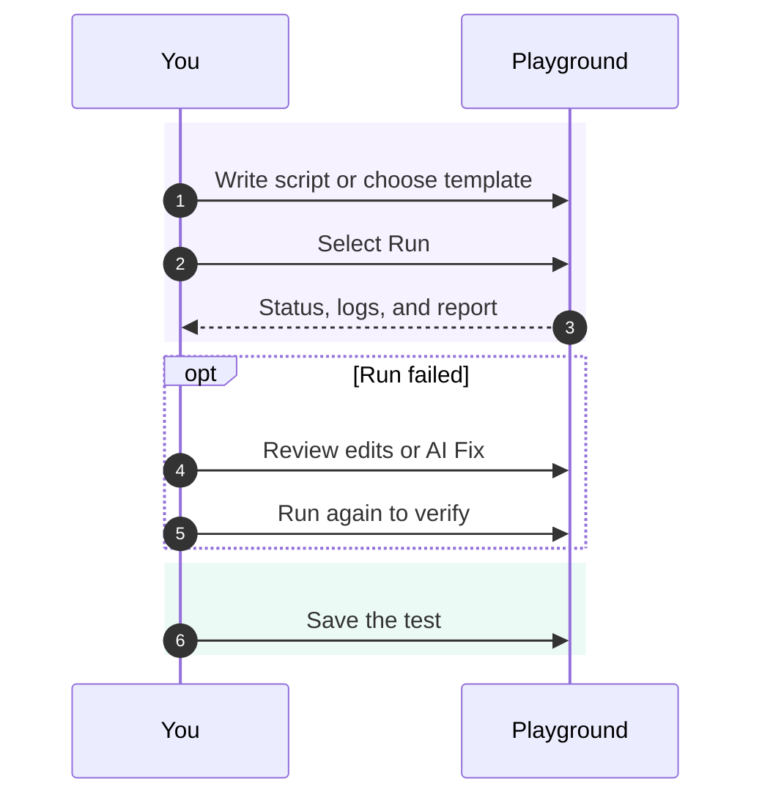

Write, run, and debug test scripts in the Playground. Review AI suggestions before applying them.


## Editor Features

Use the editor to write and check your script:

- **Syntax Highlighting** — Full TypeScript/JavaScript support with Playwright API recognition
- **Auto-completion** — IntelliSense for Playwright methods, selectors, and assertions
- **Error Detection** — Real-time syntax validation before you run
- **Code Formatting** — Automatic formatting for clean, readable code
- **Variable Access** — Use `getVariable()` and `getSecret()` for project configuration

## Running Tests

Use the Playground to check a script before adding it to an automated job or monitor.

1. Click **Run** and select an execution location if prompted.
2. Watch the run status and live logs in the results panel.
3. Open the report when the run finishes. Review errors and available screenshots or traces.
4. Update the script and run it again until it checks the expected behavior.
5. **Save** the test to reuse it in a job or synthetic monitor.

<Callout type="info">
Use **Cancel** to stop a running test. Review the cancellation details in its result.
</Callout>

<Callout type="warn">
You can save a draft at any time, including before the test has run or while it is failing. Run and validate the test before relying on it in a job or monitor.
</Callout>

<p className="text-sm md:hidden">Scroll horizontally to view the full diagram.</p>

<div className="overflow-x-auto" role="region" aria-label="Playground workflow diagram" tabIndex={0}>
<div className="min-w-[36rem]">



</div>
</div>

## AI Create

Describe the behavior you want to test. AI Create suggests a script for you to review, edit, and run.

<Callout type="warn">
**Beta Feature**: AI-generated browser tests may require refinement. For best results, **record your test first** using the [Supercheck Recorder Extension](/docs/recorder) or Playwright's codegen, then use AI Create to enhance or modify it. Review all generated code before running.
</Callout>


### How to Use AI Create

1. Click the **AI Create** button (purple gradient)
2. Describe what you want to test in natural language
3. Click **Generate** to start streaming the code
4. Review the generated script in the diff viewer
5. Click **Apply to Editor** to use the code, or **Discard** to close it


### Writing Effective Prompts

**Good prompts are specific and include:**
- The user action you want to test
- Expected outcomes or assertions
- Any specific elements or data to interact with

**Example prompts:**

| Prompt | Intended Check |
|--------|-------------------|
| "Test login with email user@example.com and password test123, verify dashboard loads" | Complete login flow with form filling, submission, and URL assertion |
| "Check that the /api/health endpoint returns 200 and includes status: ok" | API test with fetch, status check, and JSON body validation |
| "Verify user can add a product to cart, view cart, and see correct total" | Multi-step e-commerce flow with navigation and assertions |
| "Test that the contact form validates required fields and shows error messages" | Form validation test with empty submission and error checking |

### Review Generated Code

Check the target URL, selectors, credentials, waits, and assertions. Run the script to confirm it tests the expected behavior.

## AI Fix

After a failed run, use AI Fix to review suggested changes. Apply only changes you understand, then run the test again.


### Use AI Fix

1. Run a test that fails
2. Click the **AI Fix** button (appears after failure)
3. AI analyzes the error report and your code
4. A diff viewer shows original vs. suggested fix
5. Review changes, edit if needed, then **Accept & Apply** or **Reject**


### What AI Fix Can Repair

AI Fix is effective for code-level issues that can be resolved by modifying your test:

| Issue Type | Example | AI Fix Action |
|------------|---------|---------------|
| **Selector Issues** | Element not found, wrong selector | Updates selector to match current DOM |
| **Timing Problems** | Element not visible, timeout | Adds appropriate waits or increases timeout |
| **Assertion Failures** | Expected value mismatch | Corrects assertion or expected value |
| **Navigation Errors** | Page not loading, wrong URL | Fixes URL or adds navigation waits |

### When AI Fix Shows Guidance Instead

Some failures require manual investigation rather than code changes. In these cases, AI Fix displays a guidance modal with troubleshooting steps:

- **Network Issues** — Server unreachable, DNS failures, HTTP 5xx errors
- **Authentication Failures** — Invalid credentials, expired tokens, 401/403 errors
- **Infrastructure Problems** — Database down, service unavailable
- **Permission Errors** — Access denied, insufficient privileges

<Callout type="info">
Review the suggested diff before applying it, then run the test again to verify the change.
</Callout>

## Templates

Start with pre-built templates for common testing scenarios. Templates provide working code that you can customize for your application.


### Available Templates

<Tabs items={['Browser', 'API', 'Database', 'Custom', 'Performance']}>
<Tab value="Browser">

| Category | Templates |
|----------|-----------|
| **Browser Fundamentals** | UI Smoke (navigation), Browser selection with tags, Comprehensive Browser Test |
| **Auth Flows** | Auth flow (login + logout) |
| **Responsive & Devices** | Mobile/responsive layout, Device emulation (geo, locale, timezone) |

</Tab>
<Tab value="API">

| Category | Templates |
|----------|-----------|
| **API Health** | Health/JSON contract |
| **API CRUD** | Create + read + cleanup |
| **Authentication** | Authenticated request |
| **API Coverage** | Comprehensive API Test |

</Tab>
<Tab value="Database">

| Category | Templates |
|----------|-----------|
| **Database Checks** | SELECT health check, Safe UPDATE with RETURNING, Database Discovery & Query |
| **Transactions** | Insert with rollback |

</Tab>
<Tab value="Custom">

| Category | Templates |
|----------|-----------|
| **Cross-layer** | Custom test fixtures, Form with API stubbing, Device emulation showcase, API + UI end-to-end, GitHub API + Browser Integration |

</Tab>
<Tab value="Performance">

| Category | Templates |
|----------|-----------|
| **Smoke & Health** | Smoke Check (API), Basic Performance Test |
| **Load Profiles** | Ramping Load, Advanced Thresholds |
| **Resilience** | Spike + Recovery, Stress Test, Breakpoint Test |
| **Reliability** | Soak/Endurance |
| **API Coverage** | API Checklist (GET + POST + auth), Checks & Assertions |

</Tab>
</Tabs>

### Using Templates

1. Click **Templates** in the editor toolbar
2. Browse categories or search for specific scenarios
3. Click a template to preview the code
4. Click **Apply Template** to insert it into the editor
5. Customize URLs, selectors, and test data for your app

## Test Reports

Every test run generates a detailed report with artifacts for debugging:


### Report Contents

| Artifact | Description | Use For |
|----------|-------------|---------|
| **Screenshots** | Captured at each step and on failure | Visual verification, debugging UI issues |
| **Trace** | Interactive step-by-step replay | Understanding test flow, timing issues |
| **Console Logs** | Browser console output | JavaScript errors, debug messages |
| **Network** | All HTTP requests and responses | API debugging, performance analysis |

### Viewing Traces

The Playwright Trace Viewer lets you:
- Step through each action in your test
- See the page state before and after each step
- Inspect DOM elements and their properties
- View network requests with timing
- Debug timing and selector issues

## Using Variables

Access project-level configuration, secrets, and file-backed test data in your tests:

```javascript

// Regular variables (logged normally)
const baseUrl = getVariable('BASE_URL');
const timeout = getVariable('TIMEOUT');

// Secrets are resolved at runtime and redacted from logs
const apiKey = getSecret('API_KEY');
const password = getSecret('DB_PASSWORD');

// File-backed test data
const usersCsv = readFile('USERS_CSV');

// Using in Playwright
await page.goto(baseUrl);
await page.fill('#password', password);
```

Keep credentials in **Secrets** and use **File** variables for non-sensitive fixtures and datasets. Avoid logging secret values.

See [Variables](/docs/app/automate/variables) for setup instructions.

## Learn More

For deeper understanding of the testing frameworks used in Supercheck:

- **[Playwright Documentation](https://playwright.dev/docs/intro)** — Complete guide to browser automation
- **[Playwright Locators](https://playwright.dev/docs/locators)** — Best practices for finding elements
- **[Playwright Assertions](https://playwright.dev/docs/test-assertions)** — Available assertion methods
- **[Playwright Trace Viewer](https://playwright.dev/docs/trace-viewer)** — Debugging with traces
