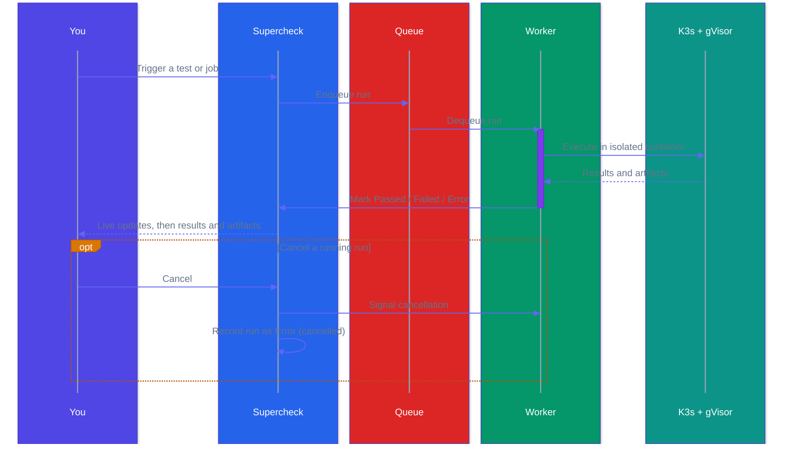

Every test or job execution creates a run with results, logs, and artifacts.

## Run Status

| Status | Description |
|--------|-------------|
| **Passed** | All tests completed successfully |
| **Failed** | One or more tests failed |
| **Error** | Execution error (timeout, crash, infrastructure) |
| **Running** | Currently executing |
| **Queued** | Waiting to execute |
| **Blocked** | Blocked by plan limits |

## View Runs

1. Go to **Runs**
2. Select a run to view its details

When a running execution is cancelled, Supercheck stops it and records the run as **Error** with cancellation details.

## Run Details

Each run includes:

- **Results** — Pass/fail count and duration
- **Screenshots** — Visual state at each step
- **Videos** — Browser test recordings
- **Logs** — Console output
- **Trace** — Step-by-step execution replay

## Debug Failures

1. Open failed run
2. Check error message
3. View screenshot at failure point
4. Review console logs
5. Check network requests

## AI Analyze

Click **AI Analyze** on any job run to generate an AI-powered analysis report.

**What AI Analyze Provides:**
- **Execution Summary** — Overview of what happened during the run
- **Failure Analysis** — Root cause identification with specific error messages
- **Performance Insights** — Duration analysis and optimization suggestions
- **Recommendations** — Actionable next steps based on actual run data

**Supported Job Types:**
- **Playwright** — Analyzes test failures with HTML report context
- **K6** — Analyzes performance metrics and threshold breaches

<Callout type="info">
AI Analyze requires a configured AI provider. See [Deployment](/docs/app/deployment/self-hosted#optional-configuration) for setup.
</Callout>
