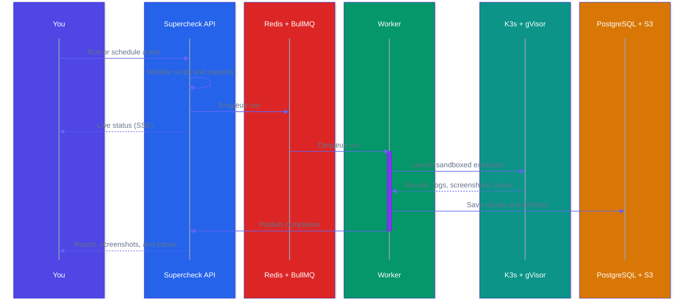

Tests are reusable scripts that validate your application. Create browser, API, database, custom, or performance tests.


## Test Types

<Cards>
<Card icon={<Chrome className="text-sky-500" />} title="Browser Test">
Playwright-based UI testing for user flows
</Card>

<Card icon={<ArrowLeftRight className="text-teal-500" />} title="API Test">
HTTP and GraphQL endpoint validation
</Card>

<Card icon={<Database className="text-cyan-500" />} title="Database Test">
SQL queries and data validation
</Card>

<Card icon={<SquareFunction className="text-indigo-500" />} title="Custom Test">
Node.js scripts for any scenario
</Card>

<Card icon={<TrendingUp className="text-violet-500" />} title="Performance Test">
k6 load testing from multiple regions
</Card>
</Cards>

## Create Test

1. Go to **Create** and select test type
2. Write script in the [Playground](/docs/app/automate/playground)
3. Use **AI Create** to generate from natural language
4. Use **Templates** to start with pre-built scripts
5. Click **Run** to validate
6. **Save** when passing



## AI Features

- **AI Create** — Generate tests from plain English descriptions (beta for browser tests)
- **AI Fix** — Automatically fix failing tests by analyzing errors
- **Templates** — Pre-built scripts for common scenarios

<Callout type="info">
For browser tests, consider recording with the [Supercheck Recorder Extension](/docs/recorder) or [Playwright Codegen](https://playwright.dev/docs/codegen) first, then use AI to enhance.
</Callout>

See [Playground](/docs/app/automate/playground) for details.

## Test Examples

<Tabs items={['Browser Test', 'API Test', 'Performance Test']}>
<Tab value="Browser Test">

```typescript
/**
 * Playwright UI smoke test.
 * 
 * Purpose:
 * - Verify that the application loads correctly
 * - Check that critical UI elements are visible
 * - Perform a basic user interaction
 * 
 * @see https://playwright.dev/docs/writing-tests
 */
import { expect, test } from '@playwright/test';

const APP_URL = 'https://demo.playwright.dev/todomvc';

test.describe('UI smoke test', () => {
  test('home page renders primary UI', async ({ page }) => {
    // Navigate to the application
    await page.goto(APP_URL);

    // Verify page title and input visibility
    await expect(page).toHaveTitle(/TodoMVC/);
    await expect(page.getByPlaceholder('What needs to be done?')).toBeVisible();

    // Perform interaction: Add a new task
    await page.getByPlaceholder('What needs to be done?').fill('Smoke task');
    await page.keyboard.press('Enter');
    
    // Verify the task was added to the list
    await expect(page.getByRole('listitem').first()).toContainText('Smoke task');
  });
});
```

📚 [Playwright Writing Tests](https://playwright.dev/docs/writing-tests) | [Locators Guide](https://playwright.dev/docs/locators)

</Tab>
<Tab value="API Test">

```typescript
/**
 * API health probe with contract checks.
 * 
 * Purpose:
 * - Verify that the API is up and running (status 200)
 * - Check that the response headers are correct (Content-Type)
 * - Validate the structure and data types of the response body
 * 
 * @see https://playwright.dev/docs/api-testing
 */
import { expect, test } from '@playwright/test';

const API_URL = 'https://jsonplaceholder.typicode.com';

test.describe('API health check', () => {
  test('health endpoint responds with expected payload', async ({ request }) => {
    // Send GET request
    const response = await request.get(API_URL + '/posts/1');

    // Basic status checks
    expect(response.ok()).toBeTruthy();
    expect(response.status()).toBe(200);
    expect(response.headers()['content-type']).toContain('application/json');

    // Validate JSON structure
    const body = await response.json();
    expect(body).toMatchObject({ id: 1 });
    expect(typeof body.title).toBe('string');
  });
});
```

📚 [Playwright API Testing](https://playwright.dev/docs/api-testing)

</Tab>
<Tab value="Performance Test">

```javascript
/**
 * k6 smoke test for uptime and latency.
 * 
 * Purpose:
 * - Verify system availability (uptime)
 * - Check basic latency performance
 * - Ensure the system is ready for heavier load tests
 * 
 * Configuration:
 * - VUs: 3 virtual users running concurrently
 * - Duration: 30 seconds test run
 * - Thresholds: 
 *   - Error rate must be < 1%
 *   - 95th percentile response time must be < 800ms
 * 
 * @see https://grafana.com/docs/k6/latest/using-k6/thresholds/
 */
import http from 'k6/http';
import { check, sleep } from 'k6';

export const options = {
  vus: 3,           // 3 concurrent users
  duration: '30s',  // Run for 30 seconds
  thresholds: {
    http_req_failed: ['rate<0.01'],      // Error rate < 1%
    http_req_duration: ['p(95)<800'],    // 95% of requests < 800ms
  },
};

export default function () {
  const baseUrl = 'https://test-api.k6.io';
  const response = http.get(baseUrl + '/public/crocodiles/1/');

  // Validate response
  check(response, {
    'status is 200': (res) => res.status === 200,
    'body is not empty': (res) => res.body && res.body.length > 0,
  });

  sleep(1); // Pause between requests
}
```

📚 [k6 Documentation](https://grafana.com/docs/k6/latest/) | [k6 Thresholds](https://grafana.com/docs/k6/latest/using-k6/thresholds/)

</Tab>
</Tabs>

## Tags

Organize tests with color-coded tags for easy filtering and categorization.

- **Create tags** — Add custom tags with any of 15 available colors
- **Filter by tags** — Quickly find tests by tag in the list view
- **Bulk operations** — Apply or remove tags from multiple tests

Tags are project-scoped, so each project can have its own tagging system.

## Features

- **Playground** — Interactive editor with AI assistance
- **Variables** — Project-scoped config, secrets, and file-backed test data ([learn more](/docs/app/automate/variables))
- **Reports** — Screenshots, traces, and logs
- **Tags** — Color-coded organization and filtering
- **Multi-region** — Performance tests from US, EU, APAC

## Execution Limits

<Callout type="info">
**Playwright Tests:** Individual test executions have a maximum runtime of **5 minutes**. Tests exceeding this limit are automatically terminated.

**K6 Performance Tests:** Individual test executions have a maximum runtime of **60 minutes** to accommodate load testing scenarios.
</Callout>

## Running Multiple Tests

For running multiple tests together in a sequence, use **[Jobs](/docs/app/automate/jobs)**. Jobs allow you to:

- Group related tests into automated workflows
- Schedule regular execution (hourly, daily, or custom cron)
- Trigger from CI/CD pipelines
- Get aggregated reports and notifications
- Set up alerts for the entire test suite

Jobs are ideal for regression testing, smoke tests, and comprehensive validation of your application.

## Learn More

- **[Playwright Documentation](https://playwright.dev/docs/intro)** — Browser automation framework
- **[k6 Documentation](https://grafana.com/docs/k6/latest/)** — Load testing tool
