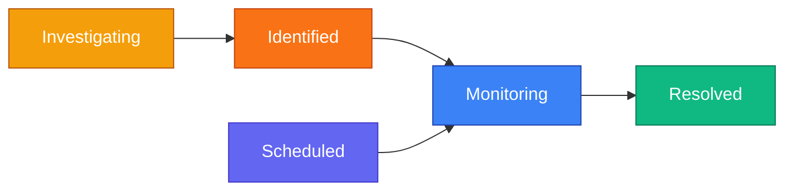
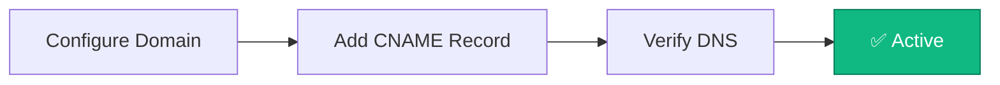

Create public status pages to communicate system health, incidents, and scheduled maintenance to your users.

<Callout type="info">
Status pages are hosted on unique subdomains and are publicly accessible without authentication.
</Callout>

## Public Status Page

Once published, your status page displays real-time system health to users:


**What users see:**
- **Status Banner** — Overall system health (All Systems Operational, Partial Outage, etc.)
- **Components** — Individual services with current status and 90-day uptime chart
- **Past Incidents** — Recent incident history grouped by date
- **Subscribe Button** — Subscribe to receive incident notifications

### Status Badges

Embed dynamic status badges on external websites, READMEs, or documentation to show real-time system health.

**Badge URL Format:**
```
https://yourdomain.com/api/status-pages/[status-page-id]/badge
```

**Query Parameters:**
- `style` — Badge style: `flat` (default) or `flat-square`
- `label` — Left-side text (default: "status", max 64 characters)

**Embedding in Markdown:**
```markdown


```

**Embedding in HTML:**
```html

```

**Status Colors:**

| Status | Color | Default |
|--------|-------|---------|
| Operational | Green | #2ecc71 |
| Degraded | Yellow | #f1c40f |
| Partial Outage | Orange | #e67e22 |
| Major Outage | Red | #e74c3c |
| Maintenance | Blue | #3498db |

Colors are customizable via the status page **Settings** tab under **Status Colors**.

<Callout type="info">
The badge is a public endpoint — no authentication required. It includes CORS headers for cross-origin embedding on any website.
</Callout>

<Callout type="tip">
Badges refresh every 5 minutes (server-side cache). For real-time updates, link directly to your status page.
</Callout>

**Testing Your Badge:**

Open your browser and visit the badge URL directly to preview the SVG output. Try different combinations:

| URL | Result |
|-----|--------|
| `/api/status-pages/ID/badge` | Default flat badge with "status" label |
| `/api/status-pages/ID/badge?style=flat-square` | Square-cornered badge |
| `/api/status-pages/ID/badge?label=API` | Custom "API" label on the left |
| `/api/status-pages/ID/badge?label=Uptime&style=flat-square` | Combined: custom label with square style |

Replace `ID` with your status page ID from the manage page URL or API response. If the badge shows `invalid id`, the path parameter is not the status page UUID.

### iCal Calendar Feed

Subscribe to status page incidents in any calendar application (Google Calendar, Apple Calendar, Outlook).

**Feed URL:**
```
https://yourdomain.com/api/status-pages/[status-page-id]/ical
```

**Subscribing:**
1. Copy the iCal feed URL for your status page
2. In your calendar app, add a new calendar subscription
3. Paste the URL and subscribe

The feed includes the last 50 incidents with impact level, status, affected services, and links to incident details.

<Callout type="info">
The iCal feed uses the same toggle as the RSS feed. Enable **RSS Feed** in your status page settings to activate both feeds.
</Callout>

### Incident Details

Users can click any incident to view the full timeline of updates:


## Subscribing to Updates

Users can subscribe to receive notifications when incidents are created, updated, or resolved.

<Tabs items={['Email', 'Slack', 'Webhook', 'RSS', 'iCal']}>
<Tab value="Email">


1. Click **Subscribe** on the status page
2. Enter email address
3. Click **Subscribe via Email**
4. Check inbox for verification email
5. Click verification link to activate subscription

</Tab>
<Tab value="Slack">


Send incident notifications directly to a Slack channel:

1. Create a Slack app at [api.slack.com/apps](https://api.slack.com/apps)
2. Enable **Incoming Webhooks**
3. Add webhook to your workspace and select channel
4. Copy the webhook URL
5. Paste URL in the subscription dialog

**Slack notifications include:**
- Rich formatted messages
- Color-coded by incident impact
- Affected services and status updates
- Direct link to status page

</Tab>
<Tab value="Webhook">

For custom integrations, subscribe via webhook:

1. Select **Webhook** tab
2. Enter your webhook endpoint URL
3. Receive JSON payloads for all incident events

</Tab>
<Tab value="RSS">

Subscribe via RSS for feed readers and monitoring tools.

</Tab>
<Tab value="iCal">

Subscribe via iCal to receive incidents in your calendar application.

1. Copy the iCal URL: `https://yourdomain.com/api/status-pages/[id]/ical`
2. Add a new calendar subscription in your app
3. Paste the URL and subscribe

Supports Google Calendar, Apple Calendar, Outlook, and any app that accepts `.ics` feeds.

</Tab>
</Tabs>

## Managing Status Pages

Navigate to **Communicate → Status Pages** to view all your status pages.


Click **Manage** to access the management interface:


### Creating a Status Page

1. Click **Create Status Page**
2. Enter:
   - **Name** — Internal identifier
   - **Headline** — Public title shown on the page
   - **Description** — Brief description for users
3. Click **Create**


Your page is created in **draft mode**. Configure components and settings before publishing.

### Publishing

1. Add at least one component
2. Configure branding in Settings
3. Click **Publish** to make the page public
4. Share the URL with your users

## Components

Components represent individual services or features on your status page.


<Tabs items={['Adding Components', 'Status Types']}>
<Tab value="Adding Components">

1. Go to **Components** tab
2. Click **Add Component**
3. Enter:
   - **Name** — Service name (e.g., "API", "Website", "Database")
   - **Description** — Brief explanation
   - **Status** — Current operational status
   - **Linked Monitors** — Associate monitors for reference


**Linked Monitors**

Associate monitors with components for reference. Linked monitors appear in the Overview tab and help you track which monitors relate to each service.

<Callout type="info">
Component status is managed manually. Update component status when creating or resolving incidents.
</Callout>

</Tab>
<Tab value="Status Types">

| Status | Color | Description |
|--------|-------|-------------|
| **Operational** | Green | Service functioning normally |
| **Degraded Performance** | Yellow | Running but slower than normal |
| **Partial Outage** | Orange | Some features unavailable |
| **Major Outage** | Red | Service completely down |
| **Under Maintenance** | Blue | Scheduled maintenance in progress |

</Tab>
</Tabs>

## Incidents

Incidents communicate service disruptions to your users.


<Tabs items={['Creating Incidents', 'Workflow', 'Impact']}>
<Tab value="Creating Incidents">

1. Go to **Incidents** tab
2. Click **Create Incident**
3. Enter:
   - **Title** — Brief description (e.g., "API Response Delays")
   - **Message** — Initial update for users
   - **Status** — Current investigation status
   - **Impact** — Severity level
   - **Affected Components** — Which services are impacted
4. Choose whether to notify subscribers
5. Click **Create**


**Incident Updates**

1. Open an existing incident
2. Click **Add Update**
3. Write update message
4. Update status if changed
5. Choose whether to notify subscribers

**Scheduled Maintenance**

1. Create incident with **Scheduled** status
2. Set start and end times
3. Enable automatic status transitions
4. Configure reminder notifications

</Tab>
<Tab value="Workflow">



| Status | Description |
|--------|-------------|
| **Investigating** | Issue detected, team investigating |
| **Identified** | Root cause found, working on fix |
| **Monitoring** | Fix deployed, monitoring stability |
| **Resolved** | Issue completely resolved |
| **Scheduled** | Planned maintenance |

</Tab>
<Tab value="Impact">

| Impact | Description |
|--------|-------------|
| **None** | Informational update |
| **Minor** | Small subset of users affected |
| **Major** | Significant impact on service |
| **Critical** | Complete service outage |

</Tab>
</Tabs>

## Subscribers

Manage users who receive incident notifications.


**Features:**
- View all subscribers (email, webhook, Slack)
- See verification status
- Search and filter by email or URL
- Export to CSV
- Delete subscribers
- View statistics (total, verified, pending)

### Notification Types

Subscribers receive notifications for:
- New incidents created
- Incident status updates
- Incident resolution
- Scheduled maintenance reminders

## Settings

Configure branding and notification settings.


<Tabs items={['Branding', 'Notifications', 'Custom Domains']}>
<Tab value="Branding">

- **Logo** — Header logo for status page
- **Favicon** — Browser tab icon
- **Status Colors** — Customize colors for each status type
- **Custom Domain** — Use your own domain (e.g., `status.example.net`)

</Tab>
<Tab value="Notifications">

- **Subscriber Types** — Enable/disable email, webhook, Slack subscriptions
- **RSS Feed** — Enable RSS feed for subscribers
- **Email Footer** — Custom text in notification emails

</Tab>
<Tab value="Custom Domains">

Use your own domain (e.g., `status.example.net`) instead of the default subdomain.

<Callout type="info">
**Local development stays on localhost:** When you access Supercheck on `http://localhost:3000`, the **View** and **Copy URL** actions keep using `http://localhost:3000/status/[subdomain]`. Supercheck does not send local development traffic to the public `STATUS_PAGE_DOMAIN`.
</Callout>

#### How Custom Domains Work



#### Step-by-Step Setup

<Steps>
  <Step>
    **Configure in Supercheck**
    
    1. Go to your status page → **Settings** tab
    2. Enter your custom domain (e.g., `status.example.net`)
    3. Click **Save**
  </Step>
  <Step>
    **Add DNS Record**
    
    Log in to your DNS provider (e.g., Cloudflare, GoDaddy, Namecheap) and add the required DNS records.

    For example, if your custom domain is `status.example.net`:

    | Type | Hostname | Target |
    |------|----------|--------|
    | CNAME | `status.example.net` | `target shown in Settings` |

    **Example self-hosted DNS layout:**

    - Reserved status-page namespace: `example.com`
    - Target shown in Settings: `cname.example.com`
    - Customer-facing custom domain: `status.example.net`

    **Cloudflare example with separate DNS zones (self-hosted):**

    | Purpose | Zone | Type | Name | Value | Proxy status |
    |---------|------|------|------|-------|--------------|
    | Target hostname | `example.com` | `A` / `AAAA` | `cname` | your app / ingress IP | `DNS only` |
    | Custom hostname | `example.net` | `CNAME` | `status` | `cname.example.com` | `DNS only` during verification |

    Skip the target `A` / `AAAA` record if an existing wildcard already covers `cname.example.com`.

    Use the exact target shown in Settings. Some DNS providers expect the full hostname, while others expect only the label relative to your zone.

    <Callout type="info">
    **DNS rules:**
    - Self-hosted: the target shown in Settings must already point to your app, usually via A/AAAA or wildcard DNS.
    - Create a CNAME for the custom hostname to that target.
    - Do not add A/AAAA records on the custom hostname itself.
    </Callout>

    <Callout type="info">
    **Separate zones are normal:** The target hostname shown in Settings and the customer-facing custom hostname can live in different DNS zones. That is common in self-hosted deployments and customer-managed domains.
    </Callout>

    <Callout type="warn">
    **Reserved domain namespace:** Do not set your custom domain to `STATUS_PAGE_DOMAIN` itself or any of its subdomains. That namespace is reserved for default UUID URLs (`[uuid].STATUS_PAGE_DOMAIN`). Use a separate hostname and point its CNAME to the target shown in Settings.
    </Callout>

    <Callout type="info">
    **Target hostname:** The target shown in Settings may resolve through A/AAAA or wildcard DNS records. That is normal and does not change the customer-facing record, which should stay a CNAME.
    </Callout>

    <Callout type="warn">
    **Cloudflare users:** Set the proxy status to **DNS only** (grey cloud icon) during initial verification and initial HTTPS checks. Only re-enable the proxy after the origin serves the custom hostname correctly.
    </Callout>
  </Step>
  <Step>
    **Verify DNS**
    
    1. Wait for DNS propagation (typically 5–30 minutes, can take up to 48 hours)
    2. Return to the **Settings** tab and click **Verify DNS**
    3. Ensure the status page is **published**
    4. Once verified and published, your custom domain is active and serving HTTPS traffic
  </Step>
</Steps>

#### HTTPS / SSL

How HTTPS is handled depends on your deployment:

| Deployment | HTTPS Handling |
|------------|---------------|
| **Supercheck Cloud** | HTTPS is enabled automatically — no action required |
| **Self-hosted (Docker Compose)** | The default `docker-compose-secure.yml` includes a catch-all Traefik route for verified custom domains and forwards those hostnames to the app. Provide TLS certificates for those hostnames separately via Traefik dynamic TLS config, a wildcard/custom certificate, Cloudflare, or another reverse proxy. |
| **Behind Cloudflare proxy** | Keep the record on **DNS only** until the origin serves HTTPS correctly for the custom hostname. If you later enable the proxy, use SSL/TLS mode **Full** or **Full (Strict)** in your Cloudflare dashboard. |
| **Custom / self-managed certificates** | Keep the `status-custom` Traefik router and attach your own TLS configuration for the hostname (for example mounted certificates via a Traefik dynamic config file, or a wildcard/custom certificate). |
| **Other reverse proxies (nginx, Caddy)** | Configure your reverse proxy to accept traffic for the custom domain and terminate TLS. Forward to the app on port 3000. |

<Callout type="warn">
**Cloudflare SSL/TLS mode:** If using Cloudflare proxy with your custom domain, set the SSL/TLS encryption mode to **Full** or **Full (Strict)** in Cloudflare dashboard → SSL/TLS. The **Flexible** mode can cause redirect loops.
</Callout>

#### Removing a Custom Domain

To remove a custom domain, clear the domain field in **Settings** and save. The default subdomain URL will continue to work.

#### Troubleshooting

| Issue | Solution |
|-------|----------|
| "CNAME not found" | Wait 15–30 minutes for DNS propagation, then try again |
| "Points to wrong target" | Verify your CNAME target matches the value shown in Settings |
| "Target hostname is not publicly resolvable yet" | Keep your custom hostname as a CNAME only. Make sure the target shown in Settings already points to your app, usually via A/AAAA or wildcard DNS. |
| "Domain already in use" | The domain is configured on another status page — remove it there first |
| 404 on custom domain | Ensure the status page is published, the domain is verified, and the configured custom domain is not `STATUS_PAGE_DOMAIN` (or one of its subdomains). Also verify the CNAME record points to the exact target shown in Settings. |
| Verification fails with Cloudflare | Cloudflare proxy flattens CNAME records into A/AAAA records, making the CNAME invisible to verification. Temporarily set the record to **DNS only** (grey cloud), click **Verify DNS**, then re-enable the proxy. |
| DNS dashboard shows an A/AAAA record too | That is normal for the target hostname shown in Settings. Keep the customer-facing hostname as a CNAME only; do not add both a CNAME and A/AAAA on the same hostname. |
| Redirect loops with Cloudflare | Set Cloudflare SSL/TLS mode to **Full** or **Full (Strict)** |
| HTTPS not working (self-hosted) | The default Docker Compose config routes verified custom domains to the app, but you must terminate TLS for those hostnames separately. If behind Cloudflare, ensure SSL mode is **Full** or **Full (Strict)**. If using Traefik directly, provide matching certificates via dynamic TLS config or a wildcard/custom certificate. |

<Callout type="info">
**Self-hosted configuration:** Set `STATUS_PAGE_DOMAIN` to the hostname reserved for default status page URLs (`[uuid].STATUS_PAGE_DOMAIN`). Supercheck derives the custom-domain target automatically, usually `cname.STATUS_PAGE_DOMAIN`. That target must already point to your app, usually through A/AAAA or wildcard DNS.
</Callout>

<Callout type="info">
**DNS provider input formats vary:** Some DNS providers want the full hostname (`status.example.net`), while others want only the label relative to your zone (`status`). The required CNAME target stays the same in either format.
</Callout>

<Callout type="warn">
**Local/self-hosted placeholders are not enough for custom domains:** If `STATUS_PAGE_DOMAIN` still resolves to `localhost`, `127.0.0.1`, or another non-public placeholder, custom domains remain unavailable until you switch `STATUS_PAGE_DOMAIN` to a publicly reachable hostname. In the Docker Compose templates, setting `APP_DOMAIN` usually does this automatically.
</Callout>

<Callout type="tip">
**Test DNS Propagation:** Use [dnschecker.org](https://dnschecker.org) to verify your CNAME record has propagated globally before clicking Verify DNS.
</Callout>

</Tab>
</Tabs>
