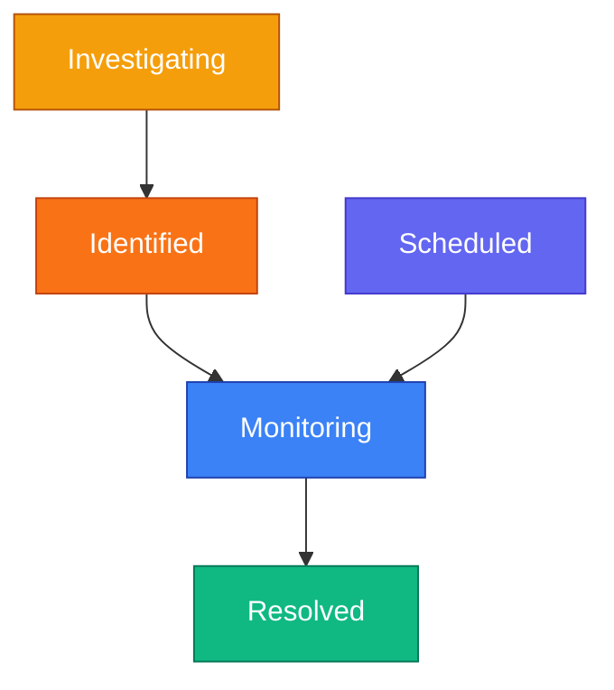
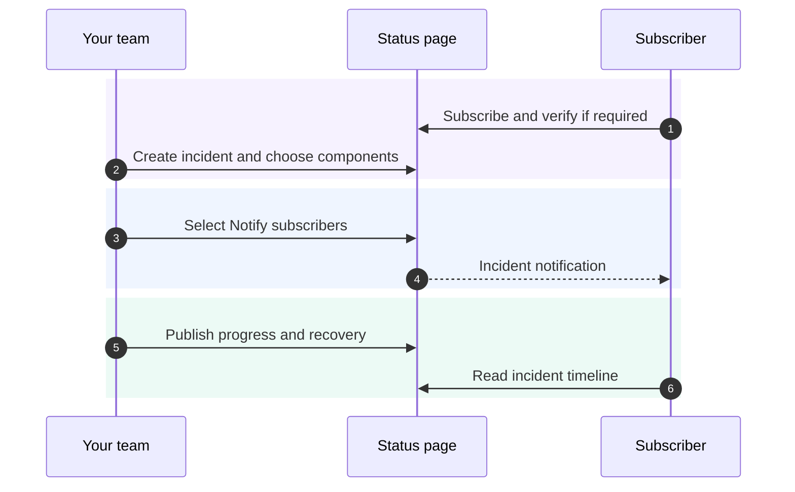
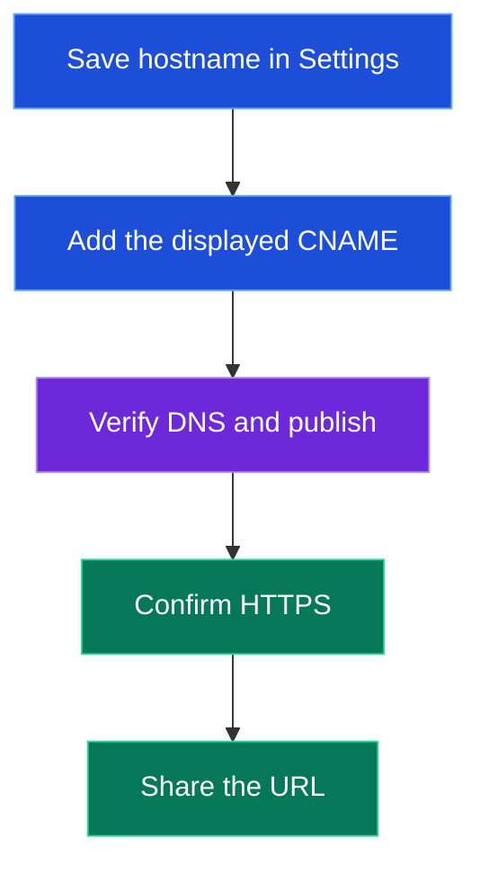

Create public status pages to communicate system health, incidents, and scheduled maintenance to your users.

<Callout type="info">
Status pages are hosted on unique subdomains and are publicly accessible without authentication.
</Callout>

## Managing Status Pages

Navigate to **Communicate → Status Pages** to view all your status pages.


Click **Manage** to access the management interface:


### Creating a Status Page

1. Click **Create Status Page**
2. Enter:
   - **Name** — Internal identifier
   - **Headline** — Public title shown on the page
   - **Description** — Brief description for users
3. Click **Create**


Your page is created in **draft mode**. Configure components and settings before publishing.

### Publishing

1. Add at least one component
2. Configure branding in Settings
3. Click **Publish** to make the page public
4. Share the URL with your users

## Public Status Page

Once published, your status page displays real-time system health to users:


**What users see:**
- **Status Banner** — Overall system health (All Systems Operational, Partial Outage, etc.)
- **Components** — Individual services with current status and 90-day uptime chart
- **Past Incidents** — Recent incident history grouped by date
- **Subscribe Button** — Subscribe to receive incident notifications

### Status Badges

Embed dynamic status badges on external websites, READMEs, or documentation to show real-time system health.

**Badge URL Format:**
```
https://yourdomain.com/api/status-pages/[status-page-id]/badge
```

**Query Parameters:**
- `style` — Badge style: `flat` (default) or `flat-square`
- `label` — Left-side text (default: "status", max 64 characters)

**Embedding in Markdown:**
```markdown


```

**Embedding in HTML:**
```html

```

**Status Colors:**

| Status | Color | Default |
|--------|-------|---------|
| Operational | Green | #2ecc71 |
| Degraded | Yellow | #f1c40f |
| Partial Outage | Orange | #e67e22 |
| Major Outage | Red | #e74c3c |
| Maintenance | Blue | #3498db |

Colors are customizable via the status page **Settings** tab under **Status Colors**.

<Callout type="info">
The badge is a public endpoint — no authentication required. It includes CORS headers for cross-origin embedding on any website.
</Callout>

<Callout type="tip">
Badges may take up to 5 minutes to reflect an update. For real-time updates, link directly to your status page.
</Callout>

**Testing Your Badge:**

Open your browser and visit the badge URL directly to preview the SVG output. Try different combinations:

| URL | Result |
|-----|--------|
| `/api/status-pages/ID/badge` | Default flat badge with "status" label |
| `/api/status-pages/ID/badge?style=flat-square` | Square-cornered badge |
| `/api/status-pages/ID/badge?label=API` | Custom "API" label on the left |
| `/api/status-pages/ID/badge?label=Uptime&style=flat-square` | Combined: custom label with square style |

Replace `ID` with your status page ID from the manage page URL or API response. If the badge shows `invalid id`, the path parameter is not the status page UUID.

### iCal Calendar Feed

Subscribe to status page incidents in any calendar application (Google Calendar, Apple Calendar, Outlook).

**Feed URL:**
```
https://yourdomain.com/api/status-pages/[status-page-id]/ical
```

**Subscribing:**
1. Copy the iCal feed URL for your status page
2. In your calendar app, add a new calendar subscription
3. Paste the URL and subscribe

The feed includes the last 50 incidents with impact level, status, affected services, and links to incident details.

<Callout type="info">
The iCal feed uses the same toggle as the RSS feed. Enable **RSS Feed** in your status page settings to activate both feeds.
</Callout>

### Incident Details

Users can click any incident to view the full timeline of updates:


## Subscribing to Updates

Users can subscribe to receive notifications when incidents are created, updated, or resolved.

<Tabs items={['Email', 'Slack', 'Webhook', 'RSS', 'iCal']}>
<Tab value="Email">


1. Click **Subscribe** on the status page
2. Enter email address
3. Click **Subscribe via Email**
4. Check inbox for verification email
5. Click verification link to activate subscription

</Tab>
<Tab value="Slack">


Send incident notifications directly to a Slack channel:

1. Create a Slack app at [api.slack.com/apps](https://api.slack.com/apps)
2. Enable **Incoming Webhooks**
3. Add webhook to your workspace and select channel
4. Copy the webhook URL
5. Paste URL in the subscription dialog

**Slack notifications include:**
- Rich formatted messages
- Color-coded by incident impact
- Affected services and status updates
- Direct link to status page

</Tab>
<Tab value="Webhook">

For custom integrations, subscribe via webhook:

1. Select **Webhook** tab
2. Enter your webhook endpoint URL
3. Receive JSON payloads for all incident events

</Tab>
<Tab value="RSS">

Subscribe via RSS for feed readers and monitoring tools.

</Tab>
<Tab value="iCal">

Subscribe via iCal to receive incidents in your calendar application.

1. Copy the iCal URL: `https://yourdomain.com/api/status-pages/[id]/ical`
2. Add a new calendar subscription in your app
3. Paste the URL and subscribe

Supports Google Calendar, Apple Calendar, Outlook, and any app that accepts `.ics` feeds.

</Tab>
</Tabs>

## Components

Components represent individual services or features on your status page.


<Tabs items={['Adding Components', 'Status Types']}>
<Tab value="Adding Components">

1. Go to **Components** tab
2. Click **Add Component**
3. Enter:
   - **Name** — Service name (e.g., "API", "Website", "Database")
   - **Description** — Brief explanation
   - **Status** — Current operational status
   - **Linked Monitors** — Associate monitors for reference


**Linked Monitors**

Associate monitors with components for reference. Linked monitors appear in the Overview tab and help you track which monitors relate to each service.

<Callout type="info">
Component status is managed manually. Update component status when creating or resolving incidents.
</Callout>

</Tab>
<Tab value="Status Types">

| Status | Color | Description |
|--------|-------|-------------|
| **Operational** | Green | Service functioning normally |
| **Degraded Performance** | Yellow | Running but slower than normal |
| **Partial Outage** | Orange | Some features unavailable |
| **Major Outage** | Red | Service completely down |
| **Under Maintenance** | Blue | Scheduled maintenance in progress |

</Tab>
</Tabs>

## Incidents

Incidents communicate service disruptions to your users.


<Tabs items={['Creating Incidents', 'Workflow', 'Impact']}>
<Tab value="Creating Incidents">

1. Go to **Incidents** tab
2. Click **Create Incident**
3. Enter:
   - **Title** — Brief description (e.g., "API Response Delays")
   - **Message** — Initial update for users
   - **Status** — Current investigation status
   - **Impact** — Severity level
   - **Affected Components** — Which services are impacted
4. Choose whether to notify subscribers
5. Click **Create**


**Incident Updates**

1. Open an existing incident
2. Click **Add Update**
3. Write update message
4. Update status if changed
5. Choose whether to notify subscribers

**Scheduled Maintenance**

1. Create incident with **Scheduled** status
2. Set start and end times
3. Enable automatic status transitions
4. Configure reminder notifications

</Tab>
<Tab value="Workflow">

Use these statuses to communicate progress. Update the incident as your team investigates, applies a fix, verifies recovery, and resolves it. Scheduled maintenance can advance automatically when you enable its status transitions.


```mermaid
flowchart TB
    A[Investigating] --> B[Identified]
    B --> C[Monitoring]
    C --> D[Resolved]
    S[Scheduled] --> C

    style A fill:#f59e0b,stroke:#b45309,color:#fff
    style B fill:#f97316,stroke:#c2410c,color:#fff
    style C fill:#3b82f6,stroke:#1e40af,color:#fff
    style D fill:#10b981,stroke:#047857,color:#fff
    style S fill:#6366f1,stroke:#4338ca,color:#fff
```

| Status | Description |
|--------|-------------|
| **Investigating** | Issue detected, team investigating |
| **Identified** | Root cause found, working on fix |
| **Monitoring** | Fix deployed, monitoring stability |
| **Resolved** | Issue completely resolved |
| **Scheduled** | Planned maintenance |

</Tab>
<Tab value="Impact">

| Impact | Description |
|--------|-------------|
| **None** | Informational update |
| **Minor** | Small subset of users affected |
| **Major** | Significant impact on service |
| **Critical** | Complete service outage |

</Tab>
</Tabs>

## Subscribers

Manage users who receive incident notifications.


**Features:**
- View all subscribers (email, webhook, Slack)
- See verification status
- Search and filter by email or URL
- Export to CSV
- Delete subscribers
- View statistics (total, verified, pending)

### Notification Types

Subscribers receive notifications for:
- New incidents created
- Incident status updates
- Incident resolution
- Maintenance updates you publish with **Notify subscribers** selected

When creating or updating an incident, select **Notify subscribers** if you want to send an update. Keep the message clear about impact, current status, and the next update. Visitors can review the incident timeline on the published page even when you do not send a notification.

<p className="text-sm md:hidden">Scroll horizontally to view the full diagram.</p>

<div className="overflow-x-auto" role="region" aria-label="Status Pages workflow diagram" tabIndex={0}>
<div className="min-w-[48rem]">


```mermaid
sequenceDiagram
    accTitle: Status page updates
    accDescr: Subscribe, publish an incident, notify subscribers, and share recovery updates.
    autonumber
    participant You as Your team
    participant App as Status page
    participant Environment as Subscriber

    rect rgba(139, 92, 246, 0.08)
        Environment->>App: Subscribe and verify if required
        You->>App: Create incident and choose components
    end
    rect rgba(59, 130, 246, 0.08)
        You->>App: Select Notify subscribers
        App-->>Environment: Incident notification
    end
    rect rgba(16, 185, 129, 0.08)
        You->>App: Publish progress and recovery
        Environment->>App: Read incident timeline
    end
```

</div>
</div>

## Settings

Configure branding and notification settings.


<Tabs items={['Branding', 'Notifications', 'Custom Domains']}>
<Tab value="Branding">

- **Logo** — Header logo for status page
- **Favicon** — Browser tab icon
- **Status Colors** — Customize colors for each status type
- **Custom Domain** — Use your own domain (e.g., `status.example.net`)

</Tab>
<Tab value="Notifications">

- **Page Subscriptions** — Allow visitors to subscribe to all status updates
- **Email, Webhook, and Slack Notifications** — Enable each supported subscriber channel independently
- **Incident Subscriptions** — Allow subscriptions to individual incidents
- **RSS Feed** — Enable RSS feed for subscribers

</Tab>
<Tab value="Custom Domains">

Use a custom hostname such as `status.example.net`. Configure DNS, verify the page, then confirm HTTPS before sharing the URL.

#### Set Up a Custom Domain


```mermaid
flowchart TB
    Domain[Save hostname in Settings] --> DNS[Add the displayed CNAME]
    DNS --> Verify[Verify DNS and publish]
    Verify --> HTTPS[Confirm HTTPS]
    HTTPS --> Share[Share the URL]

    classDef action fill:#1d4ed8,stroke:#60a5fa,color:#fff
    classDef choice fill:#6d28d9,stroke:#a78bfa,color:#fff
    classDef success fill:#047857,stroke:#34d399,color:#fff
    class Domain,DNS action
    class Verify choice
    class HTTPS,Share success
```

| Step | Action |
|---|---|
| **1. Save** | Enter the custom hostname in the status page's **Settings**, then save. |
| **2. Configure DNS** | Add a **CNAME** from your custom hostname to the exact target shown in Settings. Some providers require only the hostname label, such as `status`. |
| **3. Verify** | Wait for propagation, then select **Verify DNS**. Ensure the page is published. |
| **4. Check HTTPS** | Open the custom URL and confirm the certificate is valid before sharing it. |

**Self-hosted example:**

| Purpose | Hostname | DNS record |
|---|---|---|
| Reserved default-page namespace | `[uuid].example.com` | Wildcard A/AAAA pointing to your app |
| Target shown in Settings | `cname.example.com` | A/AAAA pointing to your app; omit if the wildcard covers it |
| Custom status page | `status.example.net` | CNAME to `cname.example.com` |

Set `STATUS_PAGE_DOMAIN` to the public namespace for default URLs. Keep custom hostnames outside that namespace. The target may use A/AAAA or wildcard DNS; the custom hostname must use a CNAME only.

<Callout type="warn">
For Cloudflare, use **DNS only** during verification and initial HTTPS checks. Enable the proxy only after the origin serves HTTPS for the custom hostname; use **Full** or **Full (Strict)** TLS mode.
</Callout>

#### HTTPS / SSL

| Deployment | What to do |
|---|---|
| **Supercheck Cloud** | HTTPS is configured automatically after domain verification. |
| **Self-hosted Docker Compose** | The secure Compose file routes verified custom hostnames to the app. Configure a matching TLS certificate separately in Traefik or your reverse proxy. |
| **Traefik certificates** | Keep the `status-custom` router and supply matching certificates through dynamic TLS configuration. |
| **Other reverse proxy** | Accept the custom hostname, terminate TLS, and forward requests to the app on port 3000. |

DNS verification does not provision a self-hosted certificate. See the [HTTPS deployment guide](/docs/app/deployment/self-hosted) for the base deployment.

#### Removing a Custom Domain

Clear the domain field in **Settings** and save. The default page URL continues to work.

#### Troubleshooting

| Problem | Check |
|---|---|
| CNAME missing or wrong target | Confirm the target matches Settings, then wait for DNS propagation. Check with [DNS Checker](https://dnschecker.org). |
| Target is not publicly resolvable | Point the target hostname to your app using A/AAAA or wildcard DNS. Keep the custom hostname as a CNAME only. |
| Domain already in use | Remove it from the other status page first. |
| 404 | Publish the page, verify DNS, and check that the hostname is outside the reserved `STATUS_PAGE_DOMAIN` namespace. |
| Cloudflare verification fails | Switch the custom record to **DNS only** so its CNAME remains visible. |
| Redirect loop | Use Cloudflare **Full** or **Full (Strict)**, then check origin HTTPS. |
| Self-hosted HTTPS fails | Configure a certificate matching the custom hostname and confirm your proxy accepts it. |

Local development uses `http://localhost:3000/status/[subdomain]`. Public custom domains require a publicly reachable `STATUS_PAGE_DOMAIN`; localhost and private placeholders cannot serve as the target.

</Tab>
</Tabs>
