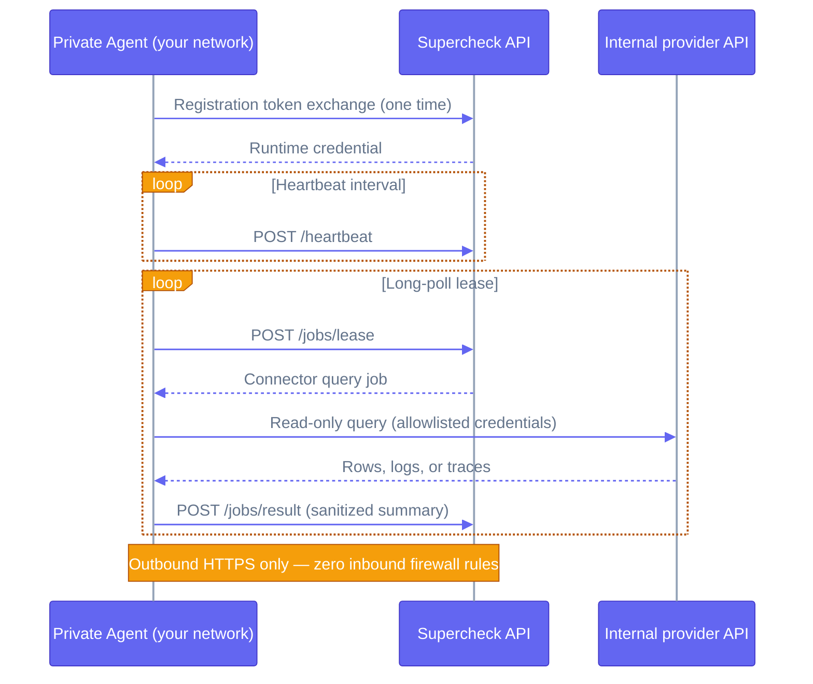

The Supercheck Private Agent is a secure, outbound-only worker designed to run inside your internal network. It connects to the Supercheck API to fetch and execute connector queries against internal services (like on-premise Kubernetes clusters, Prometheus, Grafana, or GitHub Enterprise) without requiring you to open inbound firewall ports or expose database credentials.

Unlike a standard worker, the Private Agent:
- **Does not need** PostgreSQL, Redis, or MinIO credentials.
- Connects **only** to the Supercheck API via outbound HTTPS.
- Runs with a **read-only filesystem** and stripped capabilities.

<Callout type="info">
The Private Agent is used for executing connector queries for investigations. It does not run Playwright or K6 tests.
</Callout>

<Callout type="warn">
If your Supercheck API is behind Cloudflare or another browser-oriented WAF,
exclude the machine-to-machine Private Agent API routes from interactive browser
challenges. Keep TLS, request-size limits, rate limits, logging, and normal WAF
rules enabled.

Required routes:
- `/api/private-agents/registration/exchange`
- `/api/private-agents/heartbeat`
- `/api/private-agents/jobs/lease`
- `/api/private-agents/jobs/result`

A `403` response with `cf-mitigated: challenge` means the request was stopped at
Cloudflare and never reached Supercheck. Use a narrowly scoped Skip rule when
your Cloudflare plan and challenge source support it. Cloudflare Bot Fight Mode
cannot be skipped by path; either disable that mode or use a separate machine
endpoint with equivalent TLS, rate limits, logging, and non-interactive WAF
protection. Do not weaken protection without a documented compensating control.
</Callout>

## Outbound-Only Flow

The agent only ever initiates outbound HTTPS requests to the Supercheck API. It is granted short-lived work, queries the internal provider, and returns sanitized summaries. No inbound firewall ports are required.



## Deployment

Deploy the agent on a server or Kubernetes cluster inside your internal network using the provided Docker Compose configuration.

### 1. Generate an Agent Token
First, create a Private Agent in the Supercheck dashboard:
1. Go to **Admin → Private Agents**.
2. Click **Register agent**.
3. Copy the **Agent ID** and the short-lived **Registration Token**. You will need these for the agent configuration.

### 2. Configure the Environment
On your internal server, create a `.env` file:

```bash
# Required
SUPERCHECK_API_URL=https://app.yourdomain.com
PRIVATE_AGENT_ID=your-agent-id
PRIVATE_AGENT_TOKEN=your-registration-token

# Optional Tuning
SUPERCHECK_VERSION=1.3.6
PRIVATE_AGENT_LEASE_WAIT_MS=25000
PRIVATE_AGENT_RETRY_INTERVAL_MS=5000
PRIVATE_AGENT_HEARTBEAT_INTERVAL_MS=30000
```

### 3. Deploy using Docker Compose
Download and run the [Private Agent Docker Compose file](https://raw.githubusercontent.com/supercheck-io/supercheck/main/deploy/docker/docker-compose-private-agent.yml):

```bash
curl -o docker-compose-private-agent.yml https://raw.githubusercontent.com/supercheck-io/supercheck/main/deploy/docker/docker-compose-private-agent.yml

# Start the agent
docker compose -f docker-compose-private-agent.yml up -d
```

### 4. Verify Connection
Check the agent logs to ensure it has successfully registered and connected:

```bash
docker compose -f docker-compose-private-agent.yml logs -f
```
In the Supercheck dashboard, the agent status should now show as **Active**.

### Kubernetes runtime identity and network policy

Kubernetes `runAsUser` and `runAsGroup` values must match the `pwuser` identity
inside the exact worker image tag you deploy. The current image uses `1001:1001`.
Verify custom or older tags before writing the security context:

```bash
docker run --rm --entrypoint sh \
  ghcr.io/supercheck-io/supercheck/worker:YOUR_VERSION \
  -c 'id -u pwuser; id -g pwuser'
```

Mount persistent state at `/home/pwuser/.supercheck`, set
`PRIVATE_AGENT_CREDENTIAL_FILE=/home/pwuser/.supercheck/private-agent-token`,
and make the volume writable only by that identity. A mismatch can allow the
one-time registration exchange to complete while preventing the runtime
credential from being saved for restart recovery.

Keep inbound traffic denied. Allow outbound DNS and HTTPS to Supercheck, plus
only the internal provider endpoint ports used by configured connectors. Note
that a Service port can differ from its pod target port; NetworkPolicy engines
may require the target port (for example, Grafana Service `80` to pod `3000`).
For optional Tempo access, allow the Private Agent explicitly in both the
agent egress policy and Tempo ingress policy.

## Security Posture

The provided Docker Compose configuration applies strict security constraints:
- `user: "pwuser:pwuser"`: Runs as the image's non-root account without relying on a stale numeric UID.
- `read_only: true`: Mounts the root filesystem as read-only.
- `tmpfs`: Uses memory-backed ephemeral storage for `/tmp` and cache directories.
- `security_opt: [no-new-privileges:true]`: Prevents privilege escalation.
- `cap_drop: [ALL]`: Drops all Linux capabilities.
