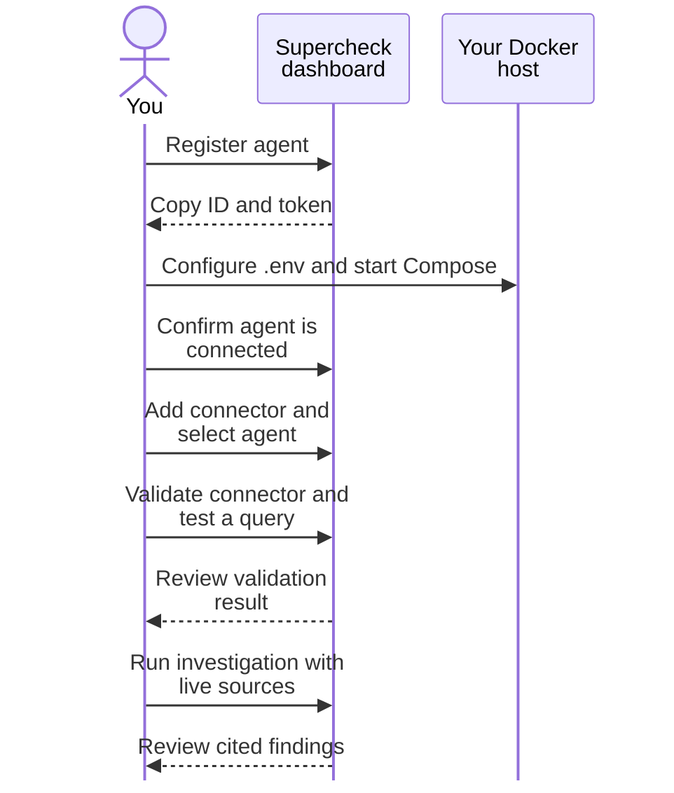

Use a Private Agent to include private services such as Prometheus, Grafana, or GitHub Enterprise in AI SRE investigations. Register it in your Supercheck dashboard, run it with Docker Compose inside your network, then select it when adding a connector.

<Callout type="info">
Private Agents execute read-only connector queries for investigations. They do not run monitors, Playwright tests, or k6 tests. For test execution, see [worker deployment](/docs/app/deployment/multi-location).
</Callout>

## Before You Start

For **Supercheck Cloud**, sign in and select the project that will use the agent. Run only the Private Agent on a machine inside your network; you do not need to self-host Supercheck.

For **self-hosted Supercheck**, use your own dashboard and instance URL. The setup steps below are the same.

You need:

- Permission to configure connectors, such as **Project Admin**, **Org Admin**, or **Org Owner**.
- Docker Engine with Compose v2 (`docker compose`) on a machine that can reach your internal provider endpoints.
- Outbound access from the container to your Supercheck instance over HTTPS. No inbound firewall ports are needed.

## Setup Workflow

<p className="text-sm md:hidden">Scroll horizontally to view the full diagram.</p>

<div className="overflow-x-auto" role="region" aria-label="Private Agent workflow diagram" tabIndex={0}>
<div className="min-w-[28rem]">


```mermaid
%%{init: {"sequence": {"mirrorActors": false, "actorMargin": 24, "width": 110, "height": 65, "wrap": true}}}%%
sequenceDiagram
    actor You
    participant Cloud as Supercheck dashboard
    participant Host as Your Docker host

    You->>Cloud: Register agent
    Cloud-->>You: Copy ID and token
    You->>Host: Configure .env and start Compose
    You->>Cloud: Confirm agent is connected
    You->>Cloud: Add connector and select agent
    You->>Cloud: Validate connector and test a query
    Cloud-->>You: Review validation result
    You->>Cloud: Run investigation with live sources
    Cloud-->>You: Review cited findings
```

</div>
</div>

## Set Up the Agent

Download the [Private Agent Compose file](https://github.com/supercheck-io/supercheck/blob/v1.3.6/deploy/docker/docker-compose-private-agent.yml) into a dedicated directory:

```bash
mkdir -p supercheck-private-agent
cd supercheck-private-agent
curl --fail --show-error --location --output docker-compose-private-agent.yml \
  https://raw.githubusercontent.com/supercheck-io/supercheck/v1.3.6/deploy/docker/docker-compose-private-agent.yml
```

### 1. Register the Agent

1. Open **Organization Admin → Private Agents** with permission to configure connectors.
2. Click **Register agent**, enter a name, and keep **Scope this agent to the current project** selected unless it needs to serve other projects in your organization. Region and network label are optional.
3. Copy the **Agent ID** and **Registration token**. The token is shown once and expires after **15 minutes**.

### 2. Configure the Environment

Create a `.env` file beside the Compose file:

```bash
SUPERCHECK_API_URL=https://your-supercheck-instance.example
PRIVATE_AGENT_ID=your-agent-id
PRIVATE_AGENT_TOKEN=your-registration-token
SUPERCHECK_VERSION=1.3.6
```

Replace the example API URL with the HTTPS origin of your Cloud dashboard or self-hosted instance, without a path such as `/api`. Use the Compose file and worker image from the same release. Keep `.env` out of version control and restrict its permissions:

```bash
chmod 600 .env
```

### 3. Start the Agent

Review the downloaded Compose file, then start the agent from the directory containing it and `.env`:

```bash
docker compose -f docker-compose-private-agent.yml up -d
docker compose -f docker-compose-private-agent.yml logs -f private-agent
```

Keep the `private-agent-state` volume so the agent can reconnect after a restart without registering again. Do not use `docker compose down -v` during routine restarts or upgrades.

### 4. Connect a Provider

1. Confirm the agent shows **connected** and has a recent heartbeat in **Organization Admin → Private Agents**.
2. In the same project, open **Organization Admin → Integrations**, click **Add connector**, choose a supported provider, set the execution mode to **Private Agent**, and select the agent you registered.
3. Enter the internal endpoint and a least-privilege read-only provider credential. Limit access to the services that need it.
4. Validate the connector and run a known-result search before using it in an investigation.

Use an endpoint the container can resolve and reach. `localhost` and loopback addresses are rejected; they do not refer to another service on the Docker host. For a service on that host, use a reachable private address or DNS name. Internal provider endpoints may use HTTP or HTTPS; prefer HTTPS.

See [Connectors](/docs/app/investigate/connectors) for supported providers and credential requirements. Provider credentials are stored encrypted by Supercheck and supplied to the agent for queries; they are not included in AI prompts.

### 5. Use the Connector in an Investigation

1. Open an incident under **Investigate → Incidents** and link it to a service in the connector's **Service scope**.
2. Turn on **Include live sources** and select **Run investigation**. This requires connector investigation permission.
3. Review the cited findings and evidence on the incident. Use [Copilot](/docs/app/investigate/copilot) with **Live sources** enabled for follow-up questions.

If the agent is unavailable or the query fails, check the agent status and connector validation before retrying. See [Incident Investigation](/docs/app/investigate/incidents) for the full responder workflow.

## Security

Use the supplied Compose file to keep its non-root user, read-only filesystem, and restricted container permissions.

Allow outbound DNS, HTTPS to Supercheck, and only the provider hosts and ports needed by your connectors. Keep inbound access denied. Query results can contain operational data even after redaction, so connect only approved evidence sources.

## Restarts and Token Rotation

```bash
docker compose -f docker-compose-private-agent.yml restart private-agent
```

Routine restarts do not require a new registration token when the state volume is preserved. Keep `PRIVATE_AGENT_TOKEN` set in `.env`; the supplied Compose file requires it.

If a token expires before registration, or you need to replace an agent credential:

1. Open the agent's actions menu in **Organization Admin → Private Agents** and choose **Rotate token**. The existing credential stops working; update the container promptly.
2. Replace `PRIVATE_AGENT_TOKEN` in `.env` with the new token.
3. Recreate the container within 15 minutes:

```bash
docker compose -f docker-compose-private-agent.yml up -d --force-recreate private-agent
```

Use the same command after changing `.env`; `restart` does not apply environment changes. Preserve the state volume.

## Troubleshooting

| Symptom | Check |
|---|---|
| Agent stays pending | Check the API URL, outbound connectivity, and logs. If the registration token expired, follow the rotation steps above. |
| Agent cannot reconnect after restart | Preserve the state volume and ensure the image user can write the credential file. |
| Agent connects but queries fail | Provider DNS, endpoint ports, read-only permissions, and the connector's selected agent and project scope. |
| Agent receives a browser challenge | Apply the proxy guidance below to the agent API routes. |

<details>
<summary>Reverse proxies and browser challenges</summary>

Private Agents cannot solve interactive browser challenges. If your Supercheck API is behind Cloudflare or another WAF, exclude only these machine-to-machine routes from interactive challenges:

- `/api/private-agents/registration/exchange`
- `/api/private-agents/heartbeat`
- `/api/private-agents/jobs/lease`
- `/api/private-agents/jobs/result`

Keep authentication, TLS, request-size limits, rate limits, logging, and non-interactive WAF protection enabled. A `403` response with `cf-mitigated: challenge` indicates that Cloudflare blocked the request before it reached Supercheck.

Cloudflare Bot Fight Mode cannot be skipped by path. Use a configuration that supports narrow exclusions, or a dedicated API hostname with equivalent protection; avoid disabling protection across the whole site.

</details>
