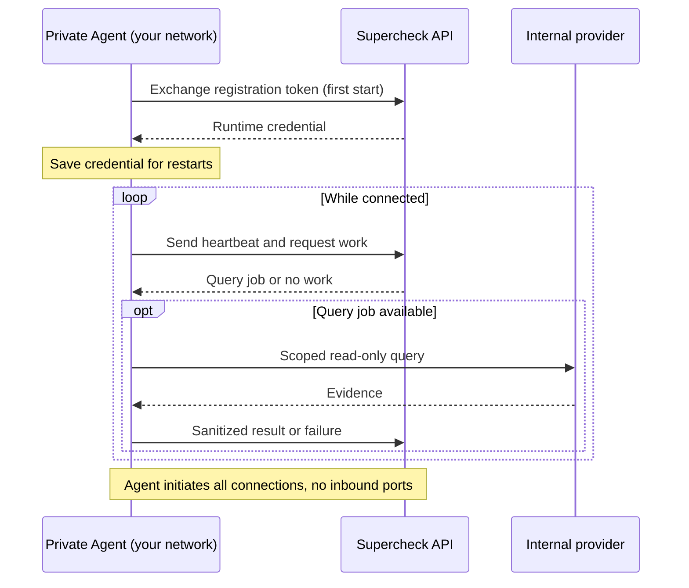

Run a Private Agent inside your network to let AI SRE query internal services such as Kubernetes, Prometheus, Grafana, and GitHub Enterprise. The agent initiates connections to Supercheck and your configured providers; it needs no inbound firewall ports or Supercheck PostgreSQL, Redis, or object-storage credentials.

<Callout type="info">
Private Agents execute read-only connector queries for investigations. They do not run Playwright or k6 tests. For test execution, see [worker deployment](/docs/app/deployment/multi-location).
</Callout>

## Connection Flow

The agent exchanges a one-time registration token, saves its runtime credential, and polls for work. Connector credentials are supplied for the leased query; bounded, sanitized results return to Supercheck and may be used as investigation evidence.


```mermaid
sequenceDiagram
    participant Agent as Private Agent (your network)
    participant API as Supercheck API
    participant Provider as Internal provider

    Agent->>API: Exchange registration token (first start)
    API-->>Agent: Runtime credential
    Note over Agent: Save credential for restarts
    loop While connected
        Agent->>API: Send heartbeat and request work
        API-->>Agent: Query job or no work
        opt Query job available
            Agent->>Provider: Scoped read-only query
            Provider-->>Agent: Evidence
            Agent->>API: Sanitized result or failure
        end
    end
    Note over Agent,API: Agent initiates all connections, no inbound ports
```

## Deployment

Use Docker Compose on a host that can reach your Supercheck API over HTTPS and the required internal provider endpoints.

### 1. Register the Agent

1. Open **Organization Admin → Private Agents** with permission to configure connectors.
2. Click **Register agent** and choose its project scope.
3. Copy the **Agent ID** and **Registration token**. The token is shown once and expires; start the agent promptly.

### 2. Configure the Environment

Create a `.env` file beside the Compose file:

```bash
SUPERCHECK_API_URL=https://app.yourdomain.com
PRIVATE_AGENT_ID=your-agent-id
PRIVATE_AGENT_TOKEN=your-registration-token
SUPERCHECK_VERSION=1.3.6
```

Use the HTTPS URL of your Supercheck instance and a tested release tag. Keep `.env` out of version control and restrict its permissions:

```bash
chmod 600 .env
```

Default heartbeat and polling settings work for most deployments; no tuning is required.

### 3. Start the Agent

Download the [Private Agent Compose configuration](https://github.com/supercheck-io/supercheck/blob/v1.3.6/deploy/docker/docker-compose-private-agent.yml) from the same release as your image, inspect it, then start the agent:

```bash
curl --fail --show-error --location --output docker-compose-private-agent.yml \
  https://raw.githubusercontent.com/supercheck-io/supercheck/v1.3.6/deploy/docker/docker-compose-private-agent.yml

docker compose -f docker-compose-private-agent.yml up -d
docker compose -f docker-compose-private-agent.yml logs -f private-agent
```

Keep the `private-agent-state` volume: it stores the runtime credential used after the registration token is consumed. Do not use `docker compose down -v` during routine restarts or upgrades.

### 4. Connect a Provider

1. Confirm the agent shows **connected** and has a recent heartbeat in **Organization Admin → Private Agents**.
2. Open **Organization Admin → Integrations**, add a supported provider, choose **Private Agent**, and select this agent.
3. Enter the internal endpoint and a least-privilege read-only provider credential. Limit access to the services that need it.
4. Validate the connector and run a known-result search before using it in an investigation.

See [Connectors](/docs/app/investigate/connectors) for supported providers, permissions, and credential requirements. Provider credentials are stored encrypted by Supercheck and supplied to the agent for query execution; they are not included in AI prompts.

## Security

The supplied Compose configuration runs as a non-root user, makes the root filesystem read-only, drops all Linux capabilities, and prevents privilege escalation. Temporary files use memory-backed storage; runtime credentials use the persistent state volume.

Allow outbound DNS, HTTPS to Supercheck, and only the provider hosts and ports needed by your connectors. Keep inbound access denied. Query results can contain operational data even after redaction, so connect only approved evidence sources.

### Kubernetes

For a Kubernetes deployment, use the same worker image in `SUPERCHECK_RUNTIME_MODE=private-agent`, without exposing a Service. Apply the same non-root, read-only, and capability restrictions as the Compose configuration.

Match `runAsUser`, `runAsGroup`, and volume permissions to the `pwuser` identity in the exact image you deploy. The supplied release uses `1001:1001`; verify custom images:

```bash
docker run --rm --entrypoint sh \
  ghcr.io/supercheck-io/supercheck/worker:1.3.6 \
  -c 'id -u pwuser; id -g pwuser'
```

Mount writable persistent state at `/home/pwuser/.supercheck` and set `PRIVATE_AGENT_CREDENTIAL_FILE=/home/pwuser/.supercheck/private-agent-token`. Supply registration tokens through a Kubernetes Secret, and provide writable temporary and cache directories as in Compose.

Use network policies to deny ingress and limit egress to DNS, Supercheck, and the configured providers. Allow the provider's pod target port when it differs from its Service port; the provider's ingress policy must also permit the agent.

## Troubleshooting

| Symptom | Check |
|---|---|
| Agent stays pending | API URL, outbound connectivity, and registration-token expiry. Rotate the token in the dashboard if needed. |
| Agent cannot reconnect after restart | Preserve the state volume and ensure the image user can write the credential file. |
| Agent connects but queries fail | Provider DNS, endpoint ports, read-only permissions, and the connector's selected agent and project scope. |
| Agent receives a browser challenge | Apply the proxy guidance below to the agent API routes. |

<details>
<summary>Reverse proxies and browser challenges</summary>

Private Agents cannot solve interactive browser challenges. If your Supercheck API is behind Cloudflare or another WAF, exclude only these machine-to-machine routes from interactive challenges:

- `/api/private-agents/registration/exchange`
- `/api/private-agents/heartbeat`
- `/api/private-agents/jobs/lease`
- `/api/private-agents/jobs/result`

Keep authentication, TLS, request-size limits, rate limits, logging, and non-interactive WAF protection enabled. A `403` response with `cf-mitigated: challenge` indicates that Cloudflare blocked the request before it reached Supercheck.

Cloudflare Bot Fight Mode cannot be skipped by path. Use a configuration that supports narrow exclusions, or a dedicated API hostname with equivalent protection; avoid disabling protection across the whole site.

</details>
