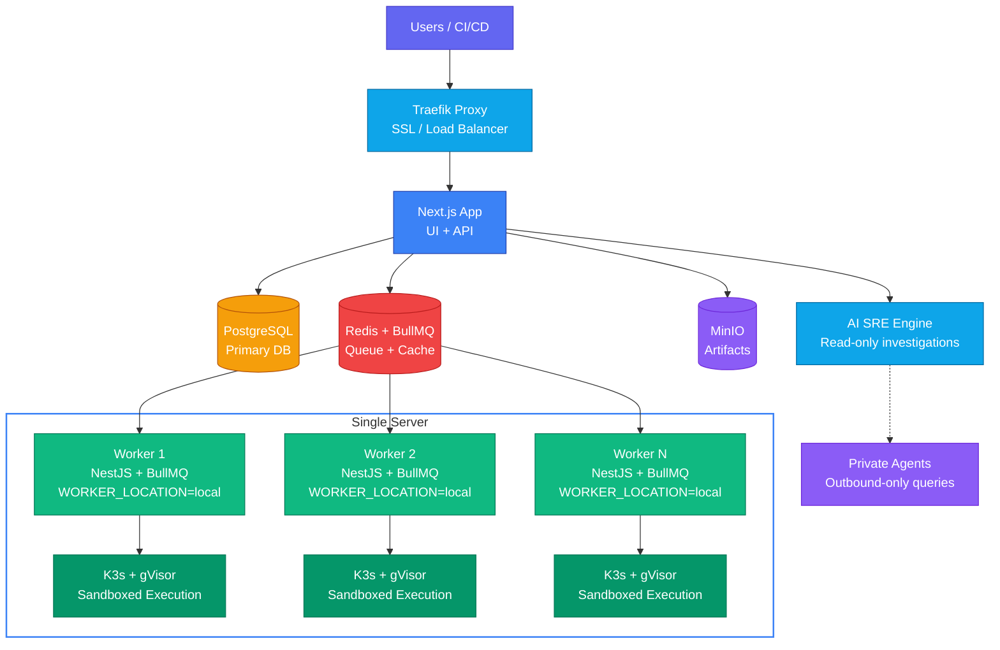

Deploy Supercheck on a single server with Docker Compose.

## Architecture

<p className="text-sm md:hidden">Scroll horizontally to view the full diagram.</p>

<div className="overflow-x-auto" role="region" aria-label="Single-Location deployment layout diagram" tabIndex={0}>
<div className="min-w-[52rem]">


```mermaid
flowchart TB
    Users[Users / CI/CD] --> T[Traefik Proxy<br/>SSL / Load Balancer]
    T --> App[Next.js App<br/>UI + API]
    App --> DB[(PostgreSQL<br/>Primary DB)] & Redis[(Redis + BullMQ<br/>Queue + Cache)] & S3[(MinIO<br/>Artifacts)]
    App --> SRE[AI SRE Engine<br/>Read-only investigations]
    SRE -.-> Private[Private Agents<br/>Outbound-only queries]

    Redis --> W1
    Redis --> W2
    Redis --> WN

    subgraph SERVER["Single Server"]
        W1[Worker 1<br/>NestJS + BullMQ<br/>WORKER_LOCATION=local] --> K3S_1[K3s + gVisor<br/>Sandboxed Execution]
        W2[Worker 2<br/>NestJS + BullMQ<br/>WORKER_LOCATION=local] --> K3S_2[K3s + gVisor<br/>Sandboxed Execution]
        WN[Worker N<br/>NestJS + BullMQ<br/>WORKER_LOCATION=local] --> K3S_N[K3s + gVisor<br/>Sandboxed Execution]
    end

    style Users fill:#6366f1,stroke:#4338ca,color:#fff
    style T fill:#0ea5e9,stroke:#0369a1,color:#fff
    style App fill:#3b82f6,stroke:#1e40af,color:#fff
    style DB fill:#f59e0b,stroke:#b45309,color:#fff
    style Redis fill:#ef4444,stroke:#b91c1c,color:#fff
    style S3 fill:#8b5cf6,stroke:#6d28d9,color:#fff
    style SRE fill:#0ea5e9,stroke:#0369a1,color:#fff
    style Private fill:#8b5cf6,stroke:#6d28d9,color:#fff
    style W1 fill:#10b981,stroke:#047857,color:#fff
    style W2 fill:#10b981,stroke:#047857,color:#fff
    style WN fill:#10b981,stroke:#047857,color:#fff
    style K3S_1 fill:#059669,stroke:#047857,color:#fff
    style K3S_2 fill:#059669,stroke:#047857,color:#fff
    style K3S_N fill:#059669,stroke:#047857,color:#fff
    style SERVER fill:none,stroke:#3b82f6,stroke-width:2px
```

</div>
</div>

Use one Compose file for the bundled stack. HTTP is available on the host for evaluation; enable the `https` profile for a public server. The optional `private-agent` profile adds read-only access to private evidence sources.

## Docker Compose

Use Ubuntu 22.04+ or Debian 12+ with Docker Engine and Compose **v2.24.4 or newer**. The execution sandbox requires Linux; macOS, Windows, and WSL2 are not supported. Allow at least 2 vCPU and 4 GB RAM.

Installing with an agent? Use the [installation runbook](https://raw.githubusercontent.com/supercheck-io/supercheck/main/deploy/docker/INSTALL.md).

### 1. Prepare the Host

```bash
git clone https://github.com/supercheck-io/supercheck.git
cd supercheck/deploy/docker
./init-secrets.sh
sudo bash setup-k3s.sh
```

The scripts generate secrets and prepare the isolated execution environment. Preserve an existing `.env` and its secrets when updating or retrying.

### 2. Configure HTTPS

For a public server, point your app hostname at the server and allow inbound TCP ports **80** and **443**. Edit `.env`:

```dotenv
COMPOSE_PROFILES=https
APP_DOMAIN=app.example.com
ACME_EMAIL=admin@example.com
STATUS_PAGE_DOMAIN=example.com
```

Traefik obtains the app certificate and redirects HTTP to HTTPS. The app URL and authentication origin are derived from `APP_DOMAIN`. If `NEXT_PUBLIC_APP_URL` is already set, update it to the same HTTPS origin.

For local evaluation, leave `COMPOSE_PROFILES` and `APP_DOMAIN` unset and open `http://localhost:3000` on the host. Port 3000 is bound to loopback; when using a remote server, forward it with SSH or configure HTTPS.

`STATUS_PAGE_DOMAIN` reserves the default status-page namespace. Point its DNS records at your instance and provide a wildcard or per-host certificate before publishing subdomain status pages. Verified custom domains also route to the app, but require your own certificate setup. If using Cloudflare, use **Full (strict)** and keep custom-domain records DNS-only until verification and origin HTTPS work.

### 3. Start and Verify

```bash
KUBECONFIG_FILE=/etc/rancher/k3s/supercheck-worker.kubeconfig docker compose config -q
KUBECONFIG_FILE=/etc/rancher/k3s/supercheck-worker.kubeconfig docker compose up -d --wait --wait-timeout 300
docker compose ps
curl --fail --silent --show-error https://app.example.com/api/health
```

For local evaluation, use `http://localhost:3000/api/health`. The app applies migrations at startup; no separate migration command is needed. Sign up, then run a test to verify the execution sandbox. To grant your account Super Admin access:

```bash
docker compose exec app node scripts/bootstrap-admin.js your-email@example.com
```

### Optional Private Agent

Register an agent in **Organization Admin → Private Agents**, then add its ID and registration token to `.env`:

```dotenv
COMPOSE_PROFILES=https,private-agent
PRIVATE_AGENT_ID=your-agent-id
PRIVATE_AGENT_TOKEN=your-registration-token
```

```bash
docker compose up -d private-agent
```

The colocated agent connects to the app over the private Docker network. It receives no database, Redis, or storage credentials. See [Private Agent](/docs/app/deployment/private-agent) for connector setup and agents on another network or connected to Supercheck Cloud.

To stop it, run `docker compose stop private-agent` and remove `private-agent` from `COMPOSE_PROFILES`. Keep the agent state volume for reconnection.

### Existing Managed Services

Use `docker-compose-external.yml` when you already have PostgreSQL, Redis, and S3-compatible storage. Configure their connection values and your domain in `.env`, then use `docker compose -f docker-compose-external.yml` for the commands above. For regional execution workers, see [Multi-Location](/docs/app/deployment/multi-location).

## Optional Configuration

<Accordions>
  <Accordion title="Browser Integrations (CORS)">
    Browser-based integrations such as Azure DevOps dashboard widgets, Grafana panels, or custom embedded views need CORS enabled on the App service.

    Add this to your `.env` when you want browser clients from those domains to call Supercheck APIs directly:

    ```bash
    CORS_ALLOWED_ORIGINS=https://dev.azure.com,https://*.visualstudio.com
    ```

    <Callout type="info">
    `CORS_ALLOWED_ORIGINS` is optional and empty by default. This preserves the secure default for self-hosted deployments. Only enable it for trusted browser-based integrations.
    </Callout>

  </Accordion>

  <Accordion title="OAuth (GitHub / Google)">
    <Tabs items={['GitHub', 'Google']}>
      <Tab value="GitHub">
        1. Go to [GitHub Developer Settings](https://github.com/settings/developers) → **OAuth Apps** → **New OAuth App**
        2. Set Callback URL: `https://app.yourdomain.com/api/auth/callback/github`
        3. Add to `.env`:
           ```bash
           GITHUB_CLIENT_ID=your-client-id
           GITHUB_CLIENT_SECRET=your-client-secret
           ```
      </Tab>
      <Tab value="Google">
        1. Go to [Google Cloud Console](https://console.cloud.google.com/) → **APIs & Services** → **Credentials**
        2. Create **OAuth client ID** with redirect URI: `https://app.yourdomain.com/api/auth/callback/google`
        3. Add to `.env`:
           ```bash
           GOOGLE_CLIENT_ID=your-client-id.apps.googleusercontent.com
           GOOGLE_CLIENT_SECRET=your-client-secret
           ```
      </Tab>
    </Tabs>
  </Accordion>

  <Accordion title="Registration Controls">
    | Variable | Default | Description |
    |----------|---------|-------------|
    | `SIGNUP_ENABLED` | `true` | Set `false` to disable open registration (invited users still work) |
    | `ALLOWED_EMAIL_DOMAINS` | *(empty)* | Comma-separated allowlist (e.g. `acme.com,acme.org`) |
  </Accordion>

  <Accordion title="Email (SMTP)">
    ```bash
    SMTP_HOST=smtp.gmail.com
    SMTP_PORT=587
    SMTP_FROM_EMAIL=notifications@yourdomain.com
    SMTP_USER=your-email@gmail.com        # Optional
    SMTP_PASSWORD=your-app-password       # Optional
    ```
  </Accordion>

  <Accordion title="AI Provider">
    OpenAI GPT-6 Luna is the default for test creation, repair, requirement extraction, and AI SRE. Provider selection applies to the whole installation. When switching providers, set both `AI_PROVIDER` and the matching `AI_MODEL`.

    <Tabs items={['OpenAI', 'Azure', 'Anthropic', 'Gemini', 'Vertex AI', 'Bedrock', 'OpenRouter', 'DeepSeek']}>
      <Tab value="OpenAI">
        ```bash
        AI_PROVIDER=openai
        AI_MODEL=gpt-6-luna
        OPENAI_API_KEY=sk-your-api-key
        ```
      </Tab>
      <Tab value="Azure">
        ```bash
        AI_PROVIDER=azure
        AZURE_RESOURCE_NAME=your-resource-name
        AZURE_API_KEY=your-api-key
        AZURE_OPENAI_DEPLOYMENT=your-deployment-name
        # Optional: only set if your Azure deployment supports temperature.
        # GPT-5/reasoning deployments commonly reject this parameter.
        AZURE_INCLUDE_TEMPERATURE=false
        ```
      </Tab>
      <Tab value="Anthropic">
        ```bash
        AI_PROVIDER=anthropic
        AI_MODEL=claude-3-5-haiku-20241022
        ANTHROPIC_API_KEY=sk-ant-your-key
        ```
      </Tab>
      <Tab value="Gemini">
        ```bash
        AI_PROVIDER=gemini
        AI_MODEL=gemini-2.5-flash
        GOOGLE_GENERATIVE_AI_API_KEY=your-api-key
        ```
      </Tab>
      <Tab value="Vertex AI">
        ```bash
        AI_PROVIDER=google-vertex
        AI_MODEL=gemini-2.5-flash
        GOOGLE_VERTEX_PROJECT=your-project-id
        ```

        <Callout type="info">
        Vertex AI uses [Google Application Default Credentials (ADC)](https://cloud.google.com/docs/authentication/application-default-credentials). On GCP, prefer an attached service account. For self-hosted Docker outside GCP, mount your service account key into the app container and set `GOOGLE_APPLICATION_CREDENTIALS` in the container environment; adding it to `.env` alone is not enough because the shipped Compose files do not forward that variable or mount the key file automatically.
        </Callout>
      </Tab>
      <Tab value="Bedrock">
        ```bash
        AI_PROVIDER=bedrock
        AI_MODEL=anthropic.claude-3-5-haiku-20241022-v1:0
        BEDROCK_AWS_REGION=us-east-1
        BEDROCK_AWS_ACCESS_KEY_ID=your-access-key
        BEDROCK_AWS_SECRET_ACCESS_KEY=your-secret-key
        ```
      </Tab>
      <Tab value="OpenRouter">
        ```bash
        AI_PROVIDER=openrouter
        AI_MODEL=anthropic/claude-3.5-haiku
        OPENROUTER_API_KEY=your-api-key
        ```
      </Tab>
      <Tab value="DeepSeek">
        ```bash
        AI_PROVIDER=deepseek
        AI_MODEL=deepseek-flash
        DEEPSEEK_API_KEY=your-deepseek-api-key
        ```

        `deepseek-flash` is the official API model ID for [DeepSeek V4.1 Flash](https://api-docs.deepseek.com/news/news260910/).

        <Callout type="warn">
        DeepSeek is optional. Selecting it sends prompts, code, uploaded requirement text, and evidence supplied to AI features to DeepSeek's hosted API. Review its data handling and China-related residency implications against your organization's requirements before enabling it. DeepSeek errors do not automatically switch to OpenAI.
        </Callout>
      </Tab>
    </Tabs>
  </Accordion>

  <Accordion title="AI SRE">
    Configure an AI provider above to use investigations, Copilot, and automatic alert triage. Database migrations run automatically when the app starts.

    No enable flags are needed. For manual investigations only, set `SRE_AUTOMATION_ENABLED=false`. To disable AI SRE entirely, set `SRE_ENABLED=false`.

    Automatic triage can use your AI provider when alerts fire and incur provider charges. Copilot live sources are on by default for authorized users. Full investigation runs have a separate **Include live sources** option. See [AI SRE Setup](/docs/app/admin/ai-sre-setup).

    After changing `.env`, apply it to both services:

    ```bash
    docker compose up -d --force-recreate app worker
    ```

  </Accordion>
</Accordions>

---

## Operations

### Scaling

Set `WORKER_REPLICAS` and `RUNNING_CAPACITY` to the same number in `.env`, then run `docker compose up -d`. Keep `WORKER_LOCATION=local` for a single-server installation.

### Backups

Back up your database, MinIO data, `.env`, and Traefik certificate volume before upgrades. For a database backup:

```bash
docker compose exec -T postgres sh -c 'pg_dump -U "$POSTGRES_USER" "$POSTGRES_DB"' > backup.sql
```

### Updates

Set `SUPERCHECK_VERSION` to the release you want in `.env`, then run:

```bash
docker compose pull
KUBECONFIG_FILE=/etc/rancher/k3s/supercheck-worker.kubeconfig docker compose up -d
```

The same file and profiles are used for installation and updates. After changing environment values, recreate the affected services; `restart` does not load new `.env` values:

```bash
docker compose up -d --force-recreate app worker
```

Recreate `private-agent` too when its settings change, preserving its state volume. Existing deployments may keep using `docker-compose-secure.yml`; it is a compatibility entry point backed by the main Compose file. HTTPS certificates and application data keep their existing named volumes.

**Upgrading from before 1.3.3:** Back up your data and run `sudo bash setup-k3s.sh` before updating to the isolated execution sandbox.

## Next Steps

- [AI SRE Setup](/docs/app/admin/ai-sre-setup) — add services and read-only evidence sources.
- [Private Agent](/docs/app/deployment/private-agent) — reach sources inside another network.
- [Multi-Location](/docs/app/deployment/multi-location) — add regional execution workers.
