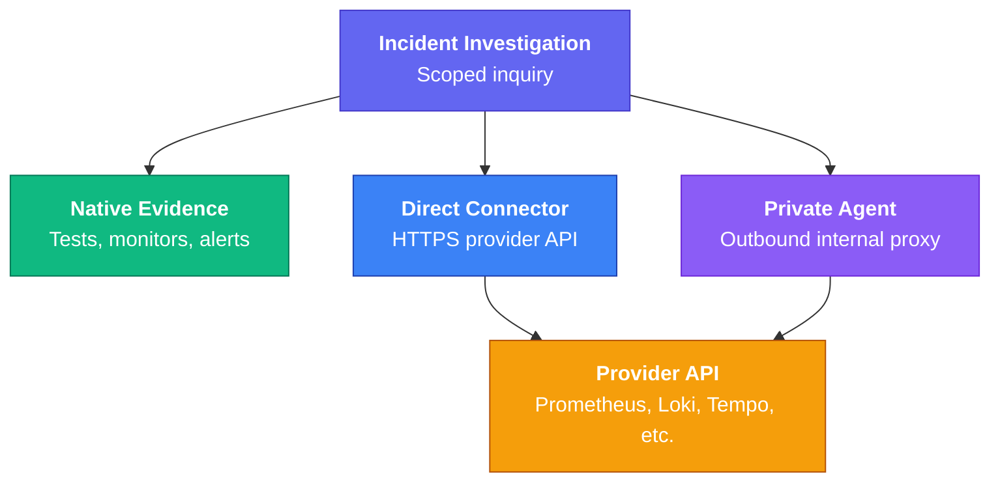

Connectors let Supercheck collect cited operational evidence during an investigation. Administrators manage them from **Organization Admin → Integrations**.

## Supported Connectors

- **Metrics and dashboards:** Prometheus, Grafana, AWS CloudWatch
- **Operational events:** Datadog
- **Logs and search:** Loki, Elasticsearch/OpenSearch
- **Tracing:** Grafana Tempo
- **Cloud and infrastructure:** Kubernetes, AWS CloudWatch
- **Errors:** Sentry
- **Code changes:** GitHub, GitLab
- **Incident management:** PagerDuty, Opsgenie

The Add Connector dialog shows only providers with implemented validation and bounded read-only search. Existing records for unsupported providers are labeled **Setup only** and cannot run searches.

## Execution Modes

**Direct** connects from the Supercheck app to a reachable provider API. In
Supercheck Cloud, direct endpoints must use HTTPS and resolve to a public
address. Private IPs, cluster-only DNS, localhost, and cleartext HTTP are
rejected to protect the service from server-side request forgery. Reserved IP
ranges, non-HTTP(S) schemes, and credentials embedded in endpoint URLs are also
rejected. Store credentials in the connector credential fields instead.

**Private Agent** connects from an outbound-only agent inside your network. It is available for GitHub, Kubernetes, Prometheus, Grafana, Sentry, Datadog, Loki, Elasticsearch/OpenSearch, Tempo, and AWS CloudWatch.

Use a Private Agent for in-cluster or on-premises endpoints. Do not expose an
internal observability API publicly or weaken endpoint restrictions only to make
a direct connector work.

Kubernetes searches require an explicit namespace. Grant the connector service
account read-only access only to the namespaces under test; do not grant
cluster-admin or unrestricted write permissions.

GitLab, PagerDuty, and Opsgenie currently support direct execution only.

## Add a Connector

1. Choose the provider, name, risk level, and supported execution mode.
2. Enter the API endpoint and least-privilege read-only credential.
3. Limit access to the services that need this evidence.
4. Save, validate, and run a bounded search with known-safe data.

Use **Context links** only when an alert destination should be correlated with a separate read-only connector.

## Credential Checklist

Use a separate credential limited to the mapped service:

| Provider | Minimum access |
|---|---|
| GitHub / GitLab | Read-only token limited to required repositories or projects |
| Grafana | `Viewer` service-account token with dashboard search; never use the admin password |
| Sentry | Project-scoped issue read access |
| Datadog | API key plus application key with read-only event access for the correct regional site |
| Elasticsearch / OpenSearch | Search-only access to approved indices |
| AWS CloudWatch | Prefer short-lived STS credentials for `DescribeAlarms`, `GetMetricData`, and `ListMetrics` |
| PagerDuty / Opsgenie | Read-only incident or alert access; Events API keys are not search credentials |

After validation, run one known-result query and one no-result query. Revoke
temporary credentials and remove disposable provider fixtures when testing is
complete.

## Query Examples

- GitLab: `project:acme/checkout deploy`
- PagerDuty: `status:triggered service:checkout`
- Opsgenie: `status:open AND priority:P1`

Each search is tenant-scoped, service-scoped, rate-limited, audited, redacted, and limited by time, rows, and bytes. Credentials are encrypted and are not included in AI prompts or responses.
