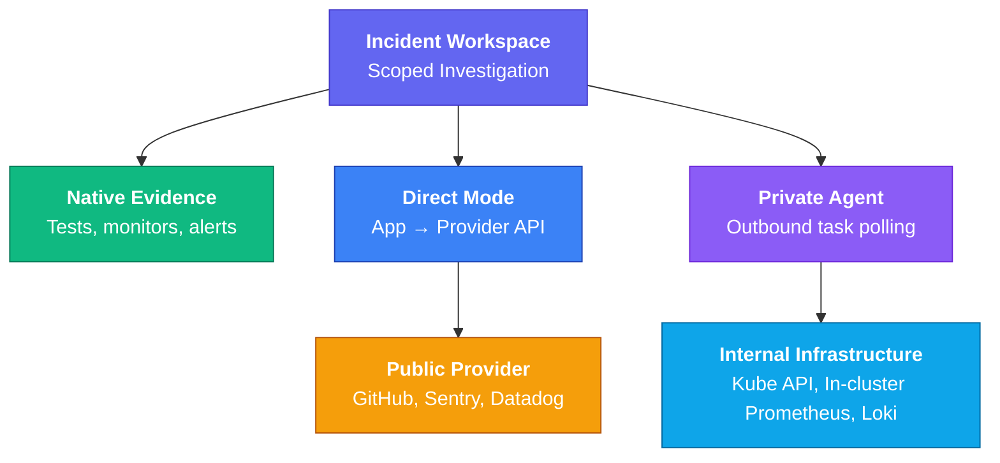

Connectors allow Supercheck's AI SRE engine to collect cited operational evidence during incident investigations. Organization administrators configure and manage connectors under **Organization Admin → Integrations**.

## Supported Providers

The Add connector dialog lists providers with implemented read-only validation and search:

- **Metrics & Dashboards** — Prometheus, Grafana, AWS CloudWatch
- **Operational Events** — Datadog
- **Logs & Search** — Loki, Elasticsearch / OpenSearch
- **Distributed Traces** — Grafana Tempo
- **Cloud & Orchestration** — Kubernetes
- **Error Tracking** — Sentry
- **Code & Deployments** — GitHub, GitLab
- **Incident Management** — PagerDuty, Opsgenie

Existing records for unsupported providers are labeled **Setup only** and cannot run searches.

## Execution Modes

### Direct Execution
Direct connectors run from the Supercheck app to a reachable provider API. In Supercheck Cloud, direct endpoints must use HTTPS and resolve to a public address. Private and reserved IPs, localhost, cluster-only DNS, cleartext HTTP, non-HTTP(S) schemes, and credentials embedded in endpoint URLs are rejected to protect the service from server-side request forgery (SSRF). Store credentials in the connector credential fields instead. In self-hosted deployments, direct connectors may also reach internal endpoints over HTTP. Self-hosted and Private Agent execution still reject loopback addresses, metadata endpoints, embedded URL credentials, and invalid schemes. Use a Private Agent when the app cannot reach the internal API directly.

### Private Agent Execution
Private Agents run as lightweight, outbound-only containers inside your private network or Kubernetes cluster. The agent polls Supercheck for read-only evidence tasks and queries internal APIs (such as in-cluster Prometheus or Loki) without exposing inbound firewall ports. Private Agents are available for GitHub, Kubernetes, Prometheus, Grafana, Sentry, Datadog, Loki, Elasticsearch/OpenSearch, Tempo, and AWS CloudWatch. GitLab, PagerDuty, and Opsgenie support direct execution only.

```mermaid
flowchart TB
    Incident["<b>Incident Workspace</b><br/>Scoped Investigation"] --> Native["<b>Native Evidence</b><br/>Tests, monitors, alerts"]
    Incident --> Direct["<b>Direct Mode</b><br/>App → Provider API"]
    Incident --> Agent["<b>Private Agent</b><br/>Outbound task polling"]
    Direct --> ProviderPub["<b>Public Provider</b><br/>GitHub, Sentry, Datadog"]
    Agent --> ProviderPriv["<b>Internal Infrastructure</b><br/>Kube API, In-cluster Prometheus, Loki"]

    style Incident fill:#6366f1,stroke:#4338ca,color:#fff
    style Native fill:#10b981,stroke:#047857,color:#fff
    style Direct fill:#3b82f6,stroke:#1e40af,color:#fff
    style Agent fill:#8b5cf6,stroke:#6d28d9,color:#fff
    style ProviderPub fill:#f59e0b,stroke:#b45309,color:#fff
    style ProviderPriv fill:#0ea5e9,stroke:#0369a1,color:#fff
```

## Adding a Connector

To register a connector:

1. Navigate to **Organization Admin → Integrations** and click **Add connector**.
2. Select your provider type and assign a recognizable name (e.g. `Production GitHub`).
3. Choose the execution mode (**Direct** or **Private Agent**). For Private Agent mode, first register an agent under **Organization Admin → Private Agents**, then select it in the connector dialog.
4. Enter the API endpoint URL and configure a least-privilege read-only credential token.
5. Define the **Service scope** to restrict which services may access this connector.
6. Save, validate, and run one known-result query and one no-result query before relying on it during an incident.

Kubernetes searches require an explicit namespace. Grant the connector service account read-only access only to the namespaces under test; do not grant cluster-admin or write permissions.

Each search is tenant- and service-scoped, rate-limited, audited, redacted, and bounded by time, rows, and bytes.

## Query Examples

Each provider uses its own read-only query language:

- **GitLab** — `project:acme/checkout deploy`
- **PagerDuty** — `status:triggered service:checkout`
- **Opsgenie** — `status:open AND priority:P1`
- **Prometheus** — PromQL, e.g. `sum(rate(http_requests_total{status=~"5.."}[5m]))`
- **Loki** — LogQL with a stream selector, e.g. `{service="checkout"} |= "error"`
- **Kubernetes** — `*` or a verified label selector with an explicit namespace

## Credential Best Practices

Always provision dedicated, read-only credentials limited to the specific service scope:

| Provider | Recommended Minimum Access Scope |
|---|---|
| **GitHub** | Read-only token limited to the repositories needed for commit search |
| **GitLab** | Personal, project, or group access token with `read_api` access limited to the required repositories |
| **Kubernetes** | ServiceAccount with read-only permissions scoped to application namespaces |
| **Grafana** | Service Account token with `Viewer` role; never use administrative accounts |
| **Prometheus / Loki** | Read-only bearer token or gateway credential for query endpoints |
| **Sentry** | Read-only integration token restricted to relevant project IDs |
| **Datadog** | API key plus application key with read-only event access for the correct regional site |
| **AWS CloudWatch** | Access key ID and secret access key with `cloudwatch:DescribeAlarms` and `cloudwatch:GetMetricData`; prefer short-lived STS credentials and include the session token |

<Callout type="info">
All connector credentials are encrypted at rest with AES-128-GCM using per-context derived keys. Credentials are never sent to AI models or included in prompts, outputs, or audit logs.
</Callout>
