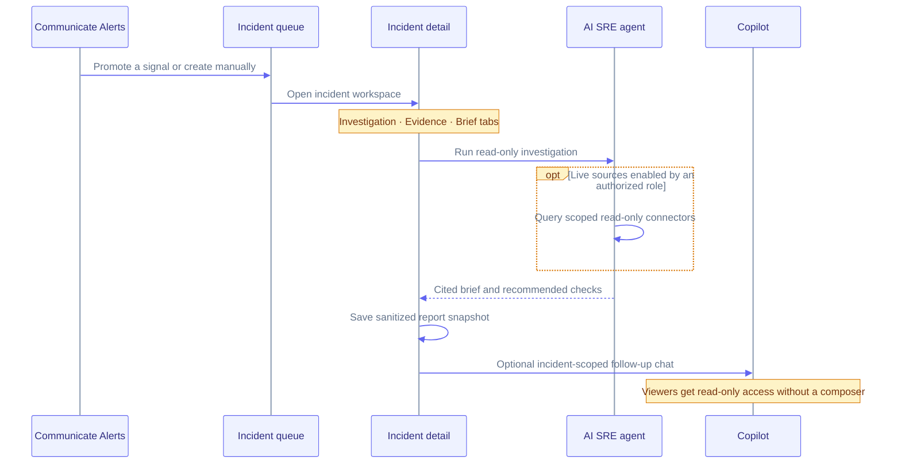

Incidents are the responder queue for issues that need investigation, evidence review, or recovery confirmation.

You can create an incident in two ways:

- From **Communicate → Alerts → Signals**, when an alert signal needs investigation. The new incident opens immediately after creation.
- From **Communicate → Incidents → New incident**, when the issue did not start from a Supercheck alert.

Both paths create the same incident workspace.

## Incident Detail

The incident detail page is intentionally focused. It shows the incident status, mapped service, stored evidence count, and the latest brief without mixing in every investigation control.

The page has three tabs:

- **Investigation** — Run a read-only investigation from stored evidence, optionally opt in to live connector tools, then save a sanitized report snapshot and review its accuracy.
- **Evidence** — Review native Supercheck evidence and citation anchors.
- **Brief** — Read or regenerate the latest evidence brief. Brief generation is kept in this tab instead of the incident header to avoid cluttering the default investigation view.

The Investigation tab includes a readiness checklist. Live connector tools are off by default and require service mapping, explicit opt-in, and connector investigation permission. Tool telemetry shows aggregate calls, failures, and latency—not inputs, raw results, or credentials.

While an investigation is running, another start is disabled and the open incident
refreshes its status automatically. If your connection is interrupted, check the
incident's status before starting again: the server may still be completing the
original run.

Completed results can be saved as sanitized, immutable report snapshots. Authorized responders can add accuracy feedback; viewers have read-only access.

### Investigation Report

Reports separate evidence from judgment using **Fact**, **Inference**, and **Hypothesis** labels. The standard responder summary includes:

- What changed
- Blast radius
- Strongest signals
- Likely cause and confidence
- Evidence gaps
- Next safe read-only checks and how to confirm recovery after a human applies a fix

If the available evidence cannot establish a cause or affected scope, the report states that explicitly instead of filling the gap with assumptions.

### Incident Trends

Select **Trends** from the incident queue to review the last 30 days of created and resolved incidents, resolution rate, average resolution time, severity mix, and most affected services. Analytics use the current organization and project context and require the same incident view permission as the queue.

### Copilot

Copilot is available from **Investigate → Copilot** and the floating launcher.

| Mode | Available context |
|---|---|
| Standalone | Text entered by the responder |
| Incident-scoped | Stored incident evidence |
| Incident-scoped with **Live sources** | Bounded connector data when explicitly enabled by an authorized role |

Standalone `/copilot` does not automatically inspect an incident, a Kubernetes cluster, or external observability systems. It uses the question and text entered in the composer. Live connector data is available only in an incident-scoped conversation when an enabled connector is scoped to the affected service, the user's role permits investigation, and **Live sources** is explicitly enabled. If supporting evidence is unavailable, Copilot reports the gap and suggests the next safe checks; it must not invent evidence IDs, source systems, queries, values, or timestamps.

If investigations are disabled, existing evidence and results remain readable but run and live-source controls are unavailable. Viewers cannot run investigations, use Copilot, or mutate snapshots and feedback. Project Editors can investigate stored evidence and use Copilot, but cannot enable **Live sources**.

## Incident Lifecycle & Verification

| Stage | Responsibility |
|---|---|
| Triage | Promote an alert signal or create an incident manually. Optional correlation can link a high-confidence related alert to an active incident. |
| Investigate | AI SRE reads native evidence and explicitly enabled, scoped connector data. |
| Decide and fix | A human reviews cited recommendations and changes the external system. |
| Confirm recovery | A human re-runs or observes the detecting checks; AI SRE does not trigger remediation or verification. |

## Alerts and Incidents

Alerts and incidents intentionally remain separate:

- **Alerts** show notification channels, alert history, and active signals.
- **Incidents** show issues your team has decided to investigate.

This keeps alert noise out of the responder queue while still making it easy to promote a signal into an incident.

## Exporting Reports

Downloaded reports include bounded evidence, recommendations, hashes, item counts, and truncation metadata. They exclude credentials, raw connector data, and source URIs.
