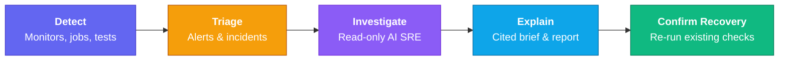

Supercheck's AI SRE transforms existing tests, monitors, jobs, alert history, and status pages into a **read-only incident investigation loop**. It connects to your existing operational tools, gathers scoped evidence, explains what likely happened with citations, and recommends fix and recovery-check steps for a human responder.

## Read-Only By Design

**Supercheck's AI SRE layer is explicitly read-only.** It never writes to your production systems or executes remediation actions on your behalf.

- The agent gathers evidence, correlates data, reasons, and recommends.
- You apply fixes in your own systems using your own tools and safeguards.
- You use the existing Playwright tests, k6 tests, or monitors to confirm recovery after applying the fix.

## Native Evidence

Supercheck automatically utilizes the rich operational evidence it already owns to investigate incidents:

- Failed monitor screenshots and Playwright videos
- Console logs and network traces from synthetic tests
- Historical monitor results with P50/P95/P99 latency trends
- Run logs and artifacts
- Status page context

## Connector Layer

For additional context, AI SRE can query [read-only connectors](/docs/app/investigate/connectors) governed by RBAC, budgets, service scope, and redaction.

Administrators manage the service catalog from the top-level **Services** page. Read-only connectors, diagnostic recipes, and private agents are configured in **Organization Admin** under **Integrations**, **Diagnostic Recipes**, and **Private Agents**.

## Responder Screens

| Screen | Purpose |
|---|---|
| **Communicate → Alerts** | Review signals and promote an actionable signal to an incident. |
| **Communicate → Incidents** | Run investigations and review evidence, briefs, and saved reports. |
| **Investigate → Copilot** | Ask read-only questions. Live sources require incident scope, permission, and explicit opt-in. |
| **Investigate → Investigation Map** | Explore trusted service, incident, change, and evidence relationships. |
