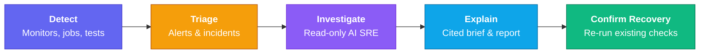
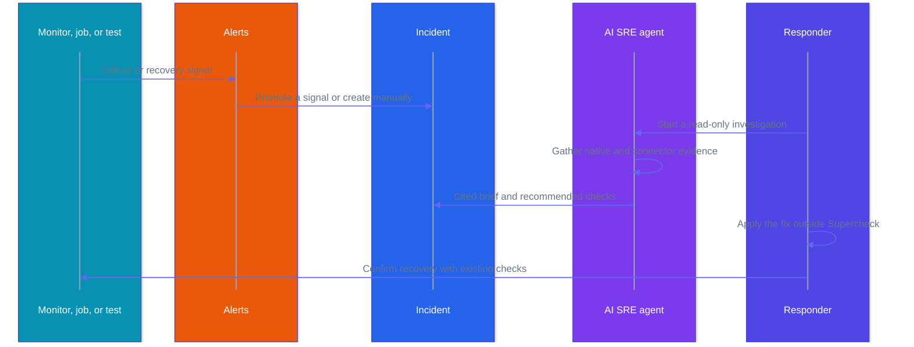

Supercheck's AI SRE transforms existing tests, monitors, jobs, alert history, and status pages into a **read-only incident investigation loop**. It connects to your existing operational tools, gathers scoped evidence, explains what likely happened with citations, and recommends fix and recovery-check steps for a human responder.

The unified reliability loop works as follows:

1. **Detect**: Monitors, jobs, and tests detect an issue.
2. **Triage**: Responders review alert signals and create an incident when the signal needs investigation. Creating from a signal opens the new incident immediately; responders can also create an incident manually when the issue starts outside Supercheck alerts.
3. **Investigate**: The AI agent gathers native evidence and read-only connector evidence across your stack.
4. **Explain**: The incident detail page keeps investigation actions, cited evidence, and the latest brief in separate focused tabs.
5. **Confirm recovery**: A responder applies the fix in their own systems, then re-runs or observes the existing detecting checks. AI SRE does not trigger remediation or the re-run automatically.

## Read-Only By Design

**Supercheck's AI SRE layer is explicitly read-only.** It never writes to your production systems or executes remediation actions on your behalf.

- The agent gathers evidence, correlates data, reasons, and recommends.
- You apply fixes in your own systems using your own tools and safeguards.
- You use the existing Playwright tests, k6 tests, or monitors to confirm recovery after applying the fix.

This read-only approach ensures the safety of your environment while leveraging AI to significantly reduce Mean Time to Resolution (MTTR).

## Native Evidence

Supercheck automatically utilizes the rich operational evidence it already owns to investigate incidents:

- Failed monitor screenshots and Playwright videos
- Console logs and network traces from synthetic tests
- Historical monitor results with P50/P95/P99 latency trends
- Run logs and artifacts
- Status page context

## Connector Layer

To get a complete picture of an incident, the AI SRE agent integrates securely with your external observability and operational tools through [Connectors](/docs/app/investigate/connectors).

These TypeScript-native connectors are strictly read-only and governed by Role-Based Access Control (RBAC), budgets, and redaction policies to guarantee that the agent only accesses authorized evidence.

Administrators manage the service catalog from the top-level **Services** page. Read-only connectors, diagnostic recipes, and private agents are configured in **Organization Admin** under **Integrations**, **Diagnostic Recipes**, and **Private Agents**.

## Responder Screens

- **Communicate → Alerts** shows failure signals, alert history, and notification channels. Delivery failures and recovery/success notifications stay in History; they are not promoted as investigation signals.
- **Communicate → Incidents** is the responder queue for alert-promoted and manually created incidents. It also shows latest investigation status and evidence counts, using the same compact filter, sorting, row sizing, and pagination pattern as other Supercheck tables. Incident detail pages keep investigation actions, cited evidence, and downloadable markdown briefs in separate focused tabs.
- **Investigate → Copilot** provides read-only conversational help without cluttering incident detail pages. New chats offer focused, editable starters for triage, evidence review, and next checks. Standalone chat uses only the context entered by the responder; incident-scoped chat can review stored evidence and query configured read-only connectors only after **Live sources** is enabled by a role with connector investigation permission. Viewers see a read-only Copilot page without a composer. Inline charts remain bounded, cited, and accessible.
- **Investigate → Investigation Map** shows a directed, read-only view of the causal path around services and incidents. The default **Essentials** view keeps services, alerts, incidents, investigations, deployments, and playbooks visible; task-oriented views reveal checks, changes, or detailed evidence only when needed. Search can still find any node type, incident focus limits the map to a two-hop neighborhood, and only the three newest evidence items per investigation or incident are included. The map uses the full page width by default. Selecting a node or relationship opens a wide, content-sized details dialog with provenance and a **View details** link when the source has a dedicated screen. Service detail pages can open the map focused on the matching service node. Only active manual/native/observed links and explicitly approved AI suggestions render as trusted service edges. Related records are grouped by type and relationship, repeated equivalent records show a compact count, and long relationship or provenance lists scroll within the dialog instead of increasing the page height. Stored investigation reports are normalized to concise graph titles so Markdown report bodies do not appear as node labels.
