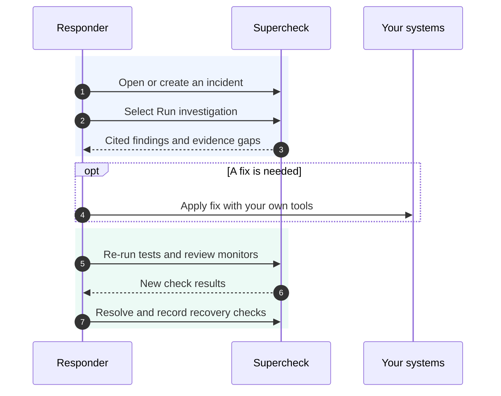

Open an incident, run a read-only investigation, and review findings with citations. Apply fixes with your own tools, then use tests or monitors to confirm recovery.

## Investigation Workflow

Scroll horizontally to view the full diagram.

```mermaid
sequenceDiagram
    accTitle: Incident investigation
    accDescr: Open an incident, investigate, apply your own fix, verify recovery, and resolve.
    autonumber
    participant You as Responder
    participant App as Supercheck
    participant Environment as Your systems

    rect rgba(59, 130, 246, 0.08)
        You->>App: Open or create an incident
        You->>App: Select Run investigation
        App-->>You: Cited findings and evidence gaps
    end
    opt A fix is needed
        You->>Environment: Apply fix with your own tools
    end
    rect rgba(16, 185, 129, 0.08)
        You->>App: Re-run tests and review monitors
        App-->>You: New check results
        You->>App: Resolve and record recovery checks
    end
```

## Read-Only By Design

Supercheck recommends checks and fixes; it does not modify your infrastructure. Opening an incident does not start an investigation. Select **Run investigation** when you are ready.

## Native Evidence

Supercheck uses stored summaries and artifact references from its tests, monitors, runs, and status pages:

- Failed monitor screenshots and Playwright videos
- Console logs and network traces from synthetic tests
- Historical monitor results with P50/P95/P99 latency trends
- Run logs and step artifacts
- Public and private status page states

Responders can inspect available screenshots, videos, and other artifacts through their source runs and monitors. The agent reads bounded text evidence and artifact references; it does not watch videos or automatically analyze screenshot contents.

## Service Catalog

Organize your system architecture by registering the systems and services you operate in the **Services** catalog. Services provide context for causal discovery, dependency tracking, and connector scoping.

## Core Navigation

| Screen | Purpose |
|---|---|
| **Communicate → Alerts** | Grouped failure signals, notification history, and channels. Select **Investigate** to open an incident directly. |
| **Investigate → [Incidents](/docs/app/investigate/incidents)** | Incident queue and detail workspaces. Run AI investigations and generate shareable evidence briefs. |
| **Investigate → [Copilot](/docs/app/investigate/copilot)** | Interactive AI assistant for asking questions about symptoms, logs, or active incident evidence. |
| **Investigate → Services** | Manage service metadata, ownership teams, repositories, and tier classifications. |
| **Organization Admin → [Integrations](/docs/app/investigate/connectors)** | Configure read-only integrations for GitHub, Kubernetes, Prometheus, Grafana, Datadog, and Loki. |

## Get Started

Select **Investigate** on an alert signal, or choose **Investigate → Incidents → New incident**. Follow the [incident guide](/docs/app/investigate/incidents) to investigate, save findings, and resolve. Services and live connectors are optional for stored-evidence investigations.
