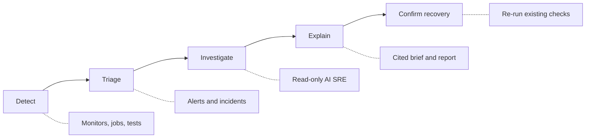

## Get Started

<Cards>
<Card icon={<Server className="text-emerald-500" />} title="Deploy" href="/docs/app/deployment">
Self-host with Docker Compose in under 10 minutes
</Card>

<Card icon={<Terminal className="text-amber-500" />} title="CLI" href="/docs/cli">
Install the Supercheck CLI for CI/CD integration and monitoring-as-code
</Card>

<Card icon={<CalendarClock className="text-purple-500" />} title="Automate" href="/docs/app/automate">
Create your first test — browser, API, database, or performance
</Card>
</Cards>

## How Supercheck Fits Together

1. **Detect** with monitors, jobs, and tests.
2. **Triage** from alerts, then open an incident when the signal needs investigation.
3. **Investigate** with native evidence and optional read-only connectors.
4. **Explain** in the incident brief and investigation report.
5. **Confirm recovery** by re-running the same checks. AI SRE does not apply fixes.

## Core Capabilities

<Cards>
<Card icon={<CalendarClock className="text-purple-500" />} title="Automate" href="/docs/app/automate">
Write browser, API, database, and performance tests with an AI-powered editor that generates code from plain English and automatically fixes failures
</Card>

<Card icon={<Globe className="text-sky-500" />} title="Monitor" href="/docs/app/monitor">
Track uptime with HTTP, website, ping, port, and synthetic monitors running from multiple geographic regions with configurable check intervals
</Card>

<Card icon={<Radio className="text-rose-500" />} title="Communicate" href="/docs/app/communicate">
Send alerts through Slack, email, Discord, Telegram, Microsoft Teams, and webhooks. Create public status pages to keep users informed during incidents
</Card>

<Card icon={<Search className="text-indigo-500" />} title="Investigate" href="/docs/app/investigate">
Resolve incidents faster with an AI SRE layer that gathers read-only evidence from external tools and recommends fixes
</Card>

<Card icon={<UserCog className="text-amber-500" />} title="Admin" href="/docs/app/admin">
Manage teams with role-based access control, organize work into projects, and maintain audit trails for compliance
</Card>
</Cards>
