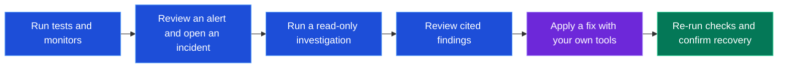

## Get Started

<Cards>
<Card icon={<Server className="text-emerald-500" />} title="Deploy" href="/docs/app/deployment">
Self-host with Docker Compose and isolated test execution
</Card>

<Card icon={<Terminal className="text-amber-500" />} title="CLI" href="/docs/cli">
Install the Supercheck CLI for CI/CD integration and monitoring-as-code
</Card>

<Card icon={<MousePointerClick className="text-sky-500" />} title="Recorder" href="/docs/recorder">
Record browser interactions and save Playwright tests to Supercheck
</Card>

<Card icon={<CalendarClock className="text-purple-500" />} title="Automate" href="/docs/app/automate">
Create your first test — browser, API, database, or performance
</Card>
</Cards>

## Your Reliability Workflow

Scroll horizontally on smaller screens to view all steps.

```mermaid
%%{init: {"flowchart":{"nodeSpacing":20,"rankSpacing":24,"padding":12,"wrappingWidth":140}}}%%
flowchart LR
    Detect[Run tests and monitors] --> Triage[Review an alert and open an incident]
    Triage --> Investigate[Run a read-only investigation]
    Investigate --> Review[Review cited findings]
    Review --> Fix[Apply a fix with your own tools]
    Fix --> Confirm[Re-run checks and confirm recovery]

    classDef action fill:#1d4ed8,stroke:#60a5fa,color:#fff
    classDef manual fill:#6d28d9,stroke:#a78bfa,color:#fff
    classDef complete fill:#047857,stroke:#34d399,color:#fff
    class Detect,Triage,Investigate,Review action
    class Fix manual
    class Confirm complete
```

AI SRE suggests checks and fixes. You apply changes and confirm recovery.

## Core Capabilities

<Cards>
<Card icon={<CalendarClock className="text-purple-500" />} title="Automate" href="/docs/app/automate">
Write tests, review AI suggestions, and schedule validated scripts.
</Card>

<Card icon={<Globe className="text-sky-500" />} title="Monitor" href="/docs/app/monitor">
Check uptime from available regions and receive failure or recovery alerts.
</Card>

<Card icon={<Radio className="text-rose-500" />} title="Communicate" href="/docs/app/communicate">
Configure alert channels and publish status updates for your users.
</Card>

<Card icon={<Search className="text-indigo-500" />} title="Investigate" href="/docs/app/investigate">
Run read-only investigations, review cited evidence, and verify recovery.
</Card>

<Card icon={<UserCog className="text-amber-500" />} title="Admin" href="/docs/app/admin">
Manage projects, members, permissions, and integrations.
</Card>
</Cards>
