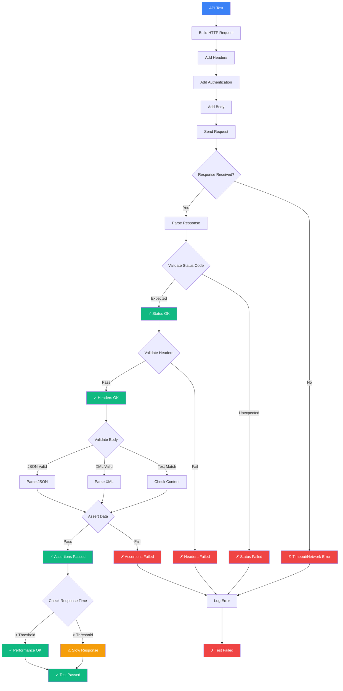
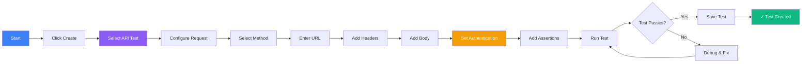
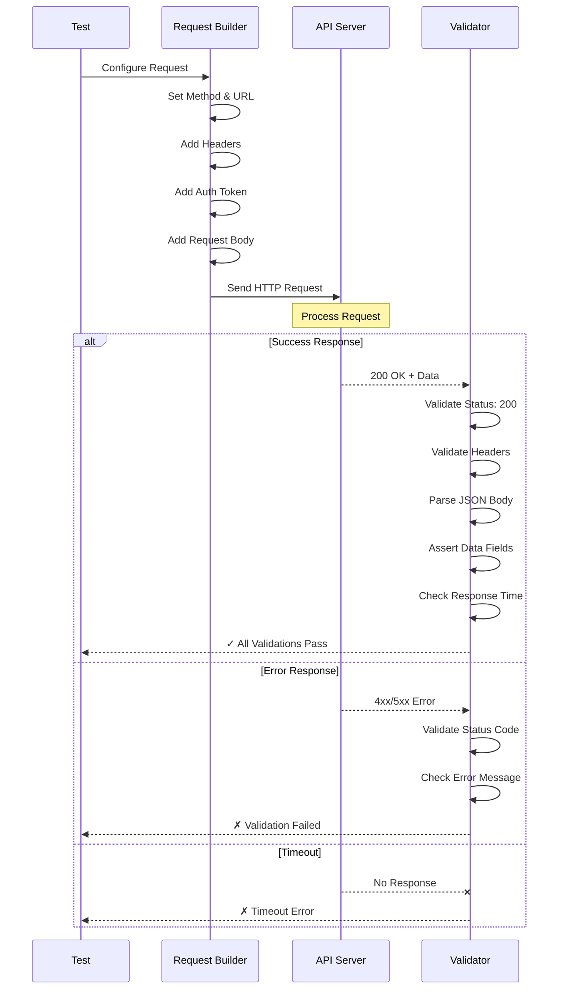
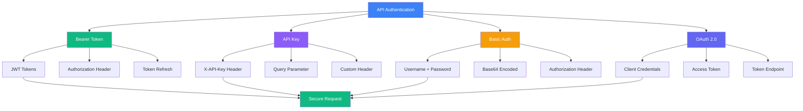
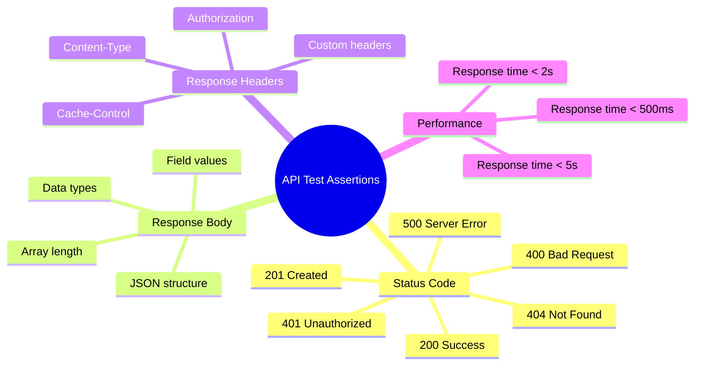

# API Test

Validate your backend APIs with automated HTTP requests and response assertions.

## API Test Execution Flow



## What is an API Test?

API tests send HTTP requests to your endpoints and validate:
- Status codes
- Response body content
- Response headers
- Response times
- Data integrity

## Creating an API Test



<Steps>
  <Step>Click **Create → API Test** in the sidebar</Step>
  <Step>Configure the request (method, URL, headers, body)</Step>
  <Step>Add assertions for the response</Step>
  <Step>Run the test</Step>
</Steps>

## Request/Response Validation



## Authentication Methods



## Example Test

```typescript
import { test, expect } from '@supercheck/test';

test('GET /api/users returns user list', async ({ request }) => {
  const response = await request.get('https://api.example.com/users', {
    headers: {
      'Authorization': `Bearer ${variables.apiToken}`,
    },
  });

  expect(response.status()).toBe(200);

  const data = await response.json();
  expect(data.users).toBeInstanceOf(Array);
  expect(data.users.length).toBeGreaterThan(0);
});
```

## Common Assertions



## Best Practices

- **Status Codes**: Validate expected status codes (2xx for success, 4xx/5xx for errors)
- **Response Validation**: Check response structure and data types
  - Use JSON schema validation for complex responses
  - Validate required fields are present
  - Check data types match expectations
- **Authentication**: Store credentials as variables/secrets
  - Use `getSecret()` for API tokens
  - Never hardcode credentials in tests
- **Performance**: Set appropriate timeout thresholds
  - Fast APIs: < 500ms
  - Standard APIs: < 2s
  - Complex queries: < 5s
- **Error Handling**: Test both success and error scenarios
  - Happy path (200 OK)
  - Validation errors (400)
  - Authentication errors (401)
  - Not found errors (404)
- **Idempotency**: Ensure tests can run multiple times safely
- **Data Cleanup**: Clean up test data after test completion

## Next Steps

- [Database tests](./database-test)
- [Custom tests](./custom-test)
- [View test runs](./runs)
