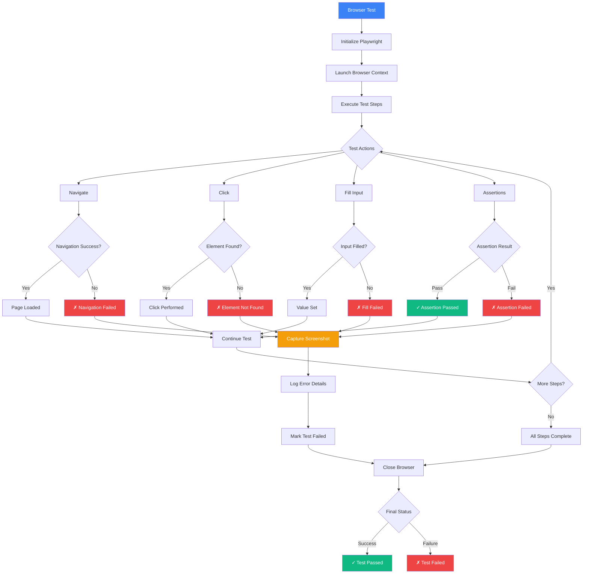
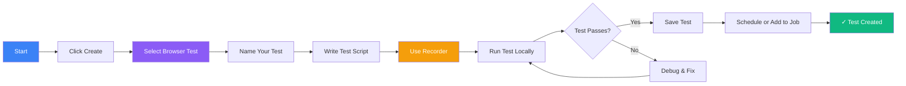
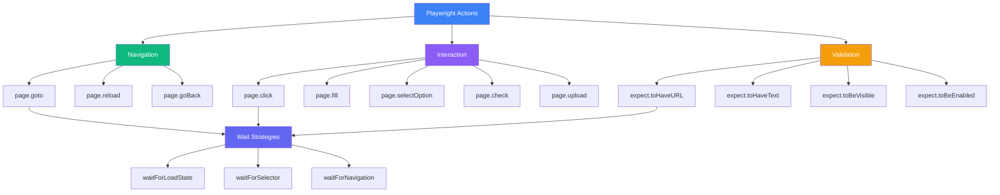
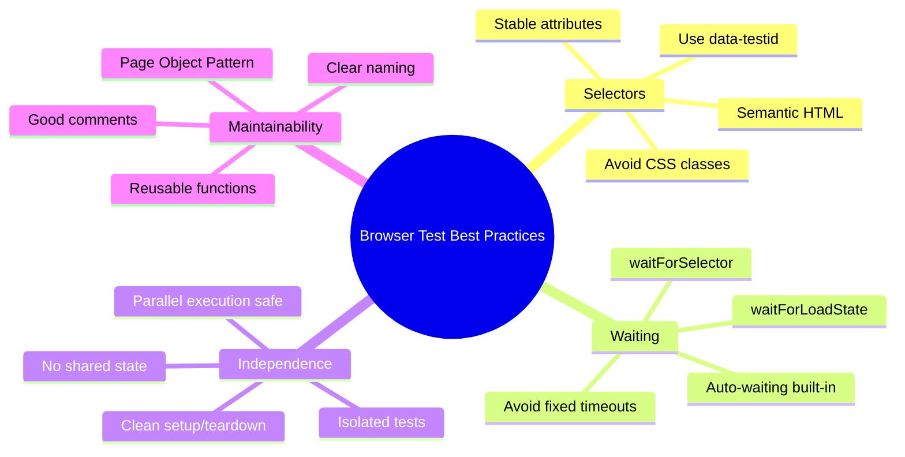

Create automated browser tests to simulate real user interactions with your web application.

## Browser Test Execution Flow



## What is a Browser Test?

Browser tests use a headless browser (powered by Playwright) to:
- Navigate through your application
- Click buttons and fill forms
- Validate page content
- Take screenshots
- Measure performance

## Creating a Browser Test



<Steps>
  <Step>Click **Create → Browser Test** in the sidebar</Step>
  <Step>Give your test a descriptive name</Step>
  <Step>Write your test script or use the recorder</Step>
  <Step>Run the test to verify it works</Step>
  <Step>Schedule or add to a job</Step>
</Steps>

## Test Interaction Patterns



## Example Test

```typescript
import { test, expect } from '@playwright/test';

test('user can login', async ({ page }) => {
  await page.goto('https://app.example.com/login');

  await page.fill('input[name="email"]', 'user@example.com');
  await page.fill('input[name="password"]', 'password');

  await page.click('button[type="submit"]');

  await expect(page).toHaveURL('https://app.example.com/dashboard');
});
```

## Best Practices



## Best Practices

- **Selectors**: Use stable selectors (data-testid attributes)
  - Good: `[data-testid="login-button"]`
  - Bad: `.btn.btn-primary.mt-3`
- **Waiting**: Wait for elements before interacting
  - Use Playwright's auto-waiting
  - `waitForSelector()` for dynamic content
  - Avoid fixed `wait()` calls
- **Screenshots**: Take screenshots on failure for debugging
- **Independence**: Keep tests independent (no shared state)
- **Reusability**: Use page objects for common patterns
- **Performance**: Run tests in parallel when possible
- **Assertions**: Use specific, meaningful assertions

## Next Steps

- [View all tests](./tests)
- [Create a job](./jobs)
- [Learn about API tests](./api-test)
