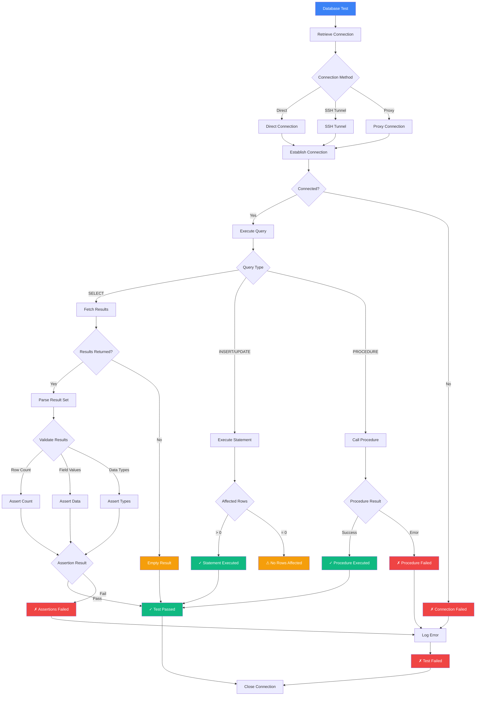
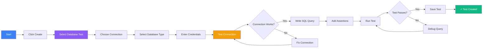
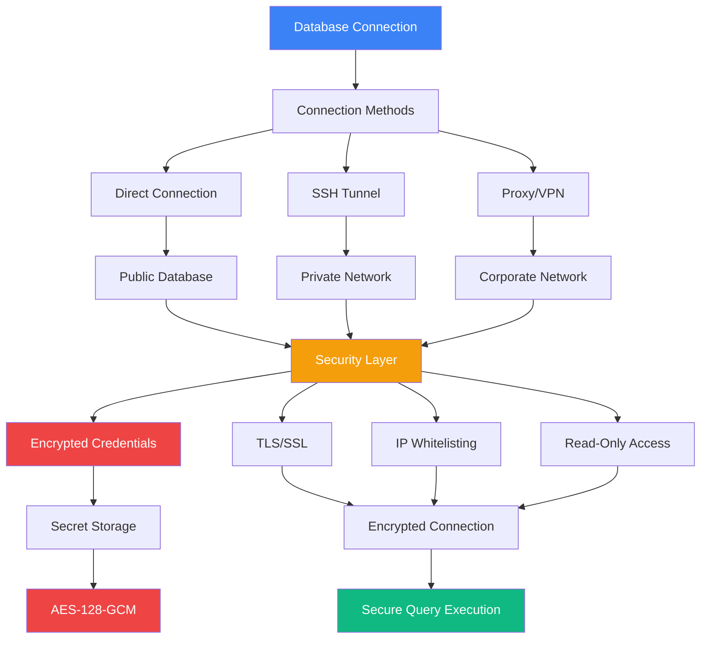
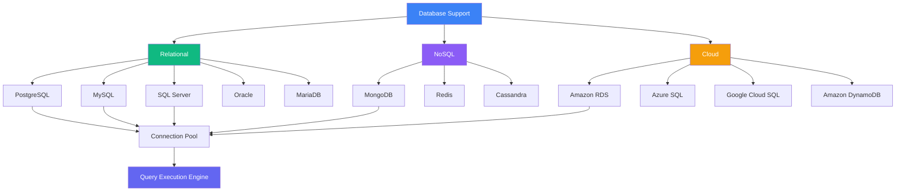
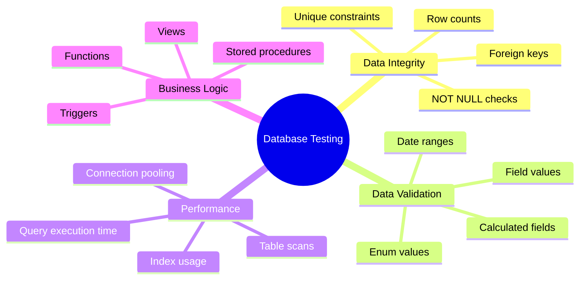

# Database Test

Run SQL queries and validate your database state directly.

## Database Test Execution Flow



## What is a Database Test?

Database tests allow you to:
- Query database tables
- Validate data integrity
- Check row counts
- Verify relationships
- Test stored procedures

## Creating a Database Test



<Steps>
  <Step>Click **Create → Database Test** in the sidebar</Step>
  <Step>Select your database connection</Step>
  <Step>Write your SQL query</Step>
  <Step>Add assertions for the results</Step>
  <Step>Run the test</Step>
</Steps>

## Connection & Security Architecture



## Supported Databases



## Example Test

```sql
-- Query active users
SELECT COUNT(*) as user_count
FROM users
WHERE active = true;

-- Expected: user_count > 0
```

## Common Use Cases



## Best Practices

- **Read-Only Access**: Use read-only database users for testing
  - Prevents accidental data modification
  - Safer for production database testing
  - Create dedicated test user with SELECT permissions only
- **Credentials Security**: Store credentials as encrypted secrets
  - Use `getSecret()` for passwords
  - Never hardcode credentials in tests
  - Rotate credentials regularly
- **SSH Tunneling**: Use SSH tunnels for private databases
  - Secure connection to private networks
  - No need to expose database publicly
  - Configure bastion host for access
- **IP Whitelisting**: Whitelist Supercheck IPs for database access
  - Additional security layer
  - Control access to database
- **Connection Pooling**: Reuse connections for better performance
  - Reduces connection overhead
  - Faster test execution
- **Query Optimization**: Write efficient queries
  - Use proper indexes
  - Avoid SELECT *
  - Limit result sets when possible
- **Timeout Settings**: Set appropriate query timeouts
  - Simple queries: 5-10 seconds
  - Complex queries: 30-60 seconds
  - Report queries: up to 5 minutes

## Next Steps

- [Custom tests](./custom-test)
- [Manage variables](./variables)
- [View test history](./runs)
