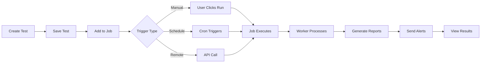

title: Automate
description: Create and manage automated tests with scheduling and execution
icon: Workflow
---

# Automate

Automate your testing workflow with powerful test creation, scheduling, and execution capabilities. Create browser, API, database, and custom tests, then run them automatically on schedules or via CI/CD integration.

<Callout type="info">
  Automate supports Playwright-based browser tests, REST/GraphQL API tests, database queries, and custom scripts.
</Callout>

## Overview

Supercheck's automation features provide:

- **Multiple Test Types**: Browser, API, Database, Custom, and Performance (k6) tests
- **Flexible Scheduling**: Cron-based job scheduling with timezone support
- **Variable Management**: Secure storage for API keys, URLs, and configuration
- **Execution History**: Detailed run logs with screenshots and traces
- **Parallel Execution**: Run multiple tests concurrently with capacity controls
- **CI/CD Integration**: Remote triggers via API for external automation

## Test Types

<Cards>
  <Card
    title="Browser Test"
    description="Simulate user interactions with Playwright"
    href="./browser-test"
  />
  <Card
    title="API Test"
    description="Validate REST APIs and GraphQL endpoints"
    href="./api-test"
  />
  <Card
    title="Database Test"
    description="Query and verify database state"
    href="./database-test"
  />
  <Card
    title="Custom Test"
    description="Write custom test scripts with full Node.js access"
    href="./custom-test"
  />
</Cards>

<Callout type="warning">
  Performance tests run <code>k6</code> scripts. If your script imports from <code>k6/*</code>, choose the **Performance** test type; Playwright-based test types only accept Playwright scripts. Avoid mixing Playwright and k6 modules in the same script—split them into separate tests.
</Callout>

## Core Concepts

### Tests
Individual test cases that validate specific functionality. Tests are reusable and can be run independently or as part of jobs.

**Features**:
- Playground editor with real-time validation
- AI-powered fix suggestions when tests fail
- Rich HTML reports with screenshots and traces
- Variable support for dynamic configuration

### Jobs
Collections of tests that run together on a schedule or trigger. Jobs provide:

- **Scheduling**: Cron-based automatic execution
- **Triggers**: Manual, remote (API), or scheduled execution
- **Grouped Results**: Combined reports for all tests
- **Alert Integration**: Notifications on success/failure

### Runs
Execution history of jobs with detailed results:

- **Execution Logs**: Stdout and stderr from test runs
- **Performance Metrics**: Execution time tracking
- **Artifacts**: Screenshots, videos, and trace files
- **Status Tracking**: Success, failure, timeout tracking

### Variables
Secure storage for reusable configuration:

- **Regular Variables**: URLs, timeouts, configuration values
- **Secrets**: API keys, passwords, database credentials (encrypted)
- **Project-Scoped**: Variables isolated per project
- **Access Control**: Role-based permissions

## Quick Start Guide

### Step 1: Create Your First Test

<Steps>
  <Step>Navigate to **Automate → Create** and choose a test type</Step>
  <Step>Write your test in the playground editor</Step>
  <Step>Click **Run Test** to validate it works</Step>
  <Step>Save the test for reuse in jobs</Step>
</Steps>

### Step 2: Create a Job

<Steps>
  <Step>Navigate to **Automate → Jobs**</Step>
  <Step>Click **Create Job** and give it a name</Step>
  <Step>Select the tests to include in this job</Step>
  <Step>Configure job settings (timeout, retries, etc.)</Step>
  <Step>Save the job</Step>
</Steps>

### Step 3: Schedule Automatic Execution

<Steps>
  <Step>Edit your job and enable scheduling</Step>
  <Step>Set cron schedule (e.g., `0 0 * * *` for daily at midnight)</Step>
  <Step>Configure timezone for accurate scheduling</Step>
  <Step>Enable alerts to get notified of failures</Step>
  <Step>Save and your job will run automatically</Step>
</Steps>

## Execution Flow

The test execution flow follows these stages:



**Trigger Types:**
- **Manual**: User clicks Run button in the UI
- **Schedule**: Automatic execution based on cron schedule
- **Remote**: API-triggered from CI/CD or external systems

## Parallel Execution

Supercheck manages execution capacity to ensure system stability:

### Capacity Limits
- **Running Capacity**: Maximum concurrent test executions (default: 5)
- **Queued Capacity**: Maximum queued executions (default: 50)

### Execution States
- **Running**: Currently executing tests
- **Queued**: Waiting for available capacity
- **Completed**: Finished executions

<Callout type="warning">
  When capacity limits are reached, new submissions will be queued. If queue is full, submissions will be rejected with a 429 error.
</Callout>

## Variables and Secrets

### Using Variables in Tests

```javascript
// Regular variables for configuration
const baseUrl = getVariable("BASE_URL");
const timeout = getVariable("TIMEOUT", { type: "number" });

// Secrets for sensitive data (protected from logging)
const apiKey = getSecret("API_KEY");
const password = getSecret("DB_PASSWORD");

// Use in your tests
await page.goto(baseUrl + "/login");
await page.fill("#password", password);
await page.setExtraHTTPHeaders({
  Authorization: `Bearer ${apiKey}`
});
```

### Secret Protection

Secrets are automatically protected from console logging:

```javascript
console.log(apiKey); // Shows: "[SECRET]"
console.log(`Key: ${apiKey}`); // Shows: "Key: [SECRET]"
JSON.stringify({ key: apiKey }); // Shows: {"key":"[SECRET]"}
```

## Trigger Types

### Manual Trigger
User-initiated execution from the web UI.

**Use Cases**:
- Ad-hoc testing
- Manual verification
- Debugging test failures

### Schedule Trigger
Automatic execution based on cron schedules.

**Use Cases**:
- Nightly regression tests
- Hourly health checks
- Weekly compliance checks

### Remote Trigger
API-based execution from external systems.

**Use Cases**:
- CI/CD integration
- Deploy verification
- External automation tools

**Example**:
```bash
curl -X POST https://api.supercheck.io/api/jobs/[job-id]/trigger \
  -H "Authorization: Bearer YOUR_API_KEY"
```

## Best Practices

### Test Organization

<Steps>
  <Step>Group related tests into logical jobs</Step>
  <Step>Use descriptive names for tests and jobs</Step>
  <Step>Keep tests focused and atomic</Step>
  <Step>Use variables for environment-specific configuration</Step>
</Steps>

### Scheduling Strategy

- **Critical Tests**: Run every 5-15 minutes
- **Regression Suites**: Run after each deployment
- **Compliance Checks**: Run daily or weekly
- **Performance Tests**: Run during off-peak hours

### Variable Management

- **Regular Variables**: URLs, timeouts, configuration
- **Secrets**: API keys, passwords, credentials
- **Naming Convention**: Use UPPER_CASE for consistency
- **Documentation**: Add descriptions for team clarity

### Error Handling

- **Retries**: Configure automatic retries for flaky tests
- **Timeouts**: Set appropriate timeouts based on test complexity
- **Alerts**: Set up notifications for critical test failures
- **Thresholds**: Use failure thresholds to prevent alert fatigue

## Common Workflows

### CI/CD Integration

<Steps>
  <Step>Create a job with your regression tests</Step>
  <Step>Generate an API key in Settings</Step>
  <Step>Add remote trigger call to your CI/CD pipeline</Step>
  <Step>Configure job to fail the build on test failure</Step>
</Steps>

### Environment Testing

<Steps>
  <Step>Create variables for each environment (BASE_URL, API_KEY, etc.)</Step>
  <Step>Create identical jobs for staging and production</Step>
  <Step>Schedule staging tests to run on every deploy</Step>
  <Step>Schedule production tests to run every hour</Step>
</Steps>

## Troubleshooting

### Test Execution Timeout

**Problem**: Test times out before completion

**Solutions**:
- Increase test timeout in Playwright config
- Optimize test for better performance
- Check for infinite loops or waiting conditions
- Review test logs for bottlenecks

### Job Failing Intermittently

**Problem**: Job passes sometimes but fails randomly

**Solutions**:
- Enable retries (2-3 attempts recommended)
- Use failure thresholds in alerts
- Check for race conditions in tests
- Review timing and wait strategies

### Variables Not Resolving

**Problem**: getVariable() returns undefined

**Solutions**:
- Verify variable exists in project variables
- Check variable name spelling (case-sensitive)
- Ensure job has access to project variables
- Review variable permissions

## Related Features

<Cards>
  <Card
    title="Monitors"
    description="Continuous monitoring of endpoints and services"
    href="../monitor/monitors"
  />
  <Card
    title="Alerts"
    description="Set up notifications for test failures"
    href="../communicate/alerts"
  />
  <Card
    title="Dashboard"
    description="View execution trends and metrics"
    href="../communicate/dashboard"
  />
</Cards>

## Need Help?

- **Test Writing**: Check test type documentation for examples
- **Scheduling**: Use [crontab.guru](https://crontab.guru) for cron syntax
- **CI/CD**: Review API reference for remote trigger documentation
- **Support**: Contact us at support@supercheck.io
