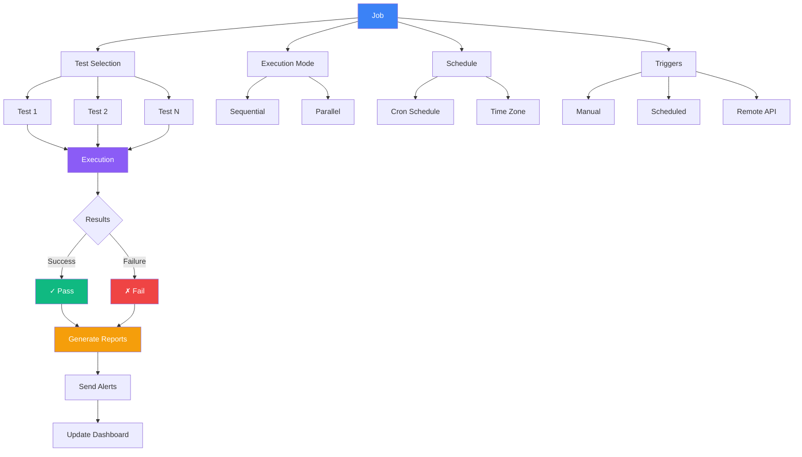
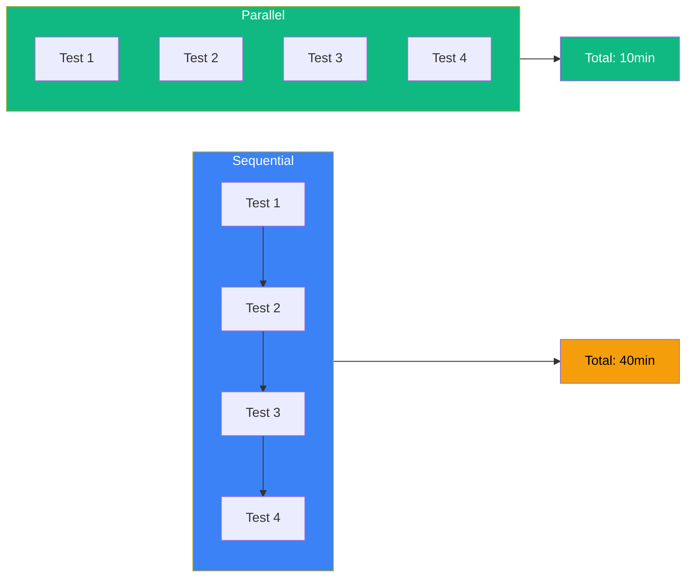
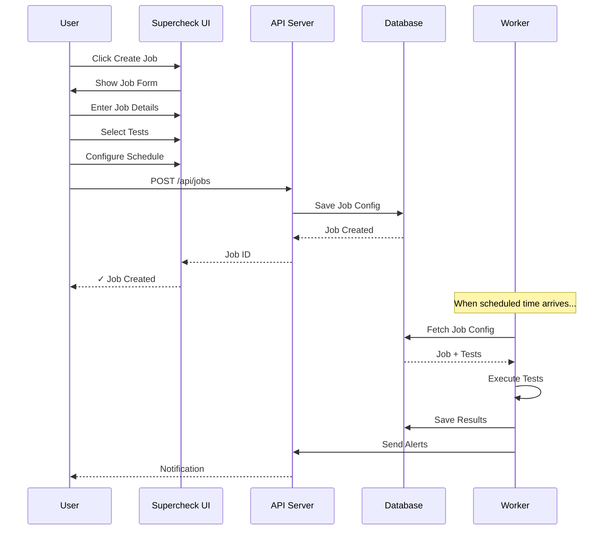
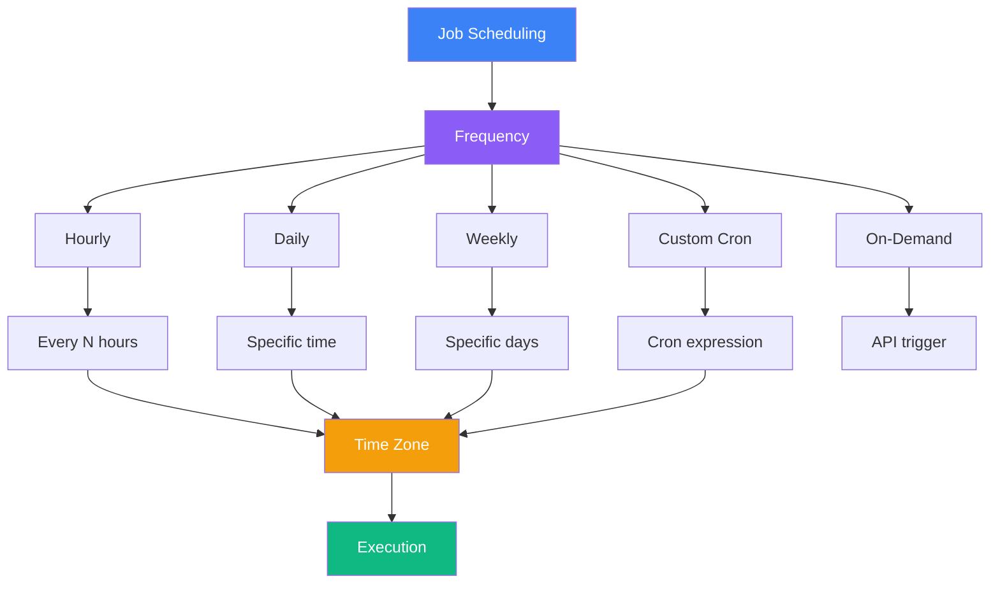
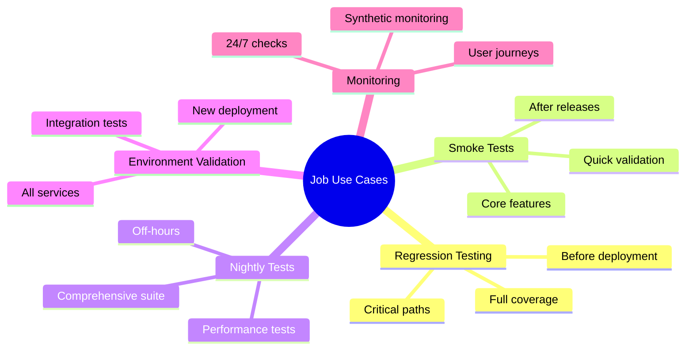

# Jobs

Group related tests and run them as a suite on a schedule or on-demand.

## Job Architecture

## What is a Job?

Jobs allow you to:
- Run multiple tests together
- Schedule recurring executions
- Create test suites
- Trigger from CI/CD

## Execution Modes Comparison

### Sequential Mode
Run tests one after another. Use when:
- Tests depend on each other
- Testing a workflow
- Resource constraints exist

### Parallel Mode
Run tests simultaneously. Use when:
- Tests are independent
- Faster execution needed
- Testing different features

## Creating a Job

### Configuration Steps

<Steps>
  <Step>Navigate to **Jobs** in the sidebar</Step>
  <Step>Click **Create Job**</Step>
  <Step>Give your job a name</Step>
  <Step>Add tests to the job</Step>
  <Step>Configure execution settings (Sequential/Parallel)</Step>
  <Step>Set up a schedule (optional)</Step>
</Steps>

## Scheduling Options

Schedule jobs to run:
- **Hourly**: Every 1-24 hours
- **Daily**: At specific time
- **Weekly**: On specific days
- **Custom cron**: Advanced scheduling
- **On-demand**: Via API trigger

## Use Cases

## Next Steps

- [View job runs](./runs)
- [Set up monitoring](../monitor)
- [Configure alerts](../communicate/alerts)
