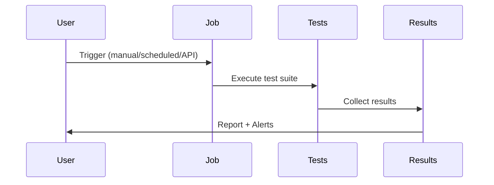

# Jobs

Group multiple tests into a suite and run them on a schedule or on-demand. Jobs support sequential or parallel execution with flexible scheduling options.

## How Jobs Work



## Execution Modes

**Sequential** - Tests run one after another
- Use when tests depend on each other
- Total time = sum of all tests
- Example: Login → Add Item → Checkout

**Parallel** - Tests run simultaneously
- Use for independent tests
- Faster execution (up to 10x)
- Example: Homepage + API + Database tests

```javascript
// Job configuration example
{
  "name": "Regression Suite",
  "tests": ["login-test", "checkout-test", "profile-test"],
  "mode": "parallel",  // or "sequential"
  "schedule": "0 2 * * *"  // Daily at 2 AM
}
```

## Scheduling

Set up recurring job executions using cron syntax:

```javascript
// Common schedules
"0 * * * *"     // Every hour
"0 2 * * *"     // Daily at 2 AM
"0 9 * * 1-5"   // Weekdays at 9 AM
"*/15 * * * *"  // Every 15 minutes
```

## Triggers

Jobs can be triggered in three ways:

1. **Manual** - Click "Run" in the UI
2. **Scheduled** - Automatic execution via cron
3. **Remote** - API trigger from CI/CD

```bash
# Remote trigger via API
curl -X POST https://app.supercheck.io/api/jobs/{job-id}/trigger \
  -H "Authorization: Bearer YOUR_API_KEY"
```

## Creating a Job

<Steps>
  <Step>Go to **Automate → Jobs**</Step>
  <Step>Click **Create Job**</Step>
  <Step>Name your job</Step>
  <Step>Select tests to include</Step>
  <Step>Choose execution mode (sequential/parallel)</Step>
  <Step>Set schedule (optional)</Step>
  <Step>Configure alerts (optional)</Step>
  <Step>Save and run</Step>
</Steps>

## Use Cases

- **Regression Testing**: Run full test suite before releases
- **Smoke Tests**: Quick validation after deployments
- **Nightly Builds**: Comprehensive tests during off-hours
- **CI/CD Integration**: Automated testing in pipelines
- **Synthetic Monitoring**: 24/7 user journey validation
