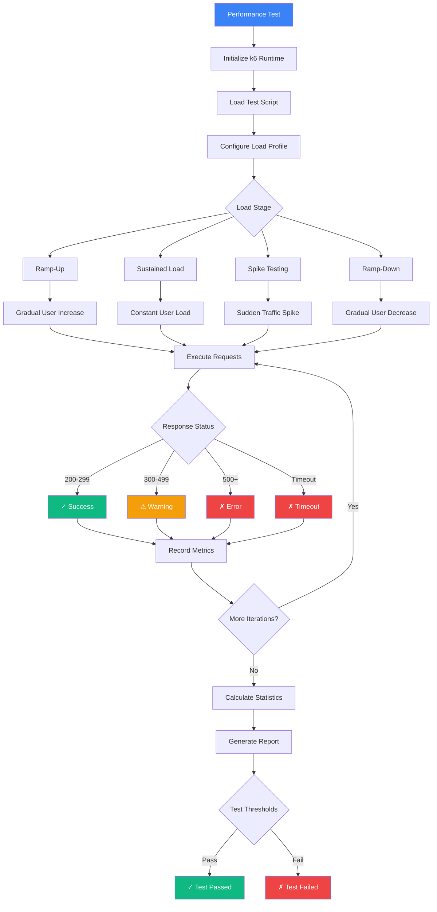

Run load and performance tests to validate your application's scalability, reliability, and responsiveness under various traffic conditions.

<Callout type="info">
  Performance tests use **k6**, an open-source load testing tool designed for cloud-native applications.
</Callout>

## What is a Performance Test?

Performance tests simulate multiple concurrent users accessing your application to measure:
- **Response Times**: How fast your application responds under load
- **Throughput**: Requests per second your application can handle
- **Error Rates**: Percentage of failed requests under stress
- **Resource Usage**: CPU, memory, and network utilization
- **Scalability Limits**: Breaking points and capacity planning

## Performance Test Flow



## Creating a Performance Test

<Steps>
  <Step>Navigate to **Automate → Create → Performance Test**</Step>
  <Step>Name your test (e.g., "Homepage Load Test")</Step>
  <Step>Write your k6 test script</Step>
  <Step>Configure load profile (VUs, duration, stages)</Step>
  <Step>Set performance thresholds</Step>
  <Step>Run test locally to validate</Step>
  <Step>Save and schedule for regular execution</Step>
</Steps>

## k6 Test Script Example

### Basic Load Test

```javascript
import http from 'k6/http';
import { check, sleep } from 'k6';

// Test configuration
export const options = {
  stages: [
    { duration: '30s', target: 10 },  // Ramp-up to 10 users
    { duration: '1m', target: 10 },   // Stay at 10 users
    { duration: '30s', target: 0 },   // Ramp-down to 0 users
  ],
  thresholds: {
    http_req_duration: ['p(95)<500'], // 95% of requests under 500ms
    http_req_failed: ['rate<0.01'],   // Error rate under 1%
  },
};

// Test scenario
export default function () {
  const response = http.get('https://your-app.com/api/products');

  // Validate response
  check(response, {
    'status is 200': (r) => r.status === 200,
    'response time < 500ms': (r) => r.timings.duration < 500,
    'has products': (r) => JSON.parse(r.body).products.length > 0,
  });

  sleep(1); // Think time between iterations
}
```

### Advanced Scenario with Multiple Endpoints

```javascript
import http from 'k6/http';
import { check, group, sleep } from 'k6';

export const options = {
  stages: [
    { duration: '1m', target: 50 },   // Ramp to 50 users
    { duration: '3m', target: 50 },   // Hold at 50 users
    { duration: '1m', target: 100 },  // Spike to 100 users
    { duration: '2m', target: 100 },  // Hold at 100 users
    { duration: '1m', target: 0 },    // Ramp down
  ],
  thresholds: {
    'http_req_duration{type:api}': ['p(95)<300'],
    'http_req_duration{type:page}': ['p(95)<1000'],
    'http_req_failed': ['rate<0.05'],
  },
};

export default function () {
  // Simulate user browsing flow
  group('Browse Homepage', function () {
    const res = http.get('https://your-app.com', {
      tags: { type: 'page' },
    });
    check(res, { 'homepage loaded': (r) => r.status === 200 });
    sleep(2);
  });

  group('View Products', function () {
    const res = http.get('https://your-app.com/api/products', {
      tags: { type: 'api' },
    });
    check(res, {
      'products loaded': (r) => r.status === 200,
      'has data': (r) => JSON.parse(r.body).length > 0,
    });
    sleep(1);
  });

  group('Add to Cart', function () {
    const payload = JSON.stringify({ productId: 123, quantity: 1 });
    const params = { headers: { 'Content-Type': 'application/json' } };

    const res = http.post('https://your-app.com/api/cart', payload, params);
    check(res, { 'added to cart': (r) => r.status === 201 });
    sleep(1);
  });
}
```

## Load Profile Patterns

### Ramp-Up Test
Gradually increase load to find capacity limits.

```javascript
export const options = {
  stages: [
    { duration: '2m', target: 100 },
    { duration: '5m', target: 100 },
    { duration: '2m', target: 200 },
    { duration: '5m', target: 200 },
    { duration: '2m', target: 300 },
    { duration: '5m', target: 300 },
  ],
};
```

### Spike Test
Sudden traffic increase to test handling of unexpected load.

```javascript
export const options = {
  stages: [
    { duration: '10s', target: 10 },   // Normal load
    { duration: '10s', target: 500 },  // Sudden spike!
    { duration: '1m', target: 500 },   // Hold spike
    { duration: '10s', target: 10 },   // Back to normal
  ],
};
```

### Stress Test
Push system beyond normal capacity to find breaking point.

```javascript
export const options = {
  stages: [
    { duration: '2m', target: 100 },
    { duration: '5m', target: 100 },
    { duration: '2m', target: 200 },
    { duration: '5m', target: 200 },
    { duration: '2m', target: 500 },
    { duration: '10m', target: 500 },
  ],
};
```

### Soak Test
Sustained load over extended period to detect memory leaks.

```javascript
export const options = {
  stages: [
    { duration: '5m', target: 100 },    // Ramp to target
    { duration: '2h', target: 100 },    // Hold for 2 hours
    { duration: '5m', target: 0 },      // Ramp down
  ],
};
```

## Performance Thresholds

Define pass/fail criteria for your tests:

### Response Time Thresholds

```javascript
thresholds: {
  http_req_duration: [
    'p(50)<200',    // 50% of requests under 200ms (median)
    'p(95)<500',    // 95% of requests under 500ms
    'p(99)<1000',   // 99% of requests under 1 second
  ],
}
```

### Error Rate Thresholds

```javascript
thresholds: {
  http_req_failed: ['rate<0.01'],  // Less than 1% errors
}
```

### Custom Metric Thresholds

```javascript
import { Counter, Trend } from 'k6/metrics';

const checkoutSuccess = new Counter('checkout_success');
const checkoutDuration = new Trend('checkout_duration');

export const options = {
  thresholds: {
    'checkout_success': ['count>1000'],       // At least 1000 successful checkouts
    'checkout_duration': ['p(95)<2000'],      // 95% under 2 seconds
  },
};
```

## k6 Modules and Features

### HTTP Requests

```javascript
import http from 'k6/http';

// GET request
const res1 = http.get('https://api.example.com/users');

// POST request with JSON
const payload = JSON.stringify({ name: 'User', email: 'user@example.com' });
const params = { headers: { 'Content-Type': 'application/json' } };
const res2 = http.post('https://api.example.com/users', payload, params);

// Batch requests (parallel)
const responses = http.batch([
  ['GET', 'https://api.example.com/users'],
  ['GET', 'https://api.example.com/products'],
]);
```

### Checks and Assertions

```javascript
import { check } from 'k6';

check(response, {
  'status is 200': (r) => r.status === 200,
  'response time OK': (r) => r.timings.duration < 500,
  'content type is JSON': (r) => r.headers['Content-Type'] === 'application/json',
  'body has data': (r) => r.body.length > 0,
});
```

### Think Time and Pacing

```javascript
import { sleep } from 'k6';

export default function () {
  http.get('https://example.com/page1');
  sleep(2); // Wait 2 seconds (think time)

  http.get('https://example.com/page2');
  sleep(1);
}
```

### Authentication

```javascript
// Basic Auth
http.get('https://api.example.com/data', {
  auth: 'basic',
  username: 'user',
  password: 'pass',
});

// Bearer Token
const token = 'your-jwt-token';
http.get('https://api.example.com/data', {
  headers: { 'Authorization': `Bearer ${token}` },
});

// Login flow
const loginRes = http.post('https://api.example.com/login', {
  username: 'user',
  password: 'pass',
});
const token = loginRes.json('token');
```

## Metrics and Reporting

### Standard k6 Metrics

- **http_req_duration**: Total request time
- **http_req_waiting**: Time to first byte (TTFB)
- **http_req_connecting**: Connection establishment time
- **http_reqs**: Total number of requests
- **http_req_failed**: Failed request count
- **vus**: Current number of virtual users
- **iteration_duration**: Time to complete one iteration

### Custom Metrics

```javascript
import { Counter, Trend, Rate, Gauge } from 'k6/metrics';

const errors = new Counter('custom_errors');
const responseTime = new Trend('custom_response_time');
const successRate = new Rate('success_rate');
const activeUsers = new Gauge('active_users');

export default function () {
  const start = Date.now();
  const res = http.get('https://example.com');
  const duration = Date.now() - start;

  responseTime.add(duration);
  successRate.add(res.status === 200);

  if (res.status !== 200) {
    errors.add(1);
  }
}
```

## Viewing Results

After running a performance test:

1. **Summary Metrics**: View key statistics (avg, min, max, p95, p99)
2. **Timeline Charts**: Visualize response times over time
3. **Error Analysis**: Review failed requests and error messages
4. **Threshold Results**: Pass/fail status for each threshold
5. **Detailed Logs**: Complete test execution logs

## Best Practices

### Test Design

<Steps>
  <Step>Start with realistic user scenarios, not just endpoint hammering</Step>
  <Step>Use appropriate think time to simulate real user behavior</Step>
  <Step>Test individual endpoints first, then combined scenarios</Step>
  <Step>Set realistic thresholds based on SLA requirements</Step>
</Steps>

### Load Profile Selection

- **Smoke Test**: 1-2 VUs to verify script works
- **Load Test**: Expected production load (e.g., 100 VUs)
- **Stress Test**: 2-3x normal load to find limits
- **Spike Test**: Sudden 10x increase to test elasticity
- **Soak Test**: Normal load for 2-8 hours to detect leaks

### Performance Optimization

- Use `http.batch()` for parallel requests
- Minimize data generation in default function
- Reuse connections when possible
- Use tags to categorize requests
- Keep scripts simple and focused

### Threshold Guidelines

```javascript
thresholds: {
  // Response times
  'http_req_duration': ['p(95)<500'],      // User-facing pages
  'http_req_duration{type:api}': ['p(95)<200'],  // API endpoints

  // Availability
  'http_req_failed': ['rate<0.01'],        // 99% success rate

  // Throughput
  'http_reqs': ['rate>100'],               // At least 100 req/s
}
```

## Common Use Cases

### API Load Testing

Test REST API endpoints under load:

```javascript
export default function () {
  const res = http.get('https://api.example.com/v1/products');
  check(res, {
    'status 200': (r) => r.status === 200,
    'response < 200ms': (r) => r.timings.duration < 200,
  });
  sleep(0.1); // 10 requests per VU per second
}
```

### E-commerce Checkout Flow

Simulate complete user journey:

```javascript
export default function () {
  // Browse products
  http.get('https://shop.example.com/products');
  sleep(2);

  // View product details
  http.get('https://shop.example.com/products/123');
  sleep(3);

  // Add to cart
  http.post('https://shop.example.com/cart', { productId: 123 });
  sleep(1);

  // Checkout
  http.post('https://shop.example.com/checkout', { /* order data */ });
  sleep(2);
}
```

### Database Performance

Test database-backed API:

```javascript
export default function () {
  // Create record
  const create = http.post('https://api.example.com/users', userData);
  const userId = create.json('id');

  // Read record
  http.get(`https://api.example.com/users/${userId}`);

  // Update record
  http.put(`https://api.example.com/users/${userId}`, updateData);

  // Delete record
  http.del(`https://api.example.com/users/${userId}`);
}
```

## Troubleshooting

### High Response Times

<Callout type="warning">
  If response times exceed thresholds, investigate backend performance, database queries, or network issues.
</Callout>

**Common Causes**:
- Database query optimization needed
- Insufficient server resources
- Network latency
- Missing indexes

### Error Rates Increasing

**Common Causes**:
- Rate limiting triggered
- Database connection pool exhausted
- Memory exhaustion
- Timeout configurations too strict

### Test Script Errors

**Common Causes**:
- Invalid JavaScript syntax
- Missing k6 module imports
- Incorrect HTTP methods or endpoints
- Authentication failures

## Related Features

<Cards>
  <Card
    title="Jobs"
    description="Schedule performance tests to run regularly"
    href="./jobs"
  />
  <Card
    title="Monitors"
    description="Monitor API endpoints 24/7 for performance degradation"
    href="../monitor/http-monitor"
  />
  <Card
    title="Variables"
    description="Use variables for test configuration and credentials"
    href="./variables"
  />
</Cards>

## Need Help?

- **k6 Documentation**: Visit [k6.io/docs](https://k6.io/docs) for comprehensive k6 guides
- **Script Examples**: Check k6 examples for common testing patterns
- **Performance Tuning**: Review your application's performance metrics to identify bottlenecks
- **Support**: Contact support@supercheck.io for assistance with performance testing
