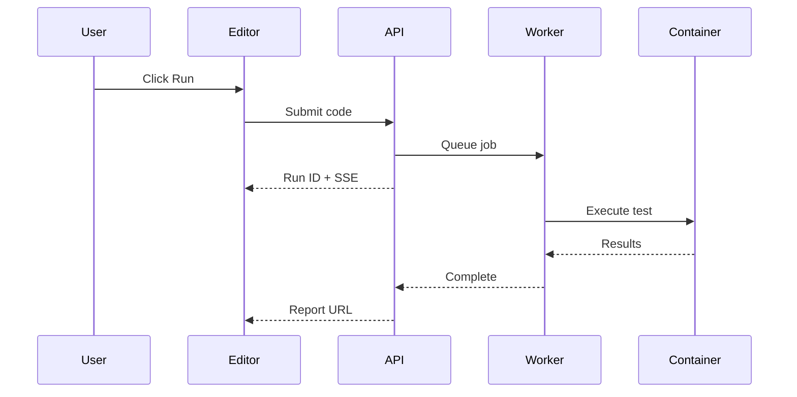

The Playground is an interactive development environment for writing, running, and debugging tests. It combines a professional code editor with AI-powered assistance to help you create reliable tests faster.


## Editor Features

The Playground uses Monaco Editor (the same editor that powers VS Code) with features tailored for test development:

- **Syntax Highlighting** — Full TypeScript/JavaScript support with Playwright API recognition
- **Auto-completion** — IntelliSense for Playwright methods, selectors, and assertions
- **Error Detection** — Real-time syntax validation before you run
- **Code Formatting** — Automatic formatting for clean, readable code
- **Variable Access** — Use `getVariable()` and `getSecret()` for project configuration

## Running Tests

Click **Run** to execute your test in an isolated container environment.



<Callout type="info">
Cancel a running test at any time. The container is immediately stopped and resources are released.
</Callout>

<Callout type="warning">
**Tests must pass before saving.** Only successfully executed tests can be saved. If your test fails, fix the issues and run it again until it passes.
</Callout>

## AI Create

Generate complete, working test scripts from plain English descriptions. AI Create uses GPT-4o-mini to understand your requirements and produce well-structured Playwright code.

<Callout type="warning">
**Beta Feature**: AI-generated browser tests may require refinement. For best results, **record your test first** using Playwright's codegen, then use AI Create to enhance or modify it. Review all generated code before running.
</Callout>


### How to Use AI Create

1. Click the **AI Create** button (purple gradient)
2. Describe what you want to test in natural language
3. Click **Generate** to start streaming the code
4. Review the generated script in the diff viewer
5. Click **Accept** to use the code, or **Reject** to discard


### Writing Effective Prompts

**Good prompts are specific and include:**
- The user action you want to test
- Expected outcomes or assertions
- Any specific elements or data to interact with

**Example prompts:**

| Prompt | What AI Generates |
|--------|-------------------|
| "Test login with email user@example.com and password test123, verify dashboard loads" | Complete login flow with form filling, submission, and URL assertion |
| "Check that the /api/health endpoint returns 200 and includes status: ok" | API test with fetch, status check, and JSON body validation |
| "Verify user can add a product to cart, view cart, and see correct total" | Multi-step e-commerce flow with navigation and assertions |
| "Test that the contact form validates required fields and shows error messages" | Form validation test with empty submission and error checking |

### What AI Create Produces

Generated tests include:
- Proper imports (`@playwright/test`)
- Descriptive test names and comments
- Robust selectors (prefers data-testid, aria-labels)
- Appropriate waits and assertions
- Error handling where needed

## AI Fix

When a test fails, AI Fix analyzes the error and suggests corrections. It examines the failure report, identifies the root cause, and generates a fixed version of your code.


### How AI Fix Works

1. Run a test that fails
2. Click the **AI Fix** button (appears after failure)
3. AI analyzes the error report and your code
4. A diff viewer shows original vs. suggested fix
5. Review changes, edit if needed, then **Accept** or **Reject**


### What AI Fix Can Repair

AI Fix is effective for code-level issues that can be resolved by modifying your test:

| Issue Type | Example | AI Fix Action |
|------------|---------|---------------|
| **Selector Issues** | Element not found, wrong selector | Updates selector to match current DOM |
| **Timing Problems** | Element not visible, timeout | Adds appropriate waits or increases timeout |
| **Assertion Failures** | Expected value mismatch | Corrects assertion or expected value |
| **Navigation Errors** | Page not loading, wrong URL | Fixes URL or adds navigation waits |

### When AI Fix Shows Guidance Instead

Some failures require manual investigation rather than code changes. In these cases, AI Fix displays a guidance modal with troubleshooting steps:

- **Network Issues** — Server unreachable, DNS failures, HTTP 5xx errors
- **Authentication Failures** — Invalid credentials, expired tokens, 401/403 errors
- **Infrastructure Problems** — Database down, service unavailable
- **Permission Errors** — Access denied, insufficient privileges

<Callout type="info">
AI Fix preserves all your original comments and code structure. It only modifies the specific lines needed to fix the issue.
</Callout>

## Templates

Start with pre-built templates for common testing scenarios. Templates provide working code that you can customize for your application.


### Available Templates

**Browser Test Templates:**

| Category | Templates |
|----------|-----------|
| **Browser Fundamentals** | UI Smoke (navigation), Browser selection with tags, Comprehensive Browser Test |
| **Auth Flows** | Auth flow (login + logout) |
| **Responsive & Devices** | Mobile/responsive layout, Device emulation (geo, locale, timezone) |

**API Test Templates:**

| Category | Templates |
|----------|-----------|
| **API Health** | Health/JSON contract |
| **API CRUD** | Create + read + cleanup |
| **Authentication** | Authenticated request |
| **API Coverage** | Comprehensive API Test |

**Database Test Templates:**

| Category | Templates |
|----------|-----------|
| **Database Checks** | SELECT health check, Safe UPDATE with RETURNING, Database Discovery & Query |
| **Transactions** | Insert with rollback |

**Custom Test Templates:**

| Category | Templates |
|----------|-----------|
| **Cross-layer** | Custom test fixtures, Form with API stubbing, Device emulation showcase, API + UI end-to-end, GitHub API + Browser Integration |

**Performance Test Templates (k6):**

| Category | Templates |
|----------|-----------|
| **Smoke & Health** | Smoke Check (API), Basic Performance Test |
| **Load Profiles** | Ramping Load, Advanced Thresholds |
| **Resilience** | Spike + Recovery, Stress Test, Breakpoint Test |
| **Reliability** | Soak/Endurance |
| **API Coverage** | API Checklist (GET + POST + auth), Checks & Assertions |

### Using Templates

1. Click **Templates** in the editor toolbar
2. Browse categories or search for specific scenarios
3. Click a template to preview the code
4. Click **Use Template** to insert into editor
5. Customize URLs, selectors, and test data for your app

## Test Reports

Every test run generates a detailed report with artifacts for debugging:


### Report Contents

| Artifact | Description | Use For |
|----------|-------------|---------|
| **Screenshots** | Captured at each step and on failure | Visual verification, debugging UI issues |
| **Trace** | Interactive step-by-step replay | Understanding test flow, timing issues |
| **Video** | Full browser recording | Seeing exactly what happened |
| **Console Logs** | Browser console output | JavaScript errors, debug messages |
| **Network** | All HTTP requests and responses | API debugging, performance analysis |

### Viewing Traces

The Playwright Trace Viewer lets you:
- Step through each action in your test
- See the page state before and after each step
- Inspect DOM elements and their properties
- View network requests with timing
- Debug timing and selector issues

## Using Variables

Access project-level configuration and secrets in your tests:

```javascript
/**
 * Variables and secrets for test configuration.
 * Variables are plain text, secrets are encrypted.
 * @see /docs/automate/variables for setup instructions
 */

// Regular variables (logged normally)
const baseUrl = getVariable('BASE_URL');
const timeout = getVariable('TIMEOUT');

// Secrets require .toString() to access the value
const apiKey = getSecret('API_KEY').toString();
const password = getSecret('DB_PASSWORD').toString();

// Using in Playwright
await page.goto(baseUrl);
await page.fill('#password', password);
```

Variables are resolved server-side before execution. Secrets are encrypted and automatically redacted from logs and screenshots.

See [Variables](/docs/automate/variables) for setup instructions.

## Best Practices

### Writing Reliable Tests
- **Use stable selectors** — Prefer `data-testid`, `aria-label`, or semantic selectors over CSS classes
- **Add explicit waits** — Use `waitForSelector` or `waitForURL` instead of fixed delays
- **Keep tests focused** — Test one user flow per test for easier debugging
- **Use descriptive names** — Name tests clearly so failures are easy to understand

### Using AI Effectively
- **Start with AI Create** for new tests, then refine manually
- **Use AI Fix** for quick selector and timing fixes
- **Review AI suggestions** before accepting—AI is helpful but not perfect
- **Provide context** in prompts for better AI-generated code

### Debugging Failures
- **Check screenshots** first to see the visual state
- **Use trace viewer** to step through the test
- **Review network tab** for API issues
- **Check console logs** for JavaScript errors

## Learn More

For deeper understanding of the testing frameworks used in Supercheck:

- **[Playwright Documentation](https://playwright.dev/docs/intro)** — Complete guide to browser automation
- **[Playwright Locators](https://playwright.dev/docs/locators)** — Best practices for finding elements
- **[Playwright Assertions](https://playwright.dev/docs/test-assertions)** — Available assertion methods
- **[Playwright Trace Viewer](https://playwright.dev/docs/trace-viewer)** — Debugging with traces
