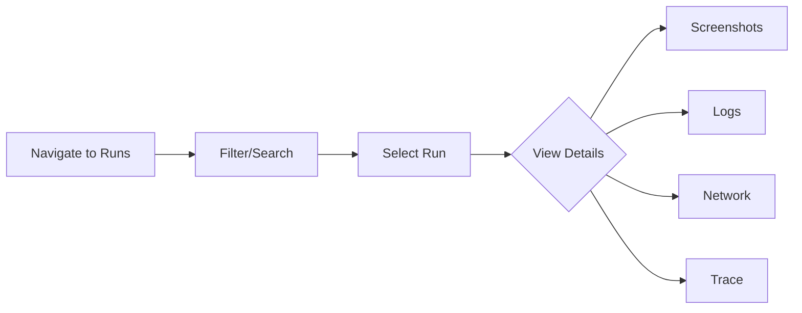

title: Runs
description: View test and job execution history
icon: ClipboardList
---

Every test or job execution creates a run with complete results, logs, screenshots, and performance metrics. View historical data and debug failures efficiently.

## What is a Run?

A run represents a single execution of a test or job, capturing:
- Execution status (pass/fail/error)
- Duration and performance metrics
- Screenshots and videos (for browser tests)
- Console logs and network requests
- Error messages and stack traces

## Viewing Runs



## Run Status

- **Passed**: All tests completed successfully
- **Failed**: One or more tests failed
- **Error**: Execution error (timeout, crash, etc.)
- **Running**: Currently executing
- **Queued**: Waiting to execute

## Run Details

Each run includes:

**Test Results**
```javascript
{
  "total": 10,
  "passed": 8,
  "failed": 2,
  "duration": 45000  // milliseconds
}
```

**Artifacts**
- HTML reports with full details
- Screenshots at each step
- Videos of browser tests
- Network HAR files
- Console logs

**Metadata**
- Trigger type (manual/scheduled/API)
- Environment and variables used
- User who triggered
- Timestamp and duration

## Filtering Runs

Search and filter by:
- Test/job name
- Status (passed/failed/error)
- Date range
- Trigger type
- User

## Using Run Data

**Debugging Failures**
<Steps>
  <Step>Open failed run</Step>
  <Step>Check error message</Step>
  <Step>View screenshot at failure point</Step>
  <Step>Review console logs</Step>
  <Step>Check network requests</Step>
  <Step>View execution trace</Step>
</Steps>

**Performance Analysis**
- Compare execution times across runs
- Identify slow tests or operations
- Track performance trends over time
- Optimize based on metrics
