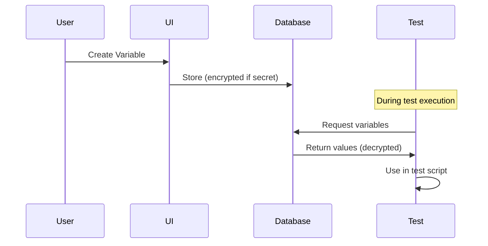

# Variables

Store reusable configuration values and sensitive data securely across your tests. Variables can be regular (plain text) or secrets (encrypted), providing flexibility while maintaining security.

## How It Works



## Variable Types

**Regular Variables** - Stored in plain text, visible in UI
- URLs, timeouts, usernames
- Configuration values, feature flags
- Non-sensitive data

**Secrets** - AES-256 encrypted, masked in UI
- API keys, passwords, tokens
- Database credentials
- Any sensitive data

## Using Variables

### Regular Variables

```javascript
// Access configuration values
const baseUrl = getVariable("BASE_URL");
const timeout = getVariable("TIMEOUT");

// Use in tests
await page.goto(baseUrl + "/login");
```

### Secrets

```javascript
// Access sensitive data (automatically protected from logs)
const apiKey = getSecret("API_KEY");
const password = getSecret("PASSWORD");

// Use securely
await page.fill("#password", password);

// Logging is automatically masked
console.log(apiKey); // Output: "***REDACTED***"
```

## Creating Variables

<Steps>
  <Step>Go to **Automate → Variables**</Step>
  <Step>Click **Add Variable**</Step>
  <Step>Enter key and value</Step>
  <Step>Mark as **Secret** if sensitive</Step>
  <Step>Save</Step>
</Steps>

## Common Patterns

```javascript
// Environment-specific configuration
const env = getVariable("ENVIRONMENT");
const apiUrl = getVariable(`${env}_API_URL`);

// Database connection
const dbConfig = {
  host: getVariable("DB_HOST"),
  port: getVariable("DB_PORT"),
  password: getSecret("DB_PASSWORD")
};

// Feature flags
const newFeatureEnabled = getVariable("FEATURE_X_ENABLED");
if (newFeatureEnabled === "true") {
  // Test new feature
}
```

## Security

- **Encryption**: Secrets use AES-256-GCM encryption
- **Access Control**: Role-based permissions (Owner/Admin/Editor)
- **Log Protection**: Secrets automatically redacted from logs and screenshots
- **Audit Trail**: All variable access is logged
